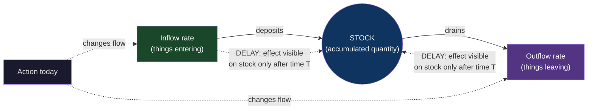
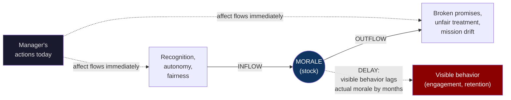
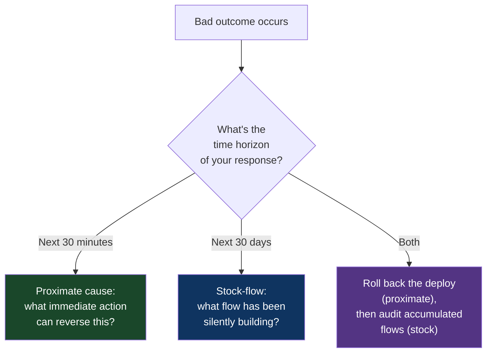

# CH-09: Stocks, Flows, and the Tyranny of Delay
### *Why the current value of anything you measure is lying to you about its current cause*

> **Part 3 of 5 · Systems Are Where Problems Live**
> **Model Type:** `system`

---

## The Misread

A new VP of Engineering is hired at a 200-person company. In her first week, she pulls up the weekly bug-count dashboard. The line is going up. Three weeks ago: 47 open bugs. Two weeks ago: 58. Last week: 71. This week: 84. Up and to the right.

She schedules an emergency review. The team is defensive. They report that they've actually been fixing more bugs than ever — 30 per week, up from 18 a quarter ago. The VP looks at the dashboard again. The line going up shows *open* bugs, not bug-fix rate. The team's fix rate is higher than it's been in two years. *But the inflow of new bugs is even higher.*

She digs further. The new bug rate spiked nine weeks ago — exactly when the team released a major refactor of the data layer. The refactor was supposed to improve velocity. It did, in some sense; new features have been shipping faster. But the bugs introduced by the refactor are still surfacing — some in QA, some by users, some by automated checks — eight to twelve weeks after the change was made. The team's high fix rate is *fixing the refactor's debt*, and the refactor's debt is being created faster than the fixes are processing it.

The team has been making local decisions correctly. They prioritized the refactor. They've been responsive to incoming bugs. They've increased throughput. By every local measure, they are doing the right thing. The bug count keeps climbing.

Worse: the team's natural response — "we'll fix more bugs!" — won't actually drain the stock if the inflow rate exceeds the fix rate. They could ship the most heroic week of bug-fixing in company history, fix 50 bugs, and watch the count rise from 84 to 90 because the inflow that week was 56. The team would feel they had failed, even though they had performed at a record pace.

The VP's intervention is not to demand more bug fixes. It's to ask, for the first time anyone can remember asking: *what is the inflow rate, and what is feeding it?* The answer points back to the refactor, nine weeks earlier. The current bug count reflects decisions made two months ago. The current effort affects the bug count of the future. The two are decoupled in time, and the team had been operating as if they weren't.

## The Blind Spot

The brain reads *current values* and assumes they reflect *current causes*. This is approximately the most useful default the brain has — for short-feedback-loop systems (catching a ball, having a conversation, walking), current state really does reflect current causes — and approximately the most expensive default the brain has for systems with delays.

A stock is *whatever has accumulated*. The water in a bathtub. The bugs in a tracker. The CO₂ in the atmosphere. The trust in a relationship. The morale in a team. The technical debt in a codebase. A stock is the integral of all the flows into and out of it, over its entire history. A stock's current value is the sum of every past inflow minus every past outflow.

A flow is *the rate of change*. Water entering the bathtub through the faucet. Bugs being created or fixed. CO₂ being emitted or absorbed. Trust being built or eroded. A flow happens now. The stock it feeds responds now and forever after.

Delay is the gap between a flow happening and its effect on the stock becoming visible to observers. CO₂ emitted today raises atmospheric concentration immediately, but the *climate effects* of that increase will be felt over decades. A trust violation today damages the relationship's stock immediately, but the *behavioral evidence* of the damage may surface months later. Bug-causing code shipped today *will* produce bugs, but the bugs may not be reported until users hit them, and users hit them on their own schedule.

The blind spot is treating the current stock as informative about current flows, when often the current stock is informative about flows from months or years ago, and current flows won't show up in the stock for months or years to come.

## The Model, Precisely

**Stocks, Flows, and Delay.**

Every system has *stocks* (accumulated quantities), *flows* (rates of change adding or draining from stocks), and *delays* between flows happening and their effects becoming visible. The current value of any stock is the integral of all past flows; *present causes do not explain present states*. The interventions that change a stock must work through flows, and the changes they produce will not appear in the stock until enough time has passed.

What this model makes visible: most metrics organizations track are stocks (open bugs, customer count, ARR, employee count, technical debt). Most actions teams take affect flows (writing code, hiring, selling, paying down debt). The actions take effect on stocks only with delay. Mismatched intuitions about this produce *systematic mis-attribution*: today's bad number gets blamed on today's actions, when it usually reflects six months of compounding flows.

Spatially: a bathtub. The level of the water (stock) depends on the rate of the faucet (inflow) and the rate of the drain (outflow). If both are equal, the level is stable regardless of how fast water is moving through. If inflow exceeds outflow, the level rises — even if you increase the outflow, as long as inflow grows faster, the level keeps rising. The level *now* reflects every past second of inflow and outflow. Yanking the faucet handle changes the inflow *immediately*, but the level changes *gradually*, and you can't tell from the level alone what the faucet is doing.

Meadows' original framing in *Thinking in Systems* is the foundational source for this model. The bathtub example is hers; the implications she draws — that "stop emitting" doesn't equal "fixed the climate," that "hire more" doesn't equal "fixed the staffing," that "be nice" doesn't equal "fixed the relationship" — are the recurring corrective to flow-blindness.

## Three Domains, One Model

### Domain 1: Engineering — Tech Debt as a Stock

Tech debt is one of the cleanest examples because it's a system most engineers participate in daily and most engineering managers fail to model correctly.

The stock: the total amount of debt in the codebase — old patterns, deferred refactors, workarounds, dead code, undocumented behavior, etc. This stock has a measurable cost (slower development, more bugs, longer onboarding) but is rarely measured directly.

The inflows: every shortcut taken under time pressure, every "we'll come back to this," every dependency added for expedience, every feature shipped without proper documentation. These flows happen continuously and are often *not even visible* — the engineer making the shortcut doesn't think "I'm adding to a stock"; they think "I'm shipping this feature."

The outflows: refactoring time, deliberate debt repayment, deprecation of old systems, documentation written, dead code removed. These flows happen episodically and are usually compressed into bursts ("tech debt week," "the refactor sprint").

The delay: the cost of debt is not paid when the debt is incurred; it's paid every time someone interacts with the indebted code. A shortcut taken today costs nothing today (in fact, it saves time today). The cost is borne over months and years as future engineers slow down navigating the resulting complexity. By the time the cost is visible — velocity is slow, onboarding is hard, bugs are common — the original shortcuts have been forgotten. The current state is being blamed on current decisions, when it actually reflects two years of accumulated flow.

The intervention pattern that works: track the *flow rates*, not just the stock. "How many new TODOs were added this week vs cleared?" "How many new untyped files were created vs converted?" "How many new dependencies were added vs removed?" Flow-rate tracking gives you a leading indicator. Stock tracking is a lagging indicator that updates too slowly to drive decisions.

### Domain 2: Organization — Morale and Trust

Team morale is a stock. It accumulates from positive flows (recognition, autonomy, meaningful work, fair treatment, sense of progress) and drains via negative flows (broken promises, unrecognized effort, perceived unfairness, churn of teammates, mission drift).

The delay is the killer. A manager who systematically demoralizes their team — say, by repeatedly taking credit for the team's work, or by ignoring feedback they explicitly solicited — does not see morale drop on Monday. The drop is gradual. The team's overt behavior (showing up, doing work) may not change for months. Then, suddenly, the manager loses two engineers in a quarter and is shocked. The shock is the stock finally crossing a threshold that produces visible action (resignations). The flow that drained the stock had been happening continuously for a year.

The reverse delay also operates. A manager who realizes they have a morale problem and corrects their behavior on Monday will not see morale recover by Friday. The trust has been depleted. Restoring inflows (recognition, autonomy, etc.) does add to the stock, but the stock starts from a low base and refills slowly. The team's overt behavior won't change for months, and the manager often loses patience ("I changed; why isn't anyone happy yet?") and reverts.

Many "sudden" team departures are stocks that have been silently draining for a long time. The departures are the inflection point at which the stock crossed the action threshold. The cause is rarely the proximate trigger; it's the underlying flow that's been running for a year.

### Domain 3: Atmospheric CO₂

The cleanest illustration of stock/flow/delay on the global scale. The stock: atmospheric CO₂ concentration, currently around 420 ppm, up from ~280 ppm pre-industrial. The inflows: emissions from fossil fuel combustion, deforestation, agriculture, cement production. The outflows: absorption by oceans and biosphere.

The delay between *emissions decisions* (a country shutting down coal plants, an industry switching to electric vehicles) and *concentration response* (atmospheric CO₂ stops rising, then falls) is *decades*. Even if every emission stopped tomorrow, the atmospheric stock would only decline slowly because the natural outflow rate is much smaller than the recent inflow rate has been. And the *climate response* — temperature, sea level, weather patterns — lags the *concentration response* by additional decades because the oceans and ice sheets are themselves massive thermal stocks with their own delays.

This is why climate policy debates that focus on "did we cause this year's hurricanes?" or "did our emissions cuts last year change anything?" are systematically miscalibrated. The current weather reflects emissions stocks built over 150 years. This year's emissions changes affect weather decades from now. Treating climate as a short-feedback-loop problem produces both denial ("the weather hasn't changed enough to convince me") and despair ("I cut my carbon and nothing happened"). Treating it as the stock-flow-delay system it actually is produces appropriate policy framing (long-term emissions trajectories) and personal action framing (your individual contribution matters in aggregate over decades, not as a daily-feedback signal).

The same structure governs many social systems on smaller scales. Public health outcomes lag policy by years. Educational outcomes lag pedagogical changes by decades. Cultural shifts lag the institutional decisions that drive them by generations. In each case, treating the current state as evidence about the current causes produces wrong attributions and wrong interventions.

## Where The Model Breaks

**The hidden assumption:** there is a meaningful delay between flow and stock change, and the system can be cleanly decomposed into stocks and flows.

Some systems have such fast feedback that the stock-flow distinction collapses. A conversation. A short-feedback-loop service-level metric where the SLO window is seconds. A trading book where positions update tick by tick. In these systems, current value really does mostly reflect current cause, and forcing a stock-flow analysis adds overhead without insight. The model is over-engineered for the situation.

Other systems have flows that interact nonlinearly with stocks in ways that break the simple bathtub intuition. Some chemical reactions accelerate as the stock increases (autocatalysis); some flows turn off when the stock crosses a threshold (saturation); some flows reverse sign depending on conditions. The "stock equals integral of flows" framing is approximately correct but misses the nonlinearity. For these cases, the stock-flow framing is a useful starting point but you need the full dynamics model to actually predict behavior.

A third failure: in systems where the *measurement* of the stock is itself a flow (e.g., the stock of company reputation, where each survey *creates* a measurement that *affects* future behavior), the measurement-stock distinction collapses. The act of measuring is a flow into or out of the stock. This is rare but happens in surveys, polls, sentiment indices, anywhere the measurement is observable to the system being measured.

**The signal you're in the break zone:** the system has very short delays (sub-second), or the system has known nonlinearities that the linear stock-flow framing can't capture. In both cases, use the model as background intuition but switch to a more detailed dynamical model for action.

## The Collision

**This model says:** trace the current state to past flows; don't blame current actions for current results.
**Immediate Causality / Proximate Cause says:** the thing that happened just before the bad outcome usually is the cause; don't get lost in distant-past analysis when the local cause is obvious.

The collision: a service goes down. Stock-flow says: "The reliability of this service is a stock that's been silently draining for months — under-staffed on-call, deferred upgrades, accumulated config drift; the outage is the threshold being crossed." Proximate-cause says: "The deploy thirty minutes before the outage broke it; the deploy is the cause; the long-term factors are context but the immediate fix is to roll back the deploy."

Both are right, at different scopes. The proximate cause tells you what to do *right now*. The stock-flow analysis tells you why this kind of incident is becoming more common and what to do *over the next quarter*. The mistake is letting one displace the other.

**The meta-skill:** the deciding signal is the *time horizon of your decision*. Short-horizon decisions (within the feedback loop of the system) need proximate causes. Long-horizon decisions (across many cycles of the system) need stock-flow analysis. Most post-mortems get hijacked by proximate-cause thinking because the proximate cause is concrete and namable; the stock-flow analysis is diffuse and harder to assign blame for. Mature engineering cultures explicitly include both — "the immediate cause was X; the contributing systemic factors were Y, Z, W; we're addressing X today and Y, Z, W over the next quarter."

## The Retrofit

**Event:** The Wells Fargo fake accounts scandal, ~2002–2016. Wells Fargo employees opened approximately 3.5 million fraudulent customer accounts over more than a decade, leading to a $185 million fine in 2016 and an estimated $3 billion+ in total costs to the bank.

The proximate-cause narrative: individual employees committed fraud, were caught, were fired. The bank fired ~5,300 employees over the years for these practices.

The stock-flow analysis: the *behavior* (opening fake accounts) was a flow. The *incentive structure* (aggressive sales quotas, "eight is great" — pushing 8 products per customer, performance reviews tied to cross-sell rates) was the *flow control*. The structure had been put in place in the late 1990s by leadership pursuing higher cross-sell numbers. The structure made fraud locally rational for employees: meet the quota by any means, including fake accounts, or lose your job. The stock — the accumulated fake accounts — built up over a decade. The reputational stock of the bank built up trust at the same time the operational stock of fraud was building up beneath it, invisible to outside observers.

The delay: the inflow began in the late 1990s. The stock crossed the threshold of public visibility in 2013 when the LA Times investigated; the formal regulatory action came in 2016, fifteen-plus years after the flow started. The CEO at the time of the public scandal had been COO and then CEO during the period the structure was created and was running. He was fired in 2016. But the structure he had built was producing the flow continuously for fifteen years, and the stock was building up under it the entire time.

Re-reading through stock-flow-delay: any participant who treated the *current* sales numbers as evidence of *current* sales success was being deceived by the stock-flow lag. The sales numbers were a stock; the underlying flow had been corrupted by the incentive structure; the corruption was visible if you measured the *flow* (account creation rate, account-to-customer-engagement ratio, complaints per account) rather than the stock. Internal compliance teams reportedly raised concerns over the years; they were sidelined because the stock kept showing good numbers and "the system is working."

**What was invisible:** the cumulative effect of a quietly-corrupted flow over many years builds a stock that looks the same as a stock built by a healthy flow — until the day it doesn't. By the time the difference becomes visible (regulatory action, customer revolt, journalist exposé), it has been building for so long that any single intervention is inadequate. The fix has to address the flow (change the incentives) and *also* drain the stock (refund customers, identify and close fraudulent accounts), and the latter takes years.

**The intervention point:** any executive at any point in those fifteen years who had asked "what are the *flow rates* of new accounts vs. flow rates of customer engagement with those accounts?" would have seen the gap. The data was there. The question wasn't asked because the stock metrics were good. Stock-flow thinking is the discipline of asking the question even when the stock looks fine, because the stock is always behind.

## The Practice Rep

> **Duration:** 48 hours
> **What you're training:** distinguishing stocks from flows in the metrics you encounter and looking for the lagged causes the stock is hiding

**The exercise:**
For the next 48 hours, every time you encounter a metric — at work, in the news, on a dashboard, in a conversation — classify it:

1. Is this a *stock* (a quantity that has accumulated)?
2. Is this a *flow* (a rate of change)?
3. If a stock: what flows are filling it and draining it? What is the delay between flow changes and stock changes?

Examples:
- "We have 240 customers" — stock. Flow: signups minus churn. Delay: signups affect stock immediately; churn often has a notice period and then a tail of usage.
- "We added 12 customers last week" — flow. The stock is total customer count; this is the inflow for the week.
- "The error rate is 0.03%" — flow (errors per request) of a system whose stock is total errors-this-window. The error rate is itself a derived flow.
- "We have 84 open bugs" — stock. Flow: bug creation minus bug closure. Delay: bugs are created by code shipped weeks earlier.

Keep a log. Aim for ten classifications across 48 hours.

**What to look for:**
The pattern that will surprise you most: you'll find that organizational decisions are often made by interpreting stock numbers as if they were flow numbers. "Bugs are up" is read as "we're being careless this week" when it actually means "the refactor three months ago is still surfacing issues." "Morale is low" is read as "what changed this month" when it actually means "what flow has been running for a year." You'll start to hear specific conversations where this misattribution is happening in real time, and you'll be able to name it.

A second pattern: you'll find that most dashboards expose stocks but not flows. The flow data is harder to collect and less satisfying to display. This is the structural reason organizations are blind to their own flow dynamics. Naming this gap, even without fixing it, is the start of doing better.

**The log:**
At the end of 48 hours, write one sentence: "I saw Stocks, Flows, and Delay at work when [the specific moment I noticed a current stock value being misattributed to a current cause when it was actually the integral of months of unnoticed flow]."
