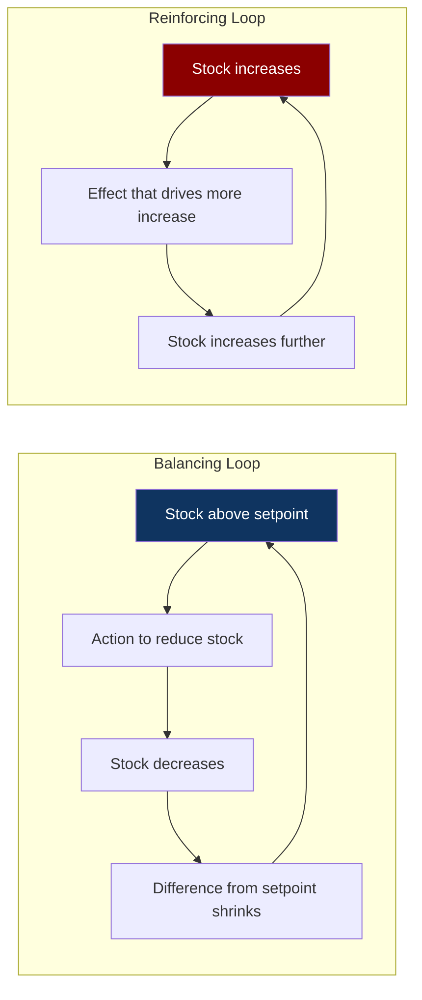
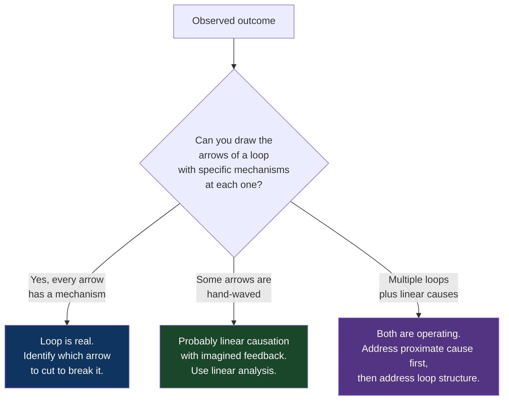

# CH-10: Feedback Loops
### *Why the system you measure becomes the system you have — and why the loop is invisible until it's closed*

> **Part 3 of 5 · Systems Are Where Problems Live**
> **Model Type:** `system`

---

## The Misread

An engineering leader rolls out a "code quality dashboard" at her 80-person company. The dashboard tracks, per team, a composite metric: test coverage, cyclomatic complexity, percentage of files with documentation, percentage of dependencies on supported versions, and a few others. The metric is published weekly. Teams can see their score and their rank against others.

She frames it carefully in the announcement: "This is not a competition. It's a tool to help teams see where to invest in quality." She means this sincerely. The dashboard is intended to be informational, not evaluative.

Six months later, the dashboard scores are excellent. Test coverage is at 89% across the org, up from 64%. Documented files are at 95%. Dependency freshness is at 98%. By every measure on the dashboard, code quality has improved dramatically.

Production incident rates are also higher than they've been in two years. The number of bugs reaching customers is up. The complaint volume from the engineers themselves — "this codebase is harder to work in than it was a year ago" — is at an all-time high.

What happened: teams optimized for the metrics, not the underlying quality the metrics were meant to proxy. Test coverage went up by adding many trivial tests that exercised lines without testing behavior. Documentation went up by adding boilerplate docstrings auto-generated from function signatures. Dependency freshness went up because teams upgraded dependencies without auditing the changes, occasionally pulling in regressions. Cyclomatic complexity went down because teams broke up genuinely complex code into many tiny functions that obscured the actual logic. Each metric was *technically improved* and the underlying quality was *measurably worse*.

The leader did everything she could to prevent this. She framed it as informational. She didn't tie it to performance reviews. She didn't reward the highest-scoring team. None of it mattered. The moment the metric was visible and persistent, the metric became the target, and the target reshaped behavior. The system had created a feedback loop she had not designed and could not see.

## The Blind Spot

We model interventions as one-way arrows. *I do X*, and X has an effect. The world responds. But the world's response, in any system with adaptive agents, includes *the agents adjusting their behavior to your intervention*, and that adjustment loops back into the system you were trying to change. The loop closes; the output becomes a new input; the system you have at time T+1 is not the system you measured at time T.

This is the core of Goodhart's Law: "When a measure becomes a target, it ceases to be a good measure." The reason it ceases to be a good measure is not metaphysical; it is that the measurement itself is a flow into the system being measured, and the system adapts to the flow. The original measurement was capturing some underlying quality. The new measurement captures the underlying quality *plus the system's optimization to look good on this measurement*. Over time, the latter dominates.

The blind spot is that humans evolved primarily in systems where their actions did not loop back rapidly into the systems they were acting on. Most of pre-modern life involved physical environments where my actions affected the world, the world responded mechanically, and the response did not adapt to my anticipation of it. In modern life — organizations, markets, social media, software systems — the entities I interact with do adapt to me, and the adaptation closes the loop in ways my intuitions don't natively model.

## The Model, Precisely

**Feedback Loops.**

Any output of a system that re-enters as an input creates a feedback loop. **Balancing loops** (negative feedback) resist change — they push the system back toward a setpoint. **Reinforcing loops** (positive feedback) amplify change — they push the system further in whatever direction it's already moving. Both kinds are everywhere; most systems are composed of many loops interacting. The behavior of the system is determined less by any single component than by the loops that connect components.

What this model makes visible: most "weird" system behavior — counterintuitive responses to interventions, sudden phase changes, self-perpetuating problems — is feedback loops doing what feedback loops do. Once you can see the loops, the behavior becomes predictable. Before you can see them, the behavior looks like noise or stupidity.

Spatially: a balancing loop is a thermostat. Temperature drifts up; heat turns off; temperature drifts back down; heat turns on; temperature stabilizes around the setpoint. A reinforcing loop is microphone feedback. Speaker output enters microphone; signal amplifies; speaker output increases; cycle accelerates until physical limits (or human intervention) stop it.

Meadows' framing: "Information held within a feedback loop in a system can affect only future behavior; it can't deliver a signal fast enough to correct behavior that drove the current feedback." This is the delay (CH-09) embedded inside the loop. Most feedback loops in real systems are loops *with* delays, which means the system overshoots the setpoint, oscillates around it, and only sometimes settles.

The recurring pattern in engineering and organizations: *we are usually inside feedback loops we did not design and cannot see, and our local interventions are the inputs that the loops are reshaping.* The lens of feedback-loop awareness is the move from "I am acting on a system" to "I am inside a system that is also acting on me."

## Three Domains, One Model

### Domain 1: Engineering — Retry Storms

A standard pattern in distributed systems: service A calls service B. B occasionally fails (network blip, transient error, brief overload). A is configured to retry on failure, with a small backoff. This is reasonable; most transient errors clear up on retry.

Under normal conditions, the system works. The retry rate is low because failures are rare. The total load on B is roughly the steady-state request rate from A.

Then B encounters a real problem — a slowdown, perhaps from a deploy or a noisy neighbor. B starts returning errors at a higher rate. A's retries kick in. Each request from A now produces 2-3 calls to B instead of 1. B's load *triples*. B's slowdown gets worse. More requests fail. A retries more. The loop closes.

This is a reinforcing loop. The "failure" is small initially; the loop amplifies it into an outage. The system has no internal mechanism to break the loop — A's retry logic, locally reasonable, is the amplifier. Without external intervention (rate limiting, circuit breakers, exponential backoff with jitter, load shedding), the loop runs until B is fully saturated and the system collapses.

Every senior infrastructure engineer has watched a retry storm. The first time, it looks like B failed catastrophically. The second time, you see the loop, and the diagnosis changes: B didn't fail catastrophically; B slowed down a little, and the *system* amplified the slowdown into a catastrophe. The fix is not "make B more reliable" — that addresses the trigger but not the loop. The fix is to *break the loop*: circuit breakers that stop retries when failure rates spike, backoff with jitter so retries don't synchronize, load shedding so B can prioritize requests during overload. These interventions don't make B more reliable; they make the system around B less reinforcing.

### Domain 2: Organization — Performance Reviews as Loops

Performance reviews are nominally a balancing loop: high performers get rewarded, low performers get coached or managed out, the team's average performance moves toward a desired setpoint. This is the design.

The actual loops are more interesting and often work against the design.

*Reinforcing loop on bias*: a manager's first impression of an employee colors subsequent feedback. The feedback is then used to set expectations and assignments. The assignments produce results that the manager interprets through the lens of the original impression. Strong first impressions produce strong outcomes; weak first impressions produce weak ones; the loop reinforces. This is a well-documented effect (the "Pygmalion effect") and it's a reinforcing loop dressed as a balancing one.

*Reinforcing loop on legibility*: visible work (presentations, demos, written docs, vocal contributions in meetings) gets noticed and rewarded. Invisible work (mentoring, infrastructure improvements, careful code review) doesn't. People shift toward visible work. Less invisible work happens. The team's overall capacity degrades, but in ways that don't show up in any individual's review. The loop reinforces the legibility bias.

*Balancing loop with delay (and overshoot)*: a team becomes underperforming. Managers respond by tightening oversight, increasing reporting, adding process. The added overhead reduces the team's actual productive time. The team's output drops further. Managers add more oversight. The team's morale collapses. Eventually the team is fully consumed by reporting and produces nothing. The "balancing" intervention overshot because the delay between intervention and visible response made the manager keep adding pressure long after the pressure had become counterproductive.

The general pattern: well-intentioned interventions in organizational systems frequently set up reinforcing loops the intervener didn't anticipate. The intervener is shocked when the outcome differs from the intent. The shock is the loop-blindness expressing itself.

### Domain 3: Microphone Feedback (the pure case)

A microphone is held too close to a speaker. The microphone picks up some noise from the room. The noise enters the amplification chain and emerges from the speaker, slightly amplified. The microphone picks up the amplified version, which is now louder. The amplifier amplifies it further. The cycle accelerates.

The reason microphone feedback is the textbook reinforcing loop is that *every element of the loop is doing exactly what it's designed to do*. The microphone is being a microphone. The amplifier is amplifying. The speaker is producing sound. Nothing has malfunctioned. The malfunction is in the *configuration* — the physical arrangement that closes the loop. Eliminating the malfunction doesn't mean fixing any component; it means breaking the loop, usually by moving the microphone, changing the gain, or pointing the speaker differently.

This generalizes powerfully. A startling number of "broken" systems have no broken components; they have a loop closed in a way the designers didn't anticipate. The diagnostic question shifts from "which component is malfunctioning?" to "what's the loop and which arrow can I cut?"

## Where The Model Breaks

**The hidden assumption:** the system has actual feedback — outputs of the system are observed and acted upon as inputs.

Some systems are *open-loop*: outputs go out and never come back as inputs. A radio broadcast. A pre-recorded message. Some legacy industrial control systems. In these, applying feedback-loop analysis is misleading because there are no loops to find. The system's behavior is determined by its inputs, full stop.

A second failure mode: the loop's cycle time may be far longer than the observation window, making the loop *exist* but be invisible. Climate change has reinforcing loops (warming releases methane from permafrost, which causes more warming) but the cycle time is decades and the data is noisy enough that the loop is hard to confirm from any local observation. In such cases, the model is correct but unhelpful for short-term decisions — by the time you can verify the loop, the loop has run.

A third failure: forcing a feedback-loop frame onto a linear system creates fake complexity. Some causes really do just cause effects without the effect feeding back. A bug that crashes a service is not a loop; it's a linear causation. Treating every situation as a loop produces over-engineered analyses and missed simple explanations. The discipline is to use the loop lens *when there's evidence of feedback*, not as a default mode.

**The signal you're in the break zone:** you've drawn the loop and you can't actually trace each arrow. If "A causes B causes C causes A" requires hand-waving at any step ("and somehow this loops back"), the loop probably isn't real. Real loops have specific mechanisms at each arrow; speculative loops have aspirations.

## The Collision

**This model says:** look for the loop; the system is shaping you while you're trying to shape it.
**Linear Causality says:** the simplest explanation is usually correct; A caused B because of mechanism M; don't invent loops where there's just a chain.

The collision is direct. Loop-thinking will find a loop in any situation if you let it. Linear-causality thinking will explain almost any outcome as a chain. Both are sometimes right.

Scenario where they collide: a team's velocity has dropped over the last quarter. Linear says: "We had three engineers leave; their work is now distributed across the others; velocity per remaining engineer is the same but headcount is lower; therefore velocity dropped." Clean, mechanistic, probably right. Loop says: "The departures triggered overload on the remaining engineers; overload led to more bugs; bug-fix work crowded out feature work; feature progress slowed; the team's sense of momentum dropped; morale fell; another engineer started interviewing elsewhere; the loop reinforces and predicts more departures." Both might be operating simultaneously.

**The meta-skill:** the deciding signal is whether *every arrow in the proposed loop has a specific, namable mechanism*. If yes, treat the loop as real. If some arrows are speculative, you're imagining a loop. The Best engineers use the loop lens as a *second pass* after a linear analysis: "we have the mechanistic explanation; now, what loops might be amplifying or dampening it?" Single-pass loop analysis is often over-eager. Single-pass linear analysis often misses the structure that explains why the same issue keeps recurring.

## The Retrofit

**Event:** The 2010 Flash Crash, May 6, 2010. The Dow Jones Industrial Average dropped roughly 9% in minutes and recovered most of it within an hour. Nearly a trillion dollars in paper value disappeared and reappeared.

The proximate cause, identified in the SEC/CFTC joint report: a single large mutual fund (Waddell & Reed) submitted an unusually large sell order for E-mini S&P 500 futures contracts, using an algorithm calibrated only by trade volume (not price or time). The order began executing into a market that was already slightly stressed from European debt-crisis news.

The loop analysis: as the sell order began consuming liquidity in E-mini futures, high-frequency trading algorithms detected the price pressure and began trading *with* the price drop — selling, expecting further declines, then buying back when the decline appeared excessive. Many HFTs operate as market-makers, providing liquidity (buying when others sell, selling when others buy). As prices fell faster than their models had anticipated, several major HFT firms hit internal risk limits and *withdrew* from the market. Liquidity evaporated. With no buyers, the sell order continued executing into thinner and thinner order books, driving prices down further. Other algorithms detected the decline and joined the selling. Cross-market arbitrage algorithms transmitted the futures price drop into the equity markets. Within minutes, individual stocks were trading at penny prices (some traded as low as $0.01) because there were literally no bids in the order book.

The loops:
1. *Sell orders → price drop → algorithmic sellers join → more sell orders.* Reinforcing.
2. *Price drop → market-makers hit risk limits → market-makers withdraw → liquidity drops → next sell order moves price further.* Reinforcing.
3. *Futures price drop → cross-market arbitrage → equity prices drop → more arbitrage.* Reinforcing.

Each loop on its own would have been damaging but bounded. The loops *coupled*: liquidity withdrawal in one market accelerated price drops, which triggered withdrawal in adjacent markets, which fed back. The system did not have any balancing loop strong enough to oppose the cascade. The recovery, when it came, was entirely external — the exchange invoked a brief pause in trading, market-makers re-entered, and prices recovered as the loops reversed direction.

Re-reading through the feedback-loop lens: no individual algorithm "caused" the crash. Each was executing the strategy it was designed for. The crash was a property of the *coupled loops* — the configuration of how the algorithms interacted, which no individual designer had modeled. The market had become a microphone-feedback system, and the trigger (the large sell order) was just the initial noise that the loop amplified.

**What was invisible:** the assumption built into every algorithm that *there would always be a buyer at some price*. This assumption was inherited from decades of market behavior where it had been reliably true. The loop made it *not true*, briefly, and the assumption was the part nobody had stress-tested. The loops were unobservable in normal conditions; they only existed under the stress that revealed them.

**The intervention point:** the post-crash interventions were almost all about *breaking the loops* — circuit breakers that halt trading when prices move too fast, "limit up / limit down" rules that prevent price excursions, kill switches in HFT firms, market-wide pauses. None of these address the algorithms themselves. All of them address the loop structure. The lesson is repeatable: when a system is failing due to coupled loops, you fix the system by *cutting arrows in the loops*, not by improving individual components.

## The Practice Rep

> **Duration:** 48 hours
> **What you're training:** seeing feedback loops in the systems you're inside, especially ones you would normally interpret as linear

**The exercise:**
For the next 48 hours, pick one ongoing system behavior at work — a recurring problem, a metric that's trending, a team dynamic, a process that's working well, a process that's failing. Draw the loop.

Drawing the loop means: write down the boxes (the stocks or components) and the arrows (the causal connections). Then trace: does any output eventually come back as an input? If yes, what kind of loop is it — balancing or reinforcing?

If you can find no loop and the system is purely linear, write that down too. Not every system has a loop. The skill is honest detection, not loop-invention.

Aim for at least three loop diagrams in 48 hours, on three different systems.

**What to look for:**
The pattern that will surprise you most: at least one of the systems you analyze will turn out to have a loop you didn't expect. The metric you've been pushing on, the team behavior you've been trying to change, the recurring incident — many of these are loops you've been inside, where your interventions have been the inputs the loop has been reshaping. Naming the loop is the moment the situation becomes intelligible. The intervention to try next is to *cut an arrow*, not to push harder on the same component.

The other pattern: you'll find some "systems" you'd been treating as feedback loops are actually linear. The team isn't in a doom loop; it just has three problems in sequence. The metric isn't gameable; it's just lagging. The discipline of trying to draw the loop and finding none is also a real outcome — it tells you the situation is simpler than your loop-thinking was making it.

**The log:**
At the end of 48 hours, write one sentence: "I saw a Feedback Loop at work when [the specific moment I recognized that the system I was inside was reshaping itself in response to my interventions, and that the next move was to cut an arrow rather than push harder]."
