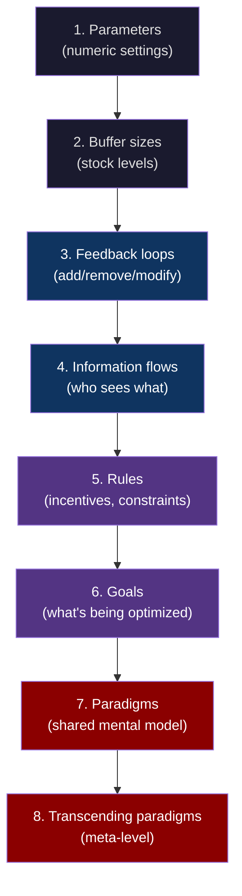
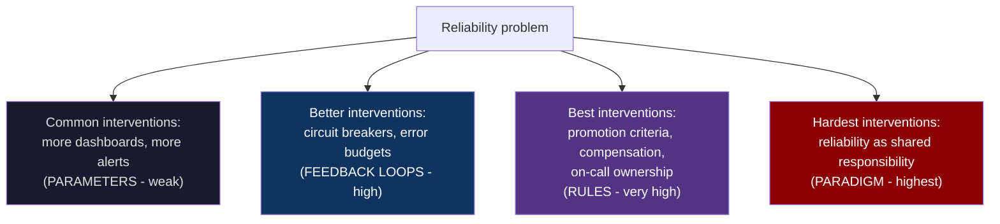
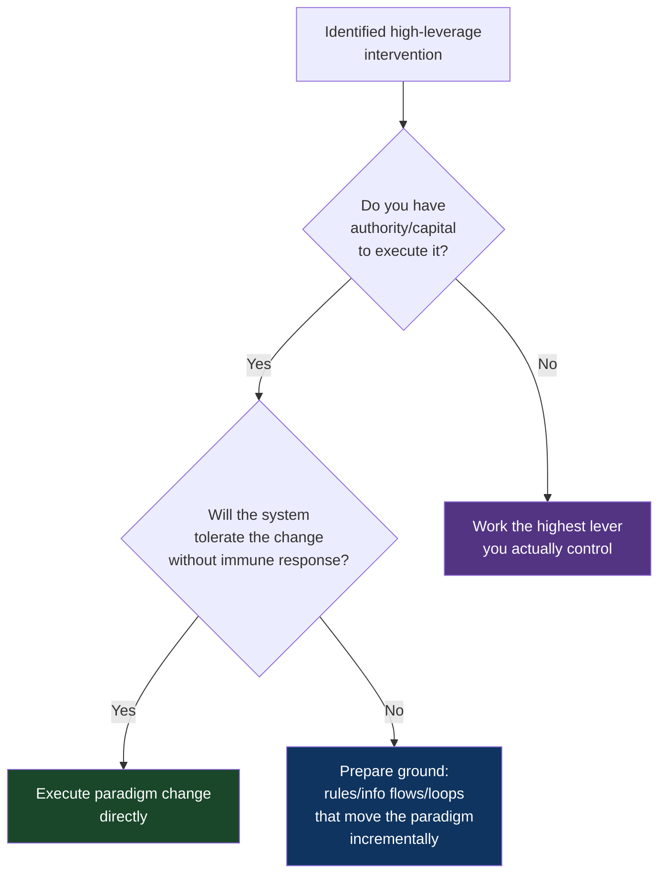

# CH-11: Leverage Points
### *Why the lever you can pull is almost never the lever that would actually move the system*

> **Part 3 of 5 · Systems Are Where Problems Live**
> **Model Type:** `system`

---

## The Misread

A CEO is concerned about company culture. He's been hearing complaints — people feel siloed, decisions take too long, there's not enough trust across teams. He decides to do something about it.

He commissions a culture initiative. The initiative includes: a new set of company values (rolled out at a Friday all-hands), a quarterly off-site for cross-functional collaboration, a Slack channel called #wins where people can share team accomplishments, a manager training program on giving feedback, and a redesigned Monday all-hands focused on celebrating team contributions. Total cost: roughly $400K and an enormous amount of senior management attention.

Six months later, the culture surveys are unchanged. The Slack channel is dead. The off-site was awkward. The values are not referenced in any actual decision the leadership team has made. The complaints have not changed. The CEO is frustrated; he did the work, and the culture didn't move.

He doesn't see what didn't change. The *promotion criteria* are unchanged. The *compensation philosophy* is unchanged. The *decision-making process* (who actually decides what, by what mechanism) is unchanged. The *org structure* (what teams exist, what they own, how they interface) is unchanged. The *hiring bar* and *firing bar* are unchanged. Each of these is something that *materially shapes* how people behave at the company every day. None of them were touched by the initiative.

The culture initiative addressed *parameters* — surface knobs like meeting cadence and channel naming. The actual culture is generated by deeper structures — the rules of who gets ahead, the goals the company is actually optimizing for, the underlying paradigm of how leadership thinks about people. The deeper structures generate the surface behaviors. Tweaking the surface and not the structures is like changing the weather report and being surprised that it didn't rain.

The CEO did real work, and the work was at the wrong leverage level. Worse: the work consumed the political capital and attention that would have been needed to move the deeper levers. Having "tried" the culture initiative, the leadership team now feels they've addressed culture and don't want to revisit it for a while. The wrong leverage point also burned the opportunity to use the right ones.

## The Blind Spot

We confuse *the levers we can see* with *the levers that would move things*. The most visible levers — announcements, programs, meetings, communications — are usually the weakest. The most powerful levers — rules, goals, paradigms — are often deeper in the system, less visible, and harder to move. The visible-strong correlation runs backwards: things you can easily change usually do little, and things that would do a lot are usually hard to change.

The blind spot is amplified by *availability*. The CEO can see the all-hands; the all-hands feels like an intervention. The CEO can't easily see the compensation philosophy; even if he can see it, changing it requires negotiating with the CFO, the comp committee, the board, every functional leader. The weak lever is in front of him; the strong lever is behind a thicket of social and political work. He pulls the weak one because he can.

The deeper blind spot, the one Meadows identified: *the system's resistance to being changed scales with the leverage of the change*. Weak levers are easy to pull because nothing important changes when you pull them. Strong levers are hard to pull because they would actually change something. The resistance you feel is approximately a *signal of leverage* — the harder it is to move, the more important it would be to move. Most people read the resistance as "we shouldn't try this" and back off, which is exactly the wrong inference.

## The Model, Precisely

**Leverage Points (Meadows' Hierarchy).**

Interventions in a system can be ranked by leverage — how much the system actually changes per unit of intervention effort. From weakest to strongest:

1. **Parameters** — numeric values, settings, knobs (e.g., a threshold, a budget number, a meeting frequency). Easy to change, low leverage.
2. **Buffer sizes** — the stocks the system carries (e.g., inventory, cash reserves). Medium effort to change, modest leverage.
3. **Feedback loops** — adding, removing, or modifying the loops that govern the system's behavior (e.g., adding a circuit breaker, changing how info flows). High leverage.
4. **Information flows** — who can see what, what gets measured and reported. Surprisingly high leverage — making information visible to actors who couldn't see it before reshapes their decisions.
5. **Rules** — incentives, constraints, what is allowed and rewarded (e.g., promotion criteria, compensation structure, regulatory framework). Very high leverage.
6. **Goals** — what the system is actually optimizing for (often different from what it claims to optimize for). Very high leverage; very hard to change.
7. **Paradigms** — the shared mental model the system's participants hold about what the system is and what it's for. Highest leverage; hardest to change.
8. **The power to transcend paradigms** — the ability to recognize that the paradigm itself is a choice, and to hold multiple paradigms loosely. Meta-level; almost no individual achieves this routinely.

What this model makes visible: every intervention you consider has a *leverage rating*. Most teams default to the weak end (parameters, buffer sizes) because those are visible and politically cheap. The teams that actually change systems work at the strong end (rules, goals, paradigms) and accept the political cost.

Spatially: think of a system as a machine. Parameters are dials on the front panel; you can turn them and small things change. Buffer sizes are reservoirs you can fill or drain. Feedback loops are circuit boards you can rewire. Information flows are sensors and displays you can connect or disconnect. Rules are the *machine's specification* — what kinds of inputs it accepts, what it does with them. Goals are *what the machine was built to do*. Paradigms are the *worldview that made building this kind of machine seem like the right thing to do.* The further down the list you go, the more of the machine you're actually reshaping.

Meadows' insight was not just the hierarchy. It was that *people invariably push on the weak end and complain when the system doesn't change.* The strong end is harder, requires more political work, and produces effects that are often invisible to outsiders (a culture is not directly observable; you only see its surface manifestations). So everyone works on the surface, and the systems persist.

## Three Domains, One Model

### Domain 1: Engineering — Why Most "Reliability Initiatives" Fail

An engineering org has a reliability problem. Incidents are frequent. The leadership decides to "improve reliability."

The parameter-level interventions: add more monitoring (more dashboards, more alerts). Lower alert thresholds. Increase the number of pages per week. Add a weekly "reliability review" meeting. Result: alert fatigue increases, on-call quality of life degrades, no actual change in incidents.

The buffer-level interventions: add redundancy (more replicas, more regions). Add capacity (over-provision by 50%). Add staffing on the on-call rotation. Result: cost goes up significantly. Some incidents are absorbed by the buffer, but the underlying causes continue and the buffer is eventually saturated.

The feedback-loop level: add circuit breakers, rate limiting, load shedding. Add error budget policies that *block* new feature deploys when reliability degrades. The first three interventions are technical; the last (error budget blocking) is organizational — it's a feedback loop that says "if reliability is poor, the system stops accepting new risk." This is high leverage because it changes the *incentive landscape* for the teams shipping changes.

The rules level: change the promotion criteria for engineers to include reliability work. Change the compensation structure so that on-call burden is compensated. Change the org chart so that on-call responsibility lives with the teams that own the code being paged on (rather than a centralized SRE team taking the heat for everyone). This is much higher leverage because it changes *what work people optimize for*.

The goals level: change what the company is actually optimizing for. If the company's true goal is "ship features as fast as possible" with reliability as an afterthought, no amount of parameter-tweaking will fix reliability. The goal generates the behavior. Changing the stated goal is easy (post a new value); changing the *actual* goal (what leadership rewards in performance reviews, what gets celebrated, what gets criticized) is hard. But it's where the leverage is.

The paradigm level: shift from "reliability is the SRE team's job" to "reliability is a property of the system that every engineer is co-responsible for." This is the paradigm shift Google's SRE book documented (and that took Google itself years to achieve internally). A team that has made this shift behaves entirely differently from one that hasn't, on every reliability dimension. No parameter-level intervention can produce that change.

### Domain 2: Organization — Why "Hiring Better People" Doesn't Fix Things

Every struggling team eventually concludes that the answer is to hire better people. They tighten the hiring bar, invest in recruiting, lower the conversion rate, and bring in more impressive resumes.

The new hires arrive. Six months later, the team's problems are unchanged. The new hires are now also unhappy, also producing the same kind of work the team was producing before, also generating the same complaints from stakeholders.

What happened: the team's behavior was being generated by the *system the team was operating in* (the rules: how decisions get made, how performance is measured, what is rewarded; the goals: what the team is actually optimizing for; the paradigm: what kind of team this is and what it does). The hiring intervention was at the wrong leverage level. The team didn't lack talent; it lacked structural conditions that would let talent be productive. Adding more talent to the same conditions produces more frustrated talent, not better outcomes.

This pattern is so common that a meta-pattern emerges: organizations that struggle to retain talent often *also* struggle to recognize that the talent's departure is a signal about the system, not about the talent. They respond to departures by hiring replacements, who then also leave, who then are also replaced. The hiring lever has been pulled hundreds of times without ever moving the underlying system. The cost of all that hiring is paid; the benefit was always going to be limited because the leverage was wrong.

The high-leverage move — restructuring the rules of how the team operates — is harder, more political, and often opposed by the people who designed the original rules. Most leaders don't have the political capital or stamina to make the change. So the hiring lever gets pulled again.

### Domain 3: Wikipedia and the Encyclopedia Paradigm

Encyclopedias, for centuries, operated on a stable paradigm: encyclopedias are written by experts, edited by professionals, published by institutions, and updated periodically through editions. Britannica, the most prestigious example, employed thousands of contributors and editors, charged hundreds of dollars per set, and updated content every few years.

Various reform efforts addressed parameters within this paradigm: faster update cycles, more diverse contributors, online versions, cheaper pricing. These were real improvements. They preserved the underlying paradigm.

Wikipedia, launched in 2001, changed the *paradigm*: an encyclopedia can be written by *anyone*, edited *continuously*, with *no central editorial authority*. This was not a parameter tweak; it was a fundamentally different theory of what an encyclopedia is and how it works. Almost everyone who first encountered the model thought it would fail. The objections were obvious: vandalism, errors, bias, lack of expertise. Britannica's editorial structure had evolved precisely to prevent these things.

Within ten years, Wikipedia had more articles, more languages, more contributors, and (by some measures) comparable accuracy to Britannica on most subjects. Britannica eventually ceased print publication. The paradigm shift had won.

The leverage of the paradigm change was enormous and the parameter-level optimizations within the old paradigm were no match. Britannica could not have responded by being a better version of Britannica. It would have had to *become Wikipedia* to compete, which would have required killing the paradigm it had been built on for two hundred years.

This is the lesson at its starkest. Paradigm shifts beat parameter optimization, and they beat them by a large margin. The leverage hierarchy is not just theoretical; it is the explanation for why incumbent organizations so reliably lose to challengers that operate on a different paradigm.

## Where The Model Breaks

**The hidden assumption:** you have the *authority and political capital* to move the higher-leverage lever you've identified.

Identifying the right leverage point and being unable to pull it is sometimes worse than working a weaker lever you control. If you can see that the company's promotion criteria need to change but you have no influence on promotion criteria, then *knowing this* doesn't help — and the frustration of seeing the right lever while having access only to wrong ones can be demoralizing in ways that make even the wrong-lever work worse.

A subtler failure: paradigm shifts are slow. A company in genuine crisis cannot wait for a paradigm to evolve. The CEO who tries to shift the paradigm while the building is burning is doing the right thing too late. Sometimes you need to pull weak levers because they're the only ones that move fast enough.

A third failure: occasionally a system is genuinely well-tuned and the right intervention *is* a parameter tweak. A thermostat doesn't need a paradigm shift; it needs its setpoint adjusted by 2 degrees. Treating every system as needing a paradigm-level intervention is its own pathology — the over-application of systems thinking. Most systems are mostly fine and the appropriate intervention is small.

A fourth failure: paradigm shifts produce *immune responses* from the people invested in the old paradigm. If your paradigm-shifting intervention triggers an immune response strong enough to kill the intervention (and you), you've failed entirely. Sometimes the right move is a series of feedback-loop or rule changes that *prepare the ground* for an eventual paradigm shift, rather than attempting the paradigm shift directly when the system is unwilling.

**The signal you're in the break zone:** you've identified a paradigm-level intervention, but you have neither the authority nor the time horizon to execute it. In that case, the highest leverage you can *actually* achieve is somewhere below paradigm — at rules, at information flows, at feedback loops. Work the highest lever you can move, not the highest lever you can see. The frustration of seeing further than you can reach is real, but acting on the unreachable lever produces nothing.

## The Collision

**This model says:** go for the highest-leverage intervention you can find; weak levers waste effort.
**Marginal Improvement / Incrementalism says:** sustainable change comes from many small improvements over time; trying to make a paradigm shift in one step produces immune response and failure.

The collision is real. Leverage-points thinking will push you toward the paradigm end; incrementalism will pull you toward the parameter end. Both are sometimes right.

Scenario where they collide: a team is trying to improve its development process. Leverage thinking says: "Our problem is the entire 'feature factory' paradigm — we're optimizing for shipping, not for impact; we need to restructure the team around outcomes, not outputs." Incrementalism says: "We can't restructure everything in one quarter; let's improve one thing at a time — better backlog grooming this quarter, better metrics next quarter, eventually we evolve toward outcome-orientation."

Both views are defensible. Leverage thinking is right that incrementalism within a broken paradigm produces local optima inside global failure. Incrementalism is right that paradigm changes that the organization isn't ready for produce immune response and reversal.

**The meta-skill:** the deciding signal is *what the system can absorb*. Strong levers pulled in systems that aren't ready produce reversal — the change is rejected, you lose credibility, the lever becomes harder to pull next time. Weak levers in systems that need strong intervention produce theater — you appear to be acting, nothing changes, eventually leadership concludes "we tried." The skill is to pull the *strongest lever the system can absorb without rejecting*, which is usually a few rungs below the maximally identifiable leverage. Climbing the hierarchy gradually — first feedback loops, then information flows, then rules, then goals, then paradigms — is often the only feasible path to the top.

## The Retrofit

**Event:** Toyota Production System (TPS), as developed by Taiichi Ohno at Toyota in the 1950s–1980s.

Manufacturing in the mid-20th century was dominated by the American mass-production model, exemplified by Ford: long production runs of identical products, large inventories, specialized workers doing single tasks. The goal of the system, as understood by everyone in the industry, was *throughput*: produce as many units per hour as possible. The paradigm was *economies of scale* — bigger runs, more output, lower per-unit cost.

Toyota, operating in a smaller market with less capital, could not compete on scale. Ohno's contribution was a paradigm shift. He reframed the goal of the production system from *maximize throughput* to *minimize waste*. This sounds incremental. It was not. "Waste" in Ohno's framing included: overproduction, waiting time, transportation, unnecessary processing, inventory, motion, defects. Each of these had been *invisible* in the throughput paradigm — they were the cost of doing business at scale, and nobody had tried to systematically eliminate them.

From the new goal, a cascade of *rules-level* changes followed. Just-in-time inventory (eliminating the buffer of inventory the throughput paradigm depended on). Andon cords that *any worker* could pull to stop the line (a feedback loop that gave information directly to the people doing the work). Kaizen — continuous improvement driven from the floor. Heijunka — production smoothing. These weren't tweaks within mass production; they were the consequences of having changed the goal of the system.

The American auto industry watched Toyota for decades and largely failed to copy it. They could copy specific *practices* — they tried JIT, they tried kaizen circles — but the practices didn't work in their organizations because the *paradigm* was still throughput-maximization. The practices were parameters being plugged into a system whose goals were different. The practices either failed or produced ironic outcomes (e.g., JIT without the underlying paradigm produced stockouts and reliability problems, leading American firms to conclude that JIT "doesn't work").

Re-reading through leverage points: Toyota's success was not the practices. The practices were *artifacts* of having changed the goal of the production system. The American firms were trying to copy the artifacts without changing the goal. They were pulling parameter-level levers (specific practices) while leaving the goal-level lever (the throughput paradigm) untouched. The result was the predictable one: the system did not change because the leverage was wrong.

**What was invisible:** the throughput paradigm was so deeply embedded in American manufacturing that it wasn't perceived as a paradigm. It was perceived as *what manufacturing is*. Suggesting a different goal sounded crazy. Ohno had been freed from this by Toyota's circumstances (no capital for scale) and by working far enough from Detroit that the paradigm wasn't enforced on him.

**The intervention point:** any American manufacturer between 1970 and 1990 who had been willing to change the *goal* of their production system — and accept the structural changes that flowed from the new goal — could have competed with Toyota. Very few did, because the goal change required dismantling everything that had been built around the throughput goal. The leverage was visible. The political and structural cost of pulling the lever was prohibitive. So Toyota won.

## The Practice Rep

> **Duration:** 48 hours
> **What you're training:** identifying the leverage level of interventions and noticing when you're pushing on the wrong rung

**The exercise:**
Pick one recurring frustration at work — something you've been pushing on for a while without much movement. Could be a team dynamic, a process problem, a system you maintain, a relationship with a stakeholder. One thing.

Write down two lists:

**List A: Levers I've been pulling.** For each lever, label its rung in the hierarchy (parameter, buffer, feedback loop, info flow, rule, goal, paradigm).

**List B: Levers that would actually move this.** Honest assessment. For each, label its rung.

Compare the lists.

**What to look for:**
The pattern most people see: List A is concentrated at the bottom rungs (parameters, buffer sizes). List B is concentrated at the top (rules, goals, sometimes paradigms). The mismatch is the diagnosis.

Now ask the harder question: for the highest lever in List B, do I have the authority and capital to pull it? If yes — why haven't you? (Usually the answer is fear of the political cost; sometimes the answer is genuinely good — "the system isn't ready and would reject the intervention.") If no — what's the highest lever I do have authority to pull? *That* is where your effort should go for the next quarter. Stop pulling lower levers in the hope they'll add up. They won't.

**The log:**
At the end of 48 hours, write one sentence: "I saw Leverage Points at work when [the specific recurring frustration whose resolution required moving a lever higher up the hierarchy than I had been working]."
