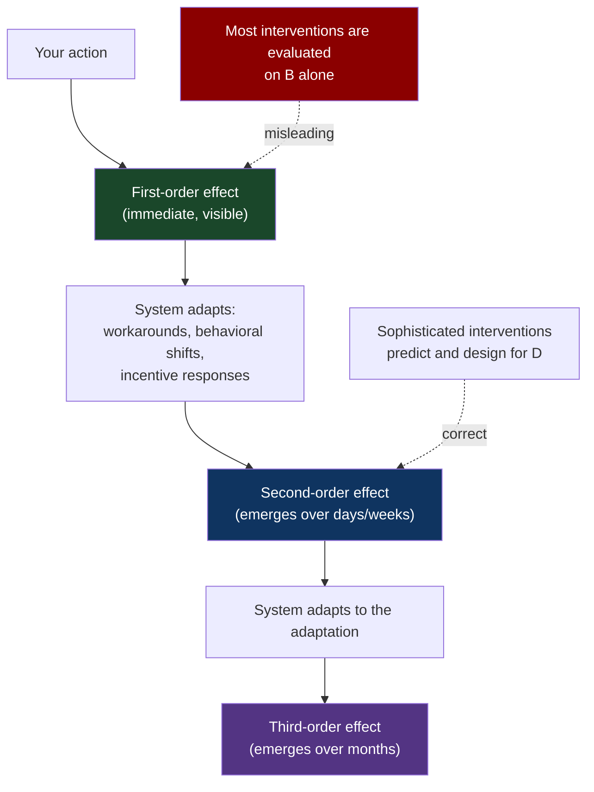
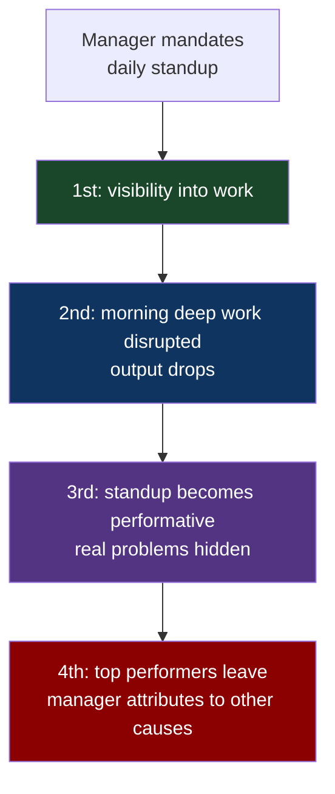
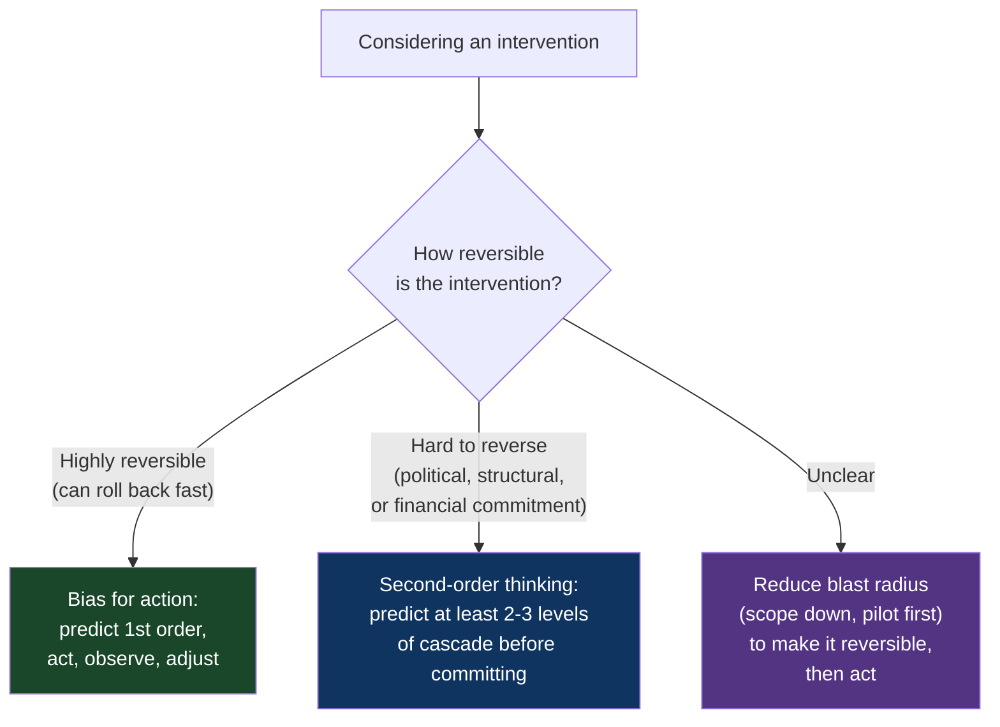

# CH-12: Second-Order Effects
### *Why the consequences that matter live two layers deeper than the consequences you can see*

> **Part 3 of 5 · Systems Are Where Problems Live**
> **Model Type:** `system`

---

## The Misread

A platform team has been hit with a string of incidents caused by misconfigured deploys. The pattern is consistent: an engineer deploys a change, the change has a config error that wasn't caught in pre-production, the change breaks something in production, the team scrambles to roll back. Over six months, there are eleven incidents of this kind.

The team's response is reasonable: add a config validation gate to the deploy pipeline. Any deploy that fails config validation is blocked until the engineer fixes it. The validation is rigorous; it catches the exact patterns that had been causing incidents.

Three months later: zero config-related incidents. The intervention worked.

Six months later, the team has a major incident from a different cause. An engineer had bypassed the deploy pipeline entirely — used a manual SSH path to update a service — because the validation gate had become so onerous that legitimate emergency fixes were being blocked for hours waiting for validation issues to be resolved. The manual path bypassed not just the config validation but also the change log, the rollback automation, and the monitoring hooks. The incident took 4 hours to resolve instead of the typical 20 minutes, because the team didn't even know exactly what had changed.

In the post-mortem, someone points out: the validation gate solved the original problem. It also created an *alternative path* (the manual bypass) that was used routinely for emergencies, and that bypass had been silently accumulating risk for months. The team had successfully addressed the first-order cause of the original incidents. They had created a second-order pattern that produced a bigger, less-understood class of incidents.

The first-order effect of the validation gate was visible immediately: fewer config errors. The second-order effect — the *system's adaptation to the gate*, including the workarounds that grew up around it — took six months to surface. The team's intervention had been correct in isolation and wrong in the system. The system had responded to the intervention in ways the intervention did not anticipate.

## The Blind Spot

We evaluate interventions by their *first-order* effects: the immediate, visible consequence of the action. This is what our intuitions are calibrated for, and it's what most analytical tools surface. The first-order effect of adding a validation gate is *fewer config errors*; the first-order effect of adding a meeting is *more information shared*; the first-order effect of changing a pricing model is *immediate revenue change*.

The second-order effect — how the system *adapts* to the intervention — is invisible at the time of intervention and often invisible for months afterward. The validation gate creates pressure to find workarounds. The added meeting consumes attention that was being used for deep work. The pricing change shifts who buys, what they buy, and how they use what they buy. These second-order effects often have larger magnitude than the first-order ones, but they don't appear until the system has had time to adapt.

The blind spot is structural. Humans evolved in environments where the systems we interacted with had limited adaptive capacity — physical environments, simple tools, small social groups. In modern environments (organizations, markets, software systems, ecosystems), the systems we act on are heavily adaptive, and our actions trigger responses that propagate through many cycles. Our intuitions were not calibrated for this. They evaluate the first-order effect, declare success or failure, and miss the cascade that follows.

## The Model, Precisely

**Second-Order (and Higher) Effects.**

When you act on a system, the system responds. The *first-order effect* is the immediate response. The *second-order effect* is how the system *adapts* to your action — how other components shift in response to the change in the original component. The *third-order effect* is how the system adapts to *that* adaptation. The interesting consequences usually live at the second or third order, not the first.

What this model makes visible: most interventions have second-order effects that are larger and longer-lived than the first-order ones, and these effects are systematically under-predicted by intervention designers. The model is a discipline of asking, before every meaningful intervention: "after this happens, the system will respond by ____" — and continuing to ask "and then ____" until you can predict at least two or three steps of cascade.

Spatially: imagine throwing a stone into a pond. The first-order effect is the splash. The second-order effects are the ripples spreading outward and interacting with the shore, reflecting back, interfering with each other. The third-order effects are the changes in fish behavior, the dispersal of pond scum, the temporary mixing of stratified water layers. The stone-thrower sees the splash and walks away. The pond's behavior over the next hour was the more important story.

Charlie Munger's pithy framing of this discipline: "And then what?" — asked recursively for any decision. Most decisions don't survive the second iteration of the question. The decisions that do survive — the ones whose proponents have thought through "and then what?" three or four times — are usually much better designed than the ones that haven't.

## Three Domains, One Model

### Domain 1: Engineering — Rate Limiting

A service starts getting more traffic than it can handle. The team adds rate limiting: each client gets, say, 1000 requests per minute; anything beyond that returns 429.

First-order effect: load on the service drops. The service stops crashing. The team is pleased.

Second-order effect: clients implement retry logic. They detect the 429, wait a bit, retry. The retries succeed because they fall within the next minute's quota. The effective throughput to a determined client is now *higher than 1000/min* — they're using their quota every minute, with retries smoothing over rate-limit responses. The total traffic to the service has barely decreased; it's just shifted in time.

Third-order effect: clients with poor retry implementations create retry storms (CH-10 territory) that briefly spike load above the original problem. Clients with good retry implementations and large user bases consume their full quota constantly, leaving no headroom for traffic bursts from other clients. The "rate limit" has become a *minimum* for sophisticated clients and an *obstacle* for less sophisticated ones — close to the opposite of the intended effect.

Fourth-order effect: client teams start lobbying for higher quotas. The platform team starts negotiating quotas on a per-client basis. The single "1000/min" number becomes a quagmire of client-specific exceptions. The original goal (protect the service from overload) is now buried under contractual and political complexity.

A team that had thought through "and then what?" twice before implementing rate limiting would have designed differently. They might have added cost-based prioritization (different request types get different quotas). They might have added a separate burst budget. They might have added load shedding that drops *low-value* requests first rather than uniformly enforcing per-client quotas. The first-order intervention (rate limiting) was correct in spirit; the specific implementation was correct only at the first order, and the second-order consequences were what made it fail.

### Domain 2: Organization — Mandating Standups

A new engineering manager joins a team. He notices the team isn't well-coordinated; he can't get a sense of what people are working on. He decides to mandate daily standups, 15 minutes each morning.

First-order effect: he has visibility. He knows what everyone is working on, at least in summary form. The team has a coordination point. This is good.

Second-order effect: the standup creates a daily synchronous interruption for every engineer, at the same time. Engineers who do their best deep work in the morning lose their best hours. The 15-minute meeting consumes more like 30–45 minutes of effective time once you account for context-switching costs. Output drops. Engineers don't initially complain because the manager is new and the standup feels normal.

Third-order effect: the standup gradually becomes performative. Engineers report what looks impressive rather than what's actually happening, because the standup is the only regular venue where the manager (and peers) hear about their work. Real problems get under-reported because reporting them in front of peers feels exposing. The manager's apparent "visibility" is increasingly into a curated narrative.

Fourth-order effect: the highest-performing engineers, who valued their morning deep-work time, start interviewing elsewhere. They leave for teams that don't have daily standups. The manager, who is reading the situation through the standup's curated narrative, doesn't see the departure coming. When the engineer announces they're leaving, the manager attributes it to "external opportunity" or "personal reasons" — not the standup, which the manager still believes is a clear win.

The intervention (standup) was reasonable. The cascade through second, third, and fourth-order effects was predictable to anyone who had thought through "and then what?" twice. Most managers don't, because the first-order benefit (visibility) is immediate and felt by the manager, while the cascade is delayed and felt mostly by others.

### Domain 3: Mao's Four Pests Campaign

In 1958, China launched the Four Pests Campaign as part of the Great Leap Forward. The four targets were mosquitoes, rodents, flies, and sparrows. Sparrows were included because they ate grain seeds; eliminating them was supposed to protect crops.

First-order effect: the campaign was successful at killing sparrows. Hundreds of millions were killed through coordinated nationwide effort — citizens banged pots to keep birds in flight until they fell from exhaustion. By 1960, sparrows were nearly extinct in many regions.

Second-order effect: the sparrows had been eating not just grain seeds, but also locusts and other insects. With the sparrow population collapsed, the locust population exploded.

Third-order effect: the locust swarms devastated grain crops on a scale far exceeding what the sparrows had ever eaten. Combined with other policy failures of the Great Leap Forward, the agricultural disaster contributed to a famine that killed an estimated 15–55 million people, one of the largest in human history.

The policy designers had evaluated the first-order effect (less seed eaten by sparrows) and projected first-order benefits (more grain). They had not asked "and then what?" The sparrows were embedded in an ecosystem with multiple feedback loops; removing them collapsed the loops in directions that produced catastrophe. The model — sparrow eats grain, kill sparrow, save grain — was first-order accurate and totally wrong about the system.

This is the most extreme example of second-order blindness having human consequences. The pattern recurs at smaller scales constantly: introduce a "predator control" program and watch the prey population explode and crash; remove a "nuisance" species and discover it was load-bearing for the ecosystem; eliminate an "obstacle" only to find that the obstacle was holding something else in place. Ecology is densely connected; first-order interventions almost always produce surprising cascades. The same is true of any system with multiple interacting feedback loops, which is to say almost every interesting system humans deal with.

## Where The Model Breaks

**The hidden assumption:** the system being acted on is sufficiently complex and adaptive that the second-order effects are non-trivial.

In genuinely simple systems — small scope, short feedback loop, no adaptive agents — second-order effects are negligible and the first-order analysis is sufficient. If you're fixing a typo in a documentation file, "and then what?" produces "the typo is fixed; that's the end." Forcing second-order thinking here is paranoia disguised as rigor.

A subtler failure: second-order thinking can become *paralysis*. If you commit to thinking through second-, third-, fourth-order effects before any action, you'll act on nothing. The cascade is in principle infinite, and reasoning about distant consequences has diminishing returns because the uncertainty compounds. At some depth, your "second-order prediction" is just a guess.

A third failure: in chaotic systems, second-order predictions are *not even probabilistically meaningful*. Weather forecasts work at 5–10 days and break down beyond that not because forecasters are bad but because chaos in the system genuinely makes longer-horizon predictions impossible. Organizational dynamics, market behavior, ecosystem responses often have chaotic elements where your second-order prediction is approximately a fantasy. The right response there is humble experimentation — cheap, reversible actions whose feedback you can observe and adapt to — not deeper reasoning about effects you can't reliably predict.

**The signal you're in the break zone:** your second-order prediction is becoming speculative and the cost of acting is low and reversible. In that case, stop predicting and start observing. Most organizational interventions have a tractable second-order effect that careful thinking can surface, but the third- and fourth-order effects often need empirical observation. The discipline is "predict what's predictable, observe what isn't."

## The Collision

**This model says:** think through "and then what?" recursively before acting.
**Bias for Action says:** the cost of over-analysis exceeds the cost of misstep; act, observe, correct.

Both are sometimes right. The collision lives in deciding which kind of decision you're facing.

Scenario where they collide: a team is deciding whether to deprecate an old API endpoint that has 30 internal consumers. Second-order thinking says: "Identify each consumer; predict how they'll respond to deprecation; predict whether they'll migrate, complain, or build workarounds; predict the political cost of each response; design the deprecation plan to minimize cascading failure." This is the right approach if the cost of getting it wrong is high (broken services, lost trust, dead products).

Bias for action says: "Announce deprecation with a 90-day timeline; help the few teams who actually need help; let the rest sort themselves out. The cost of over-engineering the deprecation plan exceeds the cost of dealing with whatever fallout actually emerges." This is right if the cost of the fallout is bounded and reversible.

**The meta-skill:** the deciding signal is *reversibility*. Reversible decisions can be made on first-order analysis and corrected by observation. Irreversible decisions (or decisions that will be hard to reverse for political reasons) deserve second-order analysis before committing. This is Bezos's "one-way door / two-way door" framing in different language. The mistake is treating two-way doors as one-way (over-analyzing reversible decisions) or one-way doors as two-way (under-analyzing irreversible ones). Both mistakes are common; the second is more dangerous.

## The Retrofit

**Event:** Prohibition in the United States, 1920–1933. The 18th Amendment banned the production, transport, and sale of alcoholic beverages, intending to reduce alcoholism, domestic violence, and public health problems associated with drinking.

First-order effect: legal alcohol sales did decrease. Per capita consumption dropped by roughly 30–50% in the early years of Prohibition. Cirrhosis-related deaths decreased. Saloons closed. The reformers had achieved their immediate goal.

Second-order effects: an illegal market emerged to satisfy continued demand. The illegal market required producers (illegal distilleries), distributors (smugglers), and retailers (speakeasies). Organized crime, which had been a fringe phenomenon in American life, scaled up dramatically to fill these roles. Figures like Al Capone, who had been small-time street criminals before Prohibition, became multi-millionaires running organizations with hundreds of employees, lawyers, accountants, and political connections.

Third-order effects: the revenue and power of organized crime created political corruption at every level of government. Police, judges, and politicians were systematically bribed. The American legal system's legitimacy was eroded by the visible reality that alcohol prohibition was un-enforceable and that enforcement officials were on the take. Public respect for law in general — not just prohibition law — declined.

Fourth-order effects: the criminal organizations built during Prohibition did not disappear when Prohibition was repealed in 1933. They diversified into other illegal markets: gambling, prostitution, labor racketeering, and eventually narcotics. The infrastructure built to satisfy alcohol demand became the infrastructure for organized crime generally, persisting for decades. Some historians argue that contemporary American organized crime traces directly to the institutional capacity built during Prohibition.

Re-reading through second-order effects: every step of this cascade was predictable in principle. Prohibition's designers were not idiots; many were thoughtful reformers with serious arguments. They had thought through the first-order effect (less drinking) and projected first-order benefits (less alcoholism). They had not thought through "and then what?" with any rigor. The cascade — illegal market, organized crime, political corruption, durable criminal infrastructure — emerged exactly as the structural logic implied. By the time it was visible, the fourth-order effects had become themselves part of the system, no longer responsive to repealing the original intervention.

**What was invisible:** the demand for alcohol was a *stock* (CH-09) that the legal supply had been draining. Eliminating the legal supply did not eliminate the demand; it just shifted where the demand would be met. Anyone who had thought of demand as a stock that needed to *go somewhere* would have predicted the illegal market. Most Prohibition advocates implicitly assumed that *eliminating supply would eliminate demand* — a model that's first-order correct in some economics textbooks and completely wrong about addictive substances or strongly desired goods.

**The intervention point:** several economists and social observers at the time *did* predict the cascade. They were treated as cynics or apologists for the saloon industry. The political moment in 1920 was strong enough that second-order arguments — "this will create an illegal market that will fund organized crime" — were dismissed as defeatist. The lesson generalizes: when political momentum behind an intervention is strong, second-order arguments are often suppressed because they slow the intervention. The momentum is also why the intervention's second-order costs are usually borne in full — by the time they're undeniable, the political capital to reverse course has been spent.

## The Practice Rep

> **Duration:** 48 hours
> **What you're training:** the discipline of asking "and then what?" recursively before acting, especially on irreversible decisions

**The exercise:**
For the next 48 hours, every time you're about to make a decision of any significance — a code change with system-wide impact, a process change, a hiring decision, a Slack message that announces a new policy, a meeting invitation that establishes a new norm — pause and write down four lines:

1. "Immediately after this happens, the result will be: ____." (First-order)
2. "Then the system will respond by: ____." (Second-order)
3. "And then the system will adapt by: ____." (Third-order)
4. "Six months later, the lasting effect will be: ____." (Long-horizon)

The third and fourth lines will feel speculative. That's fine. The discipline is to make the speculation explicit so you can check it against reality later.

**What to look for:**
At least one of the decisions you analyze will show a second-order effect that *changes your view of whether to make the decision at all*. The first-order benefit will be real; the second-order cost will be larger; the net effect will be negative. That moment — when "and then what?" reveals that the obvious decision is wrong — is the model running. The decision you would have made on first-order analysis would have produced months of unanticipated cleanup.

Equally important: you'll find decisions where the second-order analysis confirms the first-order intuition. The cascade is fine. The decision is correct. The model didn't change your action, but it did increase your confidence — and crucially, it specified *what to watch for* so that if the second-order effects start to surprise you, you'll notice. Predictive failure with surveillance beats predictive failure without it.

**The log:**
At the end of 48 hours, write one sentence: "I saw Second-Order Effects at work when [the specific moment 'and then what?' revealed a cascade that changed my decision, or specified what to monitor afterward]."
