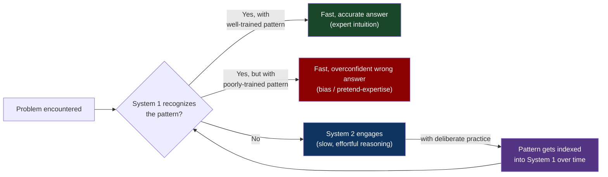
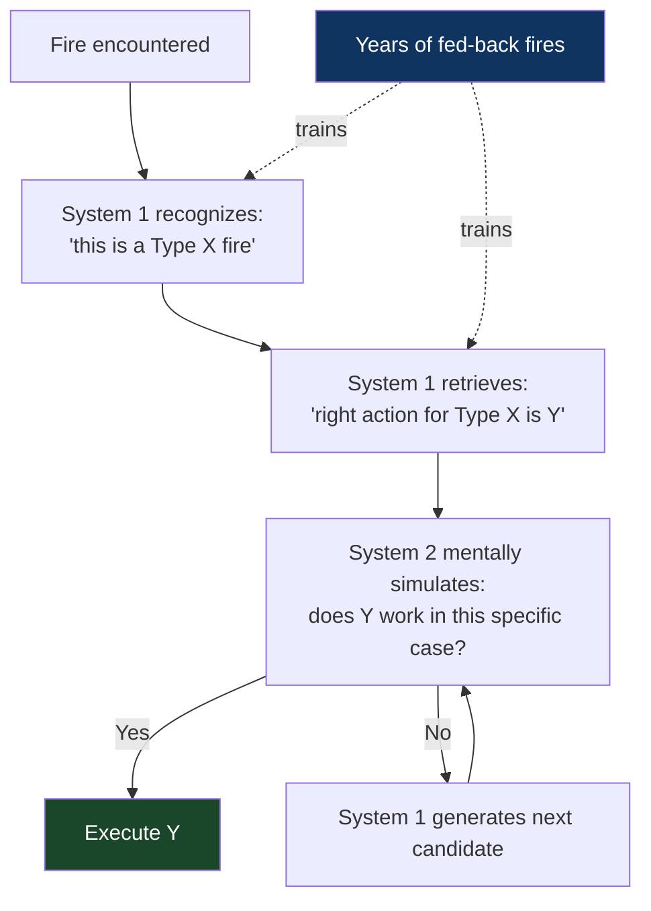
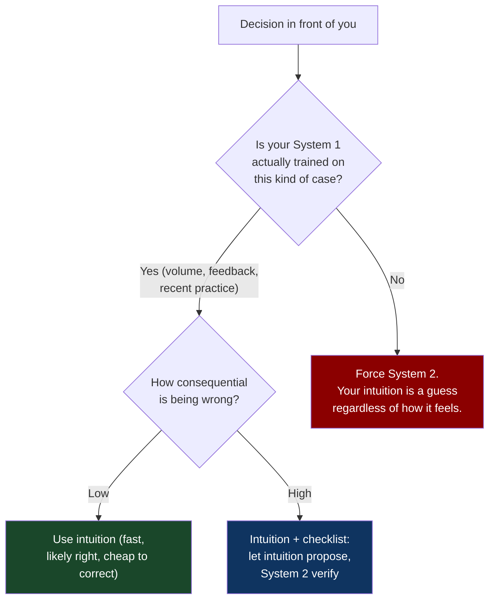

# CH-13: The Two Systems
### *Why fast intuition isn't inferior to slow reasoning — and why most untrained intuition is worse than both*

> **Part 4 of 5 · Your Brain Against You**
> **Model Type:** `perception`

---

## The Misread

A senior engineer is paired with a new hire for an afternoon. The new hire is brilliant on paper — top of her class, strong references, an excellent take-home test. They're working through a production debugging task together; a service is intermittently returning the wrong customer's data, with no clear pattern in the logs.

The senior engineer pulls up the service logs, scrolls for about forty seconds, and says, "It's the connection pool. Probably a race in how we're checking out connections — one customer's transaction is getting attached to another customer's connection."

The new hire is incredulous. The senior engineer has not read any code, has not added any instrumentation, has not formed any hypotheses out loud. He just looked at log lines and *knew*. She asks him to explain how he arrived at this. He tries. The explanation is halting and unsatisfying: "These error patterns... when I see them with this kind of frequency... in services using this connection library... it's usually the pool." He cannot really articulate the chain of reasoning. He just *recognized* something.

She concludes that he is somehow smarter than her in a way she might never match. She also vaguely suspects that he's bullshitting — the leap from log lines to root cause was so fast that it doesn't seem like a real diagnostic process.

Both conclusions are wrong. He is not smarter. He is also not bullshitting. He has, over the past eight years, debugged this same class of bug roughly fifteen times. The connection-pool failure pattern is now indexed in his head as a perceptual category, the way an experienced birder recognizes "that's a Cooper's hawk" without consciously checking field marks. The recognition is fast because it has been *trained*. Each of the fifteen prior debugging sessions, in their day, took him hours of slow deliberate reasoning. The fast recognition is the *compressed product* of those hours.

The new hire's mistake is interpreting his speed as a stable trait. It is not a trait; it is a stock of accumulated training that she does not yet have. The good news: she can build it. The bad news: she has to actually do the slow deliberate work fifteen times before her fast recognition starts working. There is no shortcut.

## The Blind Spot

We hold an implicit hierarchy that treats *slow, deliberate, conscious reasoning* (System 2) as the legitimate form of thought and *fast, automatic, intuitive responses* (System 1) as the cheap, unreliable cousin. This hierarchy is wrong, in both directions.

System 1 is not inferior. It is the *foundation of expertise*. A chess master sees positions, not pieces. A skilled doctor reads the room before reading the chart. A great salesperson smells the room. None of these are System 2 outputs; they are System 1 outputs from heavily-trained pattern recognition. Without System 1, expert behavior would be impossible — System 2 is too slow to drive real-time interaction.

System 1 is also not reliably correct. It is *overconfident in domains it has not been trained on.* Most of what we call "bias" is System 1 firing in a domain it has not actually acquired the patterns for, but is generating answers anyway because that's what System 1 does. The "blink" judgment of someone you just met is System 1 doing what System 1 does, but its calibration depends entirely on whether you've had thousands of well-feedbacked exposures to this kind of judgment. Most of the time, you haven't.

The blind spot, then, has two halves: (a) dismissing trained intuition as inferior to deliberate reasoning, which under-uses the most powerful cognitive tool experts have; (b) trusting untrained intuition as if it were trained intuition, which is the source of most overconfident bad judgments. Both halves of the blind spot are the same underlying failure: not distinguishing between *trained* and *untrained* System 1.

## The Model, Precisely

**The Two Systems.**

The mind operates in two modes. **System 1** is fast, automatic, parallel, low-effort, pattern-based, and unconscious. **System 2** is slow, deliberate, serial, high-effort, rule-based, and conscious. Both produce outputs. System 2 *can* override System 1 but rarely does, because System 2 is expensive and lazy by default.

Expertise is *trained System 1 built from past System 2 work*. Each problem you solve with effort today becomes a pattern your System 1 can retrieve cheaply in the future. The expert "knows" things they cannot articulate because the knowledge is in System 1, not System 2. Untrained System 1 is overconfident in proportion to its lack of training — it will produce answers regardless of whether the relevant patterns exist.

What this model makes visible: the goal of deliberate practice is not "get smarter" but *transfer competencies from System 2 (effortful) to System 1 (automatic)*. Every domain you become genuinely fluent in works this way. The implication is that effortful learning that doesn't transfer to System 1 produces "knowledge" you'll forget; effortful practice that does transfer produces durable skill.

Spatially: think of System 1 as a library of pre-built answers retrievable in milliseconds; System 2 as a workshop where new answers can be constructed slowly. The library is much larger and faster than the workshop, but it can only retrieve what's been deposited. The workshop is what deposits things into the library. Most people use the library all day without realizing what's in it; experts use the library on autopilot while the workshop quietly indexes new patterns from the cases the library couldn't handle.

Kahneman's framing in *Thinking, Fast and Slow* is the foundational reference. His central message — that System 1 produces most of our thoughts, that System 2 endorses or corrects them, and that System 2 is *much* lazier than we believe — is the doorway. The corollary, which Kahneman makes less central but which is critical for problem solving: deliberate practice is the only known mechanism for *improving* System 1's catalog in domains where you'd want better intuition.

## Three Domains, One Model

### Domain 1: Engineering — The Senior's Debugging Intuition

Return to the opening scene. The senior engineer's diagnostic was System 1 operating on patterns built from years of System 2 work. The patterns include:

- "Intermittent wrong-customer-data" → small set of candidate causes (connection pooling, caching, request multiplexing, threading, async context propagation)
- "Service uses [specific framework]" → narrows candidate set
- "Logs show [pattern X]" → narrows further
- "Frequency of error is [Y%]" → narrows further

By the time the senior engineer had read forty seconds of logs, his System 1 had cross-referenced multiple signals and returned a high-probability candidate. He didn't run this query consciously. He just *saw* "connection pool race."

The new hire's path to the same capability requires actually doing the System 2 work, several times, on similar cases. Each case takes hours. Most of those hours feel inefficient relative to the senior engineer's forty seconds. They are not inefficient; they are *deposits* into System 1 that will compound into the same forty-second recognition seven years from now.

The pedagogical implication: pair programming with senior engineers transfers some patterns, but only by exposing the junior to enough cases that their own System 1 indexes them. Watching the senior is not enough. The junior must *do the cases themselves*, slowly, and accept that the slowness is the price of the eventual fast recognition.

A second implication: senior engineers often *cannot teach* their fastest skills, because the skills live in System 1 and aren't articulable. The senior's explanation is post-hoc — they retrieve the answer, then construct a verbal account of why the answer is right. The verbal account is often vague and inadequate. This is not the senior failing to teach; it's a property of how the knowledge is stored. The juniors who learn fastest find ways to extract not the *answers* but the *kinds of cases the senior has seen*, and then they generate their own slow practice on similar cases.

### Domain 2: Organization — The Manager Who "Smells" Trouble

A great manager often "knows" their team is in trouble before any metric registers it. They notice a slightly different tone in standups, a slight withdrawal from one engineer, a shift in who initiates conversations in Slack. They feel the team's energy is off. They schedule extra 1:1s. They surface problems early. Other managers in the company marvel at their judgment.

What's actually happening: the manager has, over years, encountered enough cases of team dysfunction that their System 1 has built a "team distress" detector with thousands of indexed features. Most of the features are sub-articulable — they involve patterns of multi-modal information (tone, pace, choice of words, body language in video calls, what's said and what's avoided). The features fire below the threshold of conscious awareness. The manager experiences the result as a feeling: *something is off*.

Less-experienced managers don't have this detector. They wait for metrics to show problems, by which time the problems have been building for months (CH-09 — morale as a delayed stock). The metrics that eventually fire (resignations, low engagement scores, missed deadlines) are stock-level signals; the experienced manager's intuition is reading the flow-level signals directly.

The skill is real and trainable, but the training is hard to design. It requires *exposure to many cases of team distress* — including cases that resolved well and cases that resolved badly — and *honest feedback after each case* about what the early signals had actually been. Most managers don't get this training because their organizations don't surface the post-hoc analysis. A team that imploded six months ago could have been a training case for every manager in the company; usually it's not, because nobody does the structured retrospective.

### Domain 3: Firefighters Reading Fires

Gary Klein's research on naturalistic decision-making (which informed Kahneman's later thinking) studied how expert firefighters make decisions under time pressure. Klein expected to find that they compared options — *should we go in from the front or the back?* — and chose the best one. He found the opposite. Expert firefighters typically *did not compare options*. They generated *one* course of action, mentally simulated it for a few seconds, and either executed it or rejected it and generated another.

The single-option generation was System 1 producing a pattern match. The "this fire is a [type X]" recognition triggered "the right move for [type X] is [action Y]." The mental simulation was a brief System 2 check that the proposed action didn't have an obvious failure in this specific case. The decision was made in seconds.

When Klein asked the firefighters how they knew the right action, they often could not articulate it. They said things like "I just knew this wasn't a normal kitchen fire" or "something felt wrong about going through that door." Pressed, they could sometimes identify specific cues — the color of the smoke, the way the floor felt, the sound the fire was making — but the decision had been made on the integrated pattern, not on any one cue.

The firefighters' System 1 had been trained by, in many cases, hundreds of fires. The cases were heavily fed-back: the consequences of being wrong are immediate, severe, and unambiguous. A firefighter who survives ten years has had their System 1 trained by exactly the kind of high-quality feedback that builds reliable intuition. A firefighter early in their career *should not* trust their intuition the same way, and the senior firefighters know this — there's a strong tradition in the discipline of paired training and gradually expanded autonomy precisely because the System 1 catalog needs to be built before being trusted.

The structure generalizes. Any domain with high-stakes, high-feedback, high-volume case exposure produces trained intuition. Domains without one or more of these elements (e.g., long-feedback-loop decisions in business, where the outcome of a decision is visible only years later) tend to produce intuition that *feels* expert but is actually poorly calibrated, because the feedback loop is too weak to train it.

## Where The Model Breaks

**The hidden assumption:** your System 1 is actually trained in the domain you're operating in.

The most common failure is *over-extending* trained System 1 into domains where it hasn't been trained. A senior engineer's intuition about *engineering* is well-calibrated. The same engineer's intuition about *marketing strategy* or *hiring* or *personal finance* is often not — but System 1 doesn't have a "domain confidence" indicator. The intuitions about marketing feel just as confident as the intuitions about engineering. The engineer reports both with equal certainty. The engineering intuitions are usually right; the marketing intuitions are System 1 doing what System 1 does, in a domain where the patterns weren't trained.

This is the deep mechanism behind many "expert disasters": Nobel laureates investing badly, CEOs of one company being terrible at running a different one, brilliant scientists holding embarrassing political views. The person's System 1 is genuinely excellent in their domain; they then apply it in adjacent domains where it is no better than a novice's. The confidence transfers; the competence doesn't.

A second failure mode: System 1 is *resistant to updating* even with feedback. If your initial training set was biased (e.g., you learned debugging on a specific stack and developed intuitions that don't transfer to new stacks), System 1 will keep firing on the old patterns and dismiss conflicting evidence as noise. Updating System 1 requires sustained exposure to the new domain with deliberate System 2 work — essentially re-training, which is expensive and often skipped.

A third failure: in domains with poor feedback (long horizons, ambiguous outcomes, noisy environments), System 1 can be trained on the *wrong* patterns. Stock-pickers develop strong intuitions for stock-picking; most of them are anti-correlated with returns. Their System 1 has been trained, but it's been trained on noise dressed as signal.

**The signal you're in the break zone:** your intuition fires strongly but in a domain where you have not had thousands of well-fed-back cases. At that point, your "feeling" is approximately a guess wearing a costume of confidence. Demote it to a hypothesis and run System 2 on it.

## The Collision

**This model says:** trust trained intuition; train it deliberately; use it as your fast path.
**Slow, Careful Reasoning (decision frameworks, checklists, deliberate analysis) says:** in any consequential domain, distrust intuition; force System 2 work, especially for high-stakes decisions.

The collision is sharpest in domains where there's mixed evidence about whether intuition is reliable. Medicine is a famous battleground: intuitive diagnosis ("this patient has appendicitis") is sometimes faster and more accurate than checklist-driven diagnosis; sometimes it's worse. Aviation has resolved the tension by *combining* the two — pilots use intuition extensively, but critical procedures are checklist-driven, and the discipline of "even though I know this by heart, I'm reading the checklist" is enforced because intuition can fail.

**The meta-skill:** the deciding signal is *whether you've had volume + feedback in this domain*. If yes, intuition is a valid first move, with System 2 used to verify in high-stakes cases. If no, intuition is a hypothesis, not a conclusion, and System 2 must drive. The mistake most people make is trusting their intuition uniformly across domains. A more sophisticated practice: keep a mental map of *which domains your intuition has been trained in*, and treat intuitions outside that map as guesses. Most experts dramatically over-estimate the breadth of their trained-intuition map.

## The Retrofit

**Event:** Gary Klein's "Cynefin / RPD" research on naturalistic decision-making, contrasted with Daniel Kahneman's heuristics-and-biases research, leading to their 2009 paper "Conditions for Intuitive Expertise: A Failure to Disagree."

Klein and Kahneman had spent decades publishing seemingly opposed views. Klein documented how expert intuition was remarkably reliable in firefighters, military commanders, NICU nurses, and other naturalistic decision-makers. Kahneman documented how intuitive judgment was systematically wrong in clinicians making prognoses, in investors picking stocks, in pundits forecasting political events.

When the two finally collaborated to figure out why they disagreed, they discovered that they didn't. They had been studying different domains, and the domains had different properties.

The domains where Klein's experts were reliable shared three features: (a) the environment provided *high-validity cues* — the situation contained reliable signals about what was happening; (b) the decision-maker had *opportunity to learn* the cues through *prolonged practice* with feedback; (c) the feedback was *prompt and unambiguous*. Firefighting, chess, anesthesiology — all met these criteria.

The domains where Kahneman's clinicians were unreliable lacked one or more of these features. Stock-picking has very low-validity cues; the market is dominated by noise. Long-term political forecasting has slow, ambiguous feedback. Clinical prognosis for many conditions has long delays and confounding factors. In these domains, even decades of practice don't train reliable intuition, because the feedback isn't structured to allow it.

The joint paper essentially said: *trained intuition is reliable in high-validity, high-feedback domains and unreliable elsewhere*. Both researchers had been right; they had been describing different conditions.

Re-reading through the Two Systems: the deep lesson is that System 1 trains *only when the environment supports training*. A surgeon's System 1 trains because each surgery has clear outcomes; a stock-picker's System 1 doesn't train because the noise drowns the signal. Years of "experience" in a low-feedback domain produce confidence without competence. Years of experience in a high-feedback domain produce both.

**What was invisible:** the assumption that experience equals expertise. The assumption holds when the experience has been *trainable*; it fails when the experience has been in a noisy or slow-feedback environment. Most "senior" decision-makers in business operate in mixed environments — some of their experience has been trainable (specific technical skills, narrow domain operations), and some has been in noisy domains (strategy, hiring, market timing). The first produces real expertise; the second produces costumed guessing. The two are indistinguishable from inside the senior decision-maker, which is why so many of them have catastrophic blind spots in specific areas.

**The intervention point:** any individual can perform a self-audit: in which domains have I had *volume of cases* + *feedback on outcomes* + *opportunity to compare predictions to results*? Those are the domains where my intuition is worth trusting. Everywhere else, my intuition is a starting hypothesis, not a conclusion. Few people do this audit honestly; the ones who do are often unsettled by how small the trained-intuition map turns out to be.

## The Practice Rep

> **Duration:** 48 hours
> **What you're training:** the habit of asking, when an intuition fires, "when was this intuition trained, and on what cases?"

**The exercise:**
For the next 48 hours, every time you make a decision that "feels right" or have a "gut sense" about something — at work, in a meeting, in code review, in a conversation — pause for ten seconds and ask:

1. "What does my intuition say to do?"
2. "When have I encountered this kind of situation before, and how many times?"
3. "Was the feedback after those past cases clear and timely enough to actually train my intuition?"
4. "How confident am I, given the answers to 2 and 3?"

This will feel forced and slow at first. The point is to recalibrate, not to override every intuition.

**What to look for:**
You'll find two patterns. (a) Some intuitions hold up under examination — you have had many cases, the feedback was good, the intuition is well-trained. Trust those. (b) Some intuitions are *guesses you've been treating as expertise*. You haven't actually had the trained cases; the intuition is System 1 doing what System 1 does, regardless of training data. Demote those to hypotheses. The category-(b) intuitions are where most of your overconfident bad decisions live.

You may also notice the meta-pattern: senior colleagues who confidently opine on domains they have no actual trained-intuition for. This is everywhere. Once you can see it in yourself, you'll see it in them, and you'll be more careful about which of their opinions to weight heavily.

**The log:**
At the end of 48 hours, write one sentence: "I saw the Two Systems at work when [the specific moment I noticed an intuition that felt confident but turned out to be untrained in the relevant domain, or when a trained intuition saved time by getting to the right answer instantly]."
