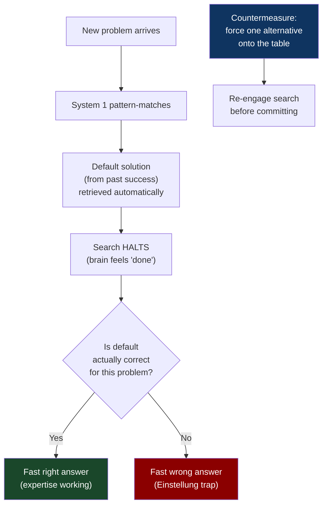
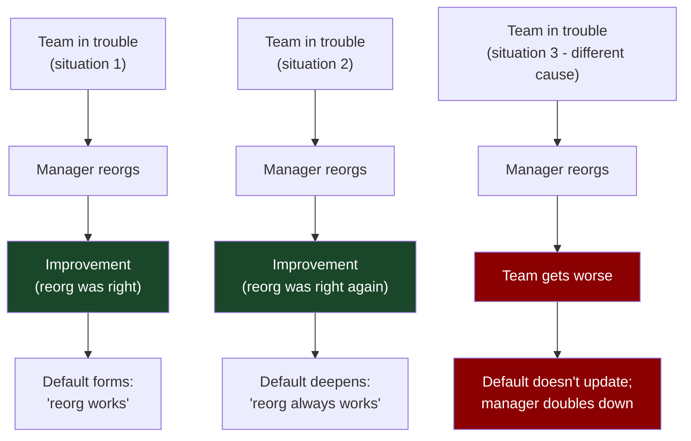
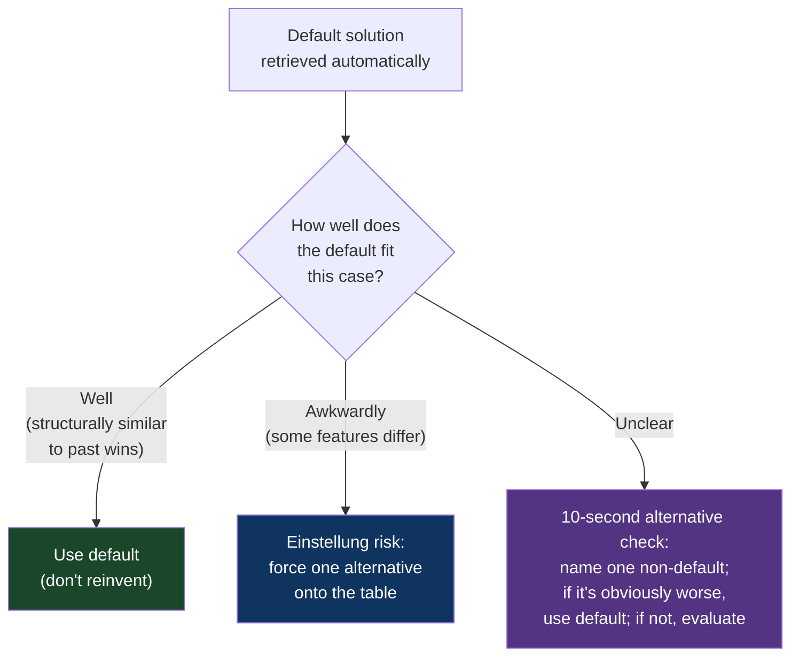

# CH-14: The Einstellung Trap
### *Why the solution you already know is the thing most actively blocking you from seeing the better one*

> **Part 4 of 5 · Your Brain Against You**
> **Model Type:** `perception`

---

## The Misread

A platform team has spent five years solving scaling problems at a high-growth company. Every time something hit a capacity ceiling, they sharded it. They sharded the database. They sharded the queue. They sharded the cache. They sharded the application servers. Each sharding project was hard, took months, paid off. The team became expert at sharding. They knew the failure modes, the migration patterns, the way to handle re-sharding when capacity grew again.

A new problem arrives. A specific service — a periodic batch job that produces a daily aggregate report — is taking 22 hours to run. It needs to complete in under 6 hours; the downstream pipeline depends on the result by morning. The team gathers to plan the work.

The conversation goes immediately to sharding. The job processes a large dataset; sharding it across N workers would, naively, divide runtime by N. The team starts designing the sharding scheme. How will input data be partitioned? How will outputs be merged? How will failures be handled? How will the job's state be coordinated? They spend two weeks on the design.

A junior engineer on the team, three months into the job, asks a question that nobody had been asking: "Why is the job slow? Like, mechanically — what is it actually spending the 22 hours doing?"

The senior engineers look at each other. Nobody has profiled it. The instinct had been to scale horizontally, which is what the team had always done, and "make it parallel" felt like obviously the right move. The junior engineer's question was the question Pólya would have asked at the start: *what is the unknown?*

They profile. The job spends 19 of the 22 hours in a single inner loop that's doing an O(n²) string comparison where O(n log n) is straightforward with the right data structure. The fix is a 14-line change. The job's runtime drops to 38 minutes. The sharding work, two weeks in, is now permanently irrelevant.

The team's expertise in sharding had become the lens through which all scaling problems appeared as sharding problems. The actual problem here was not a sharding problem at all; it was an algorithm problem. The team's deep competence in one solution actively blocked them from seeing that the situation called for a different one. The junior engineer, who had no embedded sharding instinct, asked the obvious question that the senior engineers' expertise had hidden from them.

## The Blind Spot

The brain's pattern-matching engine is the same machinery that produces the Einstellung effect. When a new problem arrives, System 1 (CH-13) searches for similar past problems. If it finds one with a known solution, it returns the matched problem-and-solution as a *pair*, and the solution comes pre-attached. The brain then *stops searching*. The match was successful; why keep looking?

The cost is that *the first pattern that matches* often crowds out the *best* pattern that could have matched. If your pattern library is dominated by one solution (sharding), then many problems that have *some* superficial resemblance to that solution's class will pattern-match to it, even when other solutions would fit better. The match is unconscious; you don't experience it as "the brain stopped searching." You experience it as "the solution is obvious."

The Einstellung effect was originally documented by Abraham Luchins in the 1940s with water-jug problems. Participants who had solved a series of problems using a particular formula continued to apply the formula even when much simpler solutions were available. The famous Luchins result: participants who had *not* been trained on the formula often found the simpler solutions immediately, while the trained participants persisted with the elaborate one. *Less training was more effective.* The trained participants were faster on problems that fit the formula and slower on problems that didn't, precisely because the formula was firing automatically and blocking other approaches.

This blind spot is *inversely* present in beginners. A beginner has no default solution to fall back on, so they suffer from analysis paralysis instead — too many candidates, no way to narrow. They are slow but unbiased. The expert is fast but biased. Both modes have costs; the expert's costs are usually invisible because the expert's confidence hides them.

## The Model, Precisely

**The Einstellung Trap.**

Past success creates a *default solution* that the brain retrieves automatically when a similar problem appears. The retrieved solution is often correct, which reinforces the pattern. But when a new problem has *surface similarity* to the default's class but *different structure*, the default is retrieved and applied incorrectly. Worse, the default *crowds out* the search for better solutions — the brain doesn't continue searching because it has already returned an answer. The trap requires expertise to spring; beginners don't suffer from it.

What this model makes visible: a substantial fraction of expert mistakes are not from lack of skill but from over-application of skills that have worked before. The countermeasure is *forcing a candidate solution onto the table* — deliberately generating an alternative to the default, even if the default seems obviously right. This is uncomfortable because it makes you feel like you're wasting time on solutions you "already know won't work." The discomfort is the trap defending itself.

Spatially: think of the solution space as a landscape with valleys representing solutions. Your past successes have worn deep ruts at certain valleys. When a new problem arrives, you slide naturally into the deepest rut — the solution you've used most. Most of the time the rut is in the right valley. Sometimes the new problem belongs in a different valley, but the rut is so deep you don't even climb out to look around. The ruts that helped you reach excellence are now the walls of the cage you can't see.

Oakley discusses this in *A Mind for Numbers* under the term "Einstellung effect" with the chess-study example: chess masters were shown positions where there was a familiar mate-in-five available, and also a less familiar mate-in-three. The masters often *missed* the mate-in-three because the mate-in-five pattern matched first and they stopped searching. The same masters, shown only the mate-in-three (without the familiar pattern present), found it immediately. The familiarity of the longer solution had blocked the better one.

## Three Domains, One Model

### Domain 1: Engineering — Default-to-Distributed

The opening misread is one expression. The pattern generalizes. Engineers who have spent years building distributed systems develop a strong default toward distributed solutions. When a new problem arrives, the default fires: "this needs to be distributed; we need consensus; we need partitioning; we need replication." Sometimes this is correct. Often the problem could be solved by a single machine, a single process, a single thread. The default is so loud that the single-machine option doesn't even surface as a candidate.

The opposite Einstellung exists. Engineers who have spent years on single-machine systems may default to "just make the box bigger" for every scaling problem, even when the problem fundamentally requires partitioning. The pattern is the same; only the direction of the default differs.

A more subtle form: "the language I'm best in" Einstellung. An engineer fluent in Python sees every problem as best solved in Python. An engineer fluent in Rust sees every problem as best solved in Rust. The defaults are different; the failure mode is identical. Past success in one tool creates a lens that makes other tools' suitability invisible.

The hardest version is the *architectural* Einstellung. A team that built a successful microservices architecture sees every new system as needing to be microservices. A team that built a successful monolith sees microservices as overkill. Each has lived through one set of failures and built the corresponding default; each is now blind to the cases where the other approach would fit.

The countermeasure in engineering: when designing a new system, always explicitly enumerate at least two architectural alternatives. Write them down. Force the conversation to compare them on the specific requirements of this system. Most teams will still pick the default, but the discipline surfaces the cases where the default is wrong, which would otherwise have been invisible.

### Domain 2: Organization — The Always-Restructure Manager

A manager joins a struggling team and reorganizes it. Two months later, the team is performing better. The manager attributes this to the reorg. They get promoted.

In their next role, they hit another struggling team. They reorg it. Performance improves. They attribute it to the reorg.

In their third role, they reorg again. This time the team gets worse. The manager doubles down — clearly the reorg was incomplete; do another reorg. The team gets worse still. The manager fires several engineers, restructures the team again, and three quarters later, the team is in worse shape than when they started.

The Einstellung was real and was producing real damage. In the first two cases, the team's problem actually had a structural component, and the reorg addressed it — though the manager's attribution may have been over-stated; some of the improvement was probably regression to the mean plus the fresh attention of a new manager. In the third case, the team's problem was *something else* — a missing capability, a corrupted relationship with a stakeholder, a tooling gap. The reorg, which had worked twice, was retrieved automatically as the solution. The actual problem was never diagnosed.

Restructure-as-default is one expression. Other organizational Einstellungs:
- "Hire more people" as the answer to every capacity issue
- "More documentation" as the answer to every coordination failure
- "Tighter process" as the answer to every quality problem
- "Better metrics" as the answer to every visibility gap
- "Loop in the CEO" as the answer to every cross-team dispute

Each of these is correct sometimes and wrong sometimes. Each has its expert practitioners whose System 1 retrieves them automatically. The mistake is not the action — the action is sometimes right — but the failure to ever consider that the action might be wrong for this case, because the default fired and the search halted.

### Domain 3: Kodak and Digital Photography

The canonical industrial example. Kodak's engineers invented the digital camera in 1975. A Kodak engineer, Steven Sasson, built a working prototype. Kodak owned the patent. They had a decade's head start on the digital photography revolution that would eventually destroy their core business.

Kodak's leadership did not see it. Or rather, they saw the digital camera — they saw it as a *threat to film sales*, not as a *new business they should build*. The Einstellung was so deep that "we are a chemistry company; we sell film and processing" was inseparable from the company's identity. Every potential opportunity in digital was evaluated through "but how does it affect film?" Investments in digital were repeatedly approved and then quietly de-prioritized when they threatened the chemical business. Senior leadership couldn't seriously consider the possibility that the chemical business itself was going to die regardless, and the only question was whether Kodak would build the replacement or watch competitors do it.

Fuji, Kodak's main competitor, had similar exposure but slightly different leadership culture. Fuji diversified more aggressively into digital, into magnetic storage, into cosmetics (their imaging technology had unexpected applications in skin care). Kodak diversified into adjacent chemical products and pharmaceuticals (a doomed attempt to leverage their chemistry expertise). Fuji is still a healthy company today. Kodak filed for bankruptcy in 2012.

The lesson is not that Kodak's leadership was uniquely stupid. They were typical. The decades of expertise in chemical photography had built an Einstellung so deep that the digital revolution was filtered through it. Every digital opportunity was perceived as "how does this affect our film business?" — and since digital cannibalized film, every opportunity was perceived as threatening. The reframe that would have been required — "film is going to die; we are a company that captures images; how do we capture them in the new way?" — was the paradigm shift (CH-11) that the Einstellung made literally invisible.

Re-reading through the Einstellung trap: the people most embedded in the chemical-photography expertise were the ones least equipped to see the digital reframe. The reframe came naturally to people who had no chemical expertise (consumers, software engineers, startups) and was nearly impossible for the people with the deepest chemical knowledge. Expertise was, in this case, the cage.

## Where The Model Breaks

**The hidden assumption:** you have a strong existing default solution that is firing on the new problem.

The Einstellung trap requires *expertise* to spring. A complete beginner doesn't have a deep default to be trapped by. Their failure mode is the opposite — they get stuck searching the solution space without a default to start from. Telling a beginner "consider alternatives to your default" is meaningless because they don't have a default; they have only alternatives.

This means the model is *not* a universal corrective. It applies to specific situations: experts, in their domain, facing a problem that's slightly different from their well-trained cases. Outside this regime — beginners, novel domains, problems that genuinely fit your default — the model doesn't apply and forcing alternatives is waste.

A second failure: sometimes the "alternative" you force onto the table is genuinely worse than the default, and the time spent considering it is real cost. If you're being asked to write a quicksort, the default ("write quicksort") is correct, and brainstorming "but what if we used a hash table?" is wasted effort. The discipline of forcing alternatives must be calibrated to *cases where the default's fit is in question*, not blanket-applied to every decision.

A third failure: alternatives can be *infinite*. Forcing one alternative is good; forcing five takes you into analysis paralysis. The Einstellung correction is to *crack open* the default with one alternative, not to exhaustively enumerate the solution space.

**The signal you're in the break zone:** you're not actually an expert in the domain (so there's no Einstellung to break); or your default is well-fitted to the case at hand; or you've already considered enough alternatives and additional ones are diminishing-returns.

## The Collision

**This model says:** force an alternative; don't trust your default.
**Don't Reinvent the Wheel says:** the familiar solution is familiar because it's been validated by experience; rebuilding from scratch is waste; trust your defaults.

The collision is direct. Einstellung correction will sometimes push you to consider alternatives that are objectively worse than the default; wheel-reinventing avoidance will sometimes lock you into a default that's been wrong for the last three cases without noticing.

Scenario where they collide: you're asked to implement a data structure. Your team has a standard library that includes a tree-based map. You could use it. You also vaguely wonder if a different structure would fit this specific use case better. Einstellung correction says: consider it. Don't-reinvent-the-wheel says: use the standard library; the time you'd spend evaluating alternatives is better spent on the actual feature.

**The meta-skill:** the deciding signal is *how cleanly the new problem fits the cases your default was trained on*. If the fit is clean, trust the default. If the fit is awkward (the new case has features the default's training cases didn't have), force one alternative. The cost of forcing one alternative is small. The cost of not forcing one, in a case where the default is wrong, is huge — the wasted weeks of pursuing the wrong solution, the trust burned with stakeholders, the eventual back-out. Most experts under-do this discipline. The senior engineers in the opening Misread should have asked "what other approach could solve this?" the first day. They didn't, and two weeks were lost.

## The Retrofit

**Event:** The Wright brothers' development of controlled flight, 1900–1903, contrasted with Samuel Langley's well-funded but failed parallel effort.

By 1900, the problem of heavier-than-air flight had attracted serious attention. Samuel Langley, the head of the Smithsonian, had been funded by the US War Department to the tune of $50,000 (a massive sum) to build a piloted aircraft. Langley's approach was rooted in his deep expertise in steam engines and engineering: build a powerful engine, build a strong frame, scale up from the model aerodromes he had successfully flown unmanned. His defaults were *engineering bigger, stronger, more powerful*. His Einstellung was that flight was a *power problem*.

The Wright brothers had no significant aerospace expertise. They had a small bicycle shop. They had read widely about previous flight attempts, including Otto Lilienthal's gliders. Their approach was different in a way that turned out to be decisive: they understood early that *control* was the unsolved problem, not power. Power was solvable with available engines; control required a *new way of thinking about how a pilot would manipulate the flying surfaces*.

They spent years on control. They built a wind tunnel and tested wing shapes. They invented "wing warping" (later replaced by ailerons) to allow lateral control. They built progressively more controllable gliders before ever attaching an engine. They put the pilot in a position to actively *fly* the aircraft, not just sit in it.

Langley built two aircraft, both of which crashed on launch in 1903. His engineering was, in some senses, more sophisticated than the Wrights'. His engines were more powerful. His funding was orders of magnitude larger. But his Einstellung — flight is a power problem — had blocked him from seeing that the unsolved problem was control. Two months after Langley's second crash, the Wrights flew at Kitty Hawk.

Re-reading through the Einstellung trap: Langley's chemical-engineering and steam-engine expertise was the *exact* kind of background that produced confidence in the "power" framing. Every problem in his prior career had been solved by engineering more power. Flight, framed as a power problem, looked solvable to him. The reframe — flight is a control problem — was a different paradigm, and his expertise blocked him from considering it seriously. The Wrights' lack of expertise meant they had no entrenched default and could perceive the actual structure of the problem.

**What was invisible:** to Langley, the Wright brothers were two amateurs from a bicycle shop. Their lack of credentials made their approach look quaint, not promising. Langley's failures were treated as "we need a more powerful engine" rather than "we need to rethink what the problem is." The Einstellung wasn't a single bad decision; it was a continuous filter on what counted as a real problem and a real solution.

**The intervention point:** any aerospace contemporary who had asked "is power really the binding constraint here, or is control?" — and taken the question seriously enough to test — would have arrived at the Wrights' insight. A few were on similar tracks (Octave Chanute corresponded with the Wrights and provided some support), but nobody else committed to the control reframe with the rigor the Wrights did. The lesson generalizes: when an entire field has been pursuing one default for decades without success, the missing insight is often a reframe that the field's expertise has been actively suppressing.

## The Practice Rep

> **Duration:** 48 hours
> **What you're training:** the habit of forcing one alternative onto the table before committing to your default solution

**The exercise:**
For the next 48 hours, every time you find yourself confidently reaching for "the obvious solution" to a problem — your default approach, your usual move, the thing you've done before — pause and do one thing:

Write down one alternative solution. Just one. It can be one you don't like. It can be one you're 90% sure is wrong. The point is not to actually use the alternative; the point is to *force the default to compete against something* before you commit.

Then, in two sentences:
1. "My default solution is ____, because ____."
2. "An alternative would be ____, which would be better if ____."

The second sentence is where the work is. The "which would be better if" forces you to articulate the condition under which your default is wrong. Then check: does that condition hold here?

**What to look for:**
The first day, you'll mostly confirm your defaults. The alternative will be obviously worse, the default will win, and the exercise will feel like overhead. That's fine. The cost is low.

By the second day, you'll catch at least one case where the alternative's "better if" condition actually holds. The default was about to fire on a problem that didn't fit its training cases. The alternative — which felt wrong initially — turns out to be the right move. That moment is the trap being broken. The cost saved (weeks of work in the wrong direction) is the entire reason the discipline exists.

You'll also notice cultural texture. Some teams *reward* defaults (the senior engineer says "we should X" and everyone agrees because they're the senior). Some teams have a culture of forced alternatives (the senior engineer says "we should X" and someone else immediately says "or we could Y"). The former culture is fragile to Einstellung; the latter is robust. If you're in the former, your practice rep is harder because you're swimming against the cultural current.

**The log:**
At the end of 48 hours, write one sentence: "I saw the Einstellung Trap at work when [the specific moment my default solution was about to fire on a problem it didn't fit, and forcing an alternative onto the table revealed a better approach]."
