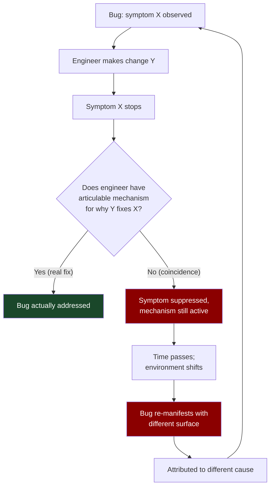
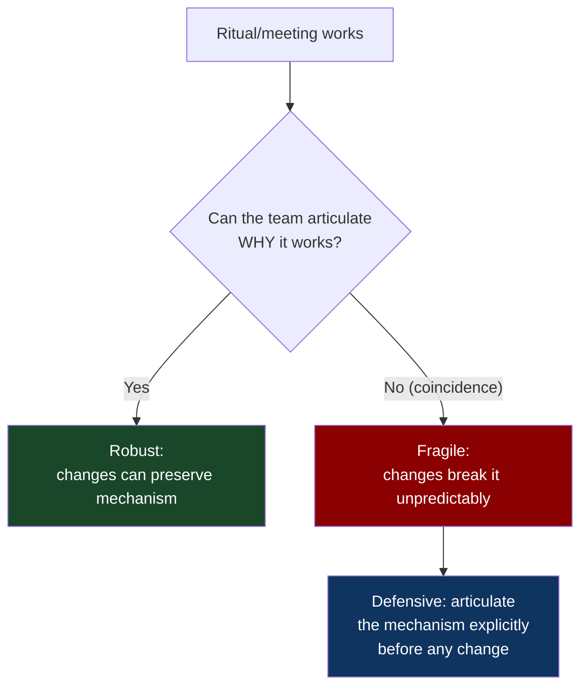
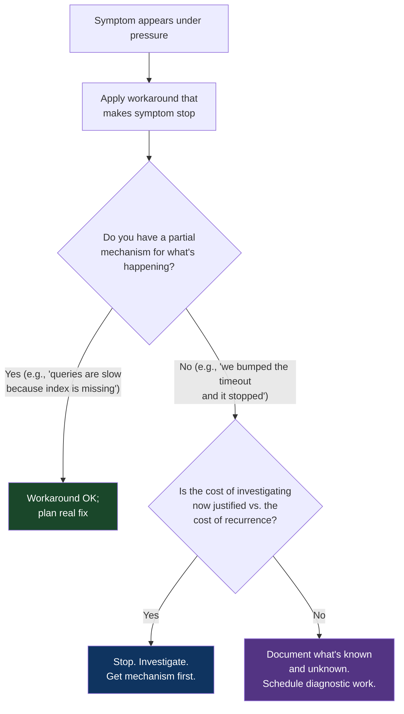

# CH-15: Programming by Coincidence
### *Why "I made the symptom go away" is not the same as "I fixed the bug" — and how to tell the difference under pressure*

> **Part 4 of 5 · Your Brain Against You**
> **Model Type:** `decision`

---

## The Misread

A junior engineer is debugging a production issue. A specific API endpoint occasionally returns the wrong data — about once every two thousand requests, a user gets a response that includes someone else's information. The bug has been open for three weeks. Several engineers have looked at it; nobody has reproduced it locally.

The junior engineer spends a day on it. He reads the code. He suspects a caching issue. He notices the endpoint uses a request-scoped object that's populated from a shared cache. He hypothesizes that the cache could be returning stale data under load. He adds an explicit cache invalidation at the start of the endpoint handler. He deploys the fix. He monitors. The error rate drops from 0.05% to 0. He closes the ticket. His manager praises the fix.

Three months later, the same bug reappears. Same symptom. The junior engineer's fix is still in the code, unchanged. He's confused. He adds more cache invalidation. The bug goes away again. Two months after that, it returns once more. He adds even more cache invalidation. He starts to suspect the entire caching layer needs to be rewritten.

What's actually happening: the bug is not a caching bug. It's a connection-pool race condition (callback to CH-13 — the senior engineer who recognized this in forty seconds). The cache invalidations the junior engineer keeps adding are *changing the timing* of the request handler, which incidentally avoids the race condition's window — most of the time. The fix isn't a fix; it's an *accidental workaround* that suppresses the symptom by shifting the timing. The underlying bug is still there. When the timing shifts again (a new deploy, a new traffic pattern, a new dependency upgrade that takes a different amount of time), the bug reappears.

The junior engineer is doing real work. He's responsive, he's reading code, he's hypothesizing, he's measuring. He's also *programming by coincidence* — making changes that correlate with symptom reduction without understanding the mechanism. The symptom-tracking feedback loop is fooling him. He thinks he's iterating toward a solution. He's iterating around a problem he doesn't understand, and the iterations are creating new accidental workarounds that will fail in new ways.

## The Blind Spot

The brain treats "the symptom went away" as confirmation that "I understood what was wrong." This is a *correlation-causation* error, but applied to your own diagnostic process. The change you made and the symptom going away co-occurred. The brain reads co-occurrence as causation. The brain does not naturally ask "did my change actually cause the symptom to go away, or did the symptom go away for a different reason that happened to coincide with my change?"

The deeper blind spot: in software, *almost any change* will perturb the system enough to shift the manifestation of subtle bugs. A bug that fired under a specific timing condition will, after almost any change, fire under a different timing condition. If you stopped looking for it after your "fix" because the symptom moved, you've not fixed it; you've just lost track of it. Six weeks later it surfaces somewhere else and is attributed to a different cause.

The countermeasure is to demand a *mechanism* — an articulable causal story that says "the bug was X; my change made X not happen anymore because Y." Without a mechanism, your fix is a bet on the same context not recurring, and contexts always recur eventually.

## The Model, Precisely

**Programming by Coincidence.**

Acting on patterns you've observed (this fix made the symptom stop) without understanding the underlying mechanism (why the bug was occurring, and why your change addresses that cause) is programming by coincidence. The fix may work for now. It will fail unpredictably later, often in ways that look unrelated to the original bug, because the mechanism is still in place and only the surface manifestation has shifted.

What this model makes visible: a substantial fraction of "fixes" in any software system are not fixes. They're symptom suppressions whose persistence depends on environmental conditions the fixer doesn't understand. When the environment changes, the suppression fails. The original bug, never having been understood, returns with no record of what causes it. Each cycle of coincidence-based fixing makes the system harder to debug because the code accumulates layers of workarounds nobody understands.

Spatially: imagine a bug as a leaking pipe inside a wall. The water sometimes seeps out through a specific crack in the drywall. A real fix is to open the wall, find the pipe, fix the leak. A coincidence fix is to paint over the crack. The paint stops the visible seepage. The water is still inside the wall. Sooner or later it finds another crack. The painter, who thought they fixed it, is bewildered when the seepage returns — and is now looking in the wrong place, because the original crack is sealed and they don't yet see the new one.

Hunt and Thomas (*The Pragmatic Programmer*) framed this as one of the central anti-patterns of software work. Their formulation: *don't code by coincidence*. Their countermeasure: always be able to explain *why* a piece of code works, in terms of the mechanisms it depends on, not in terms of the empirical observation that it currently passes tests.

## Three Domains, One Model

### Domain 1: Engineering — The Restart Reflex

Every engineer has done this: a service is misbehaving in production. The team restarts it. The service starts working. The team marks the incident closed and moves on.

What did the restart do? Often, nobody knows. It probably cleared some accumulated state — leaked memory, exhausted connection pool, stuck thread, corrupted cache. The restart's first-order effect is *to make the symptom stop*. The mechanism is opaque. If asked "why did the restart work?", most teams would shrug and say "it just did."

Three weeks later, the same service misbehaves again. The team restarts it. It works. They mark the incident closed.

The pattern continues until either: (a) the symptoms become frequent enough that restart becomes operationally untenable, at which point someone is forced to actually diagnose; or (b) the misbehavior takes a different shape — a slow death rather than a sudden one, or a misbehavior that survives restart — and the team is now flying blind, because they never understood the underlying cause.

The "restart fixed it" pattern is the purest form of programming by coincidence. It works, sometimes for years. It hides the actual problem. It also accumulates: if a service "needs restarts" weekly, the team starts adding automation (cron jobs that restart preemptively). The automation hides the problem further. Eventually the service has been running on workarounds for so long that the original problem has become institutional knowledge ("we always restart that thing on Sunday nights, just because"), and nobody remembers there was a bug.

A real fix requires articulating the mechanism: the service leaks file descriptors at a rate of N per hour; after T hours it exhausts the FD limit; the symptom is connection errors. *Now* you can choose: fix the leak, increase the FD limit, recycle the process before exhaustion (deliberately, with an articulated reason). Each of these is a real intervention because each rests on understanding.

### Domain 2: Organization — The Meeting That "Just Works"

A team has a recurring meeting that everyone agrees is valuable. It's been running for two years. The format has evolved through accident — somebody started doing a particular round-robin format, somebody else added a recurring agenda item, somebody else moved it from Tuesday to Wednesday, somebody else changed the duration from 30 to 45 minutes. Nobody designed it; it accreted.

A new manager joins and wants to "improve" the meeting. They reorganize it: change the order, change the format, drop one item, add another. The meeting deteriorates. People complain. The manager is confused; the changes seemed reasonable individually.

What happened: the previous format had been load-bearing in ways nobody had articulated. The round-robin had been suppressing one specific tendency (one engineer dominating the conversation). The recurring item had been giving cover for a specific kind of question that people felt was hard to ask cold. The Wednesday slot avoided a recurring conflict with another team's standup. The 45 minutes had been long enough to ensure the difficult topics got time without being so long that people checked out.

The previous meeting had been functioning, but the team was *operating it by coincidence*. They knew it worked; they didn't know *why* it worked. The mechanisms — what each format element actually accomplished — were never written down or even explicitly understood. When the new manager perturbed it, the load-bearing mechanisms failed, and the meeting collapsed in ways that surprised everyone.

This is programming by coincidence applied to organizational design. Many "this just works, don't change it" rituals are this pattern. They work for reasons nobody can articulate. They are also fragile — any environmental change can break them, and the team won't be able to repair them because they don't understand them. The defensive move is the same as in code: *articulate the mechanism*. What is this meeting doing? Why does the format support that? What would have to change for this not to work anymore? Often the articulation reveals that some of the format is genuinely load-bearing and some of it is vestigial. The load-bearing parts deserve preservation; the vestigial parts can be cleaned up.

### Domain 3: Medieval Bloodletting

For roughly two millennia, bloodletting was a standard medical treatment for a wide variety of ailments. Patients who received bloodletting often improved. The treatment was endorsed by the most respected physicians of every era from Galen through the 18th century. It was based on the humoral theory of disease, which provided a mechanistic story: illness was caused by an imbalance of bodily humors; bloodletting restored balance.

The mechanistic story was almost entirely wrong. Bloodletting did, occasionally, produce real improvements — by reducing blood pressure in patients with fluid overload, by triggering certain immune responses, by acting as a placebo. The improvements were enough to keep the practice going. Patients who died were attributed to the disease being too far advanced; patients who recovered were attributed to the treatment.

This is programming by coincidence at civilizational scale. The treatment "worked" in the sense that some patients improved after receiving it. The mechanism (humoral imbalance) was fictional. The actual mechanism that produced occasional benefit was understood by nobody at the time. The actual mechanism that produced frequent harm (blood loss weakening already-sick patients) was actively obscured by the humoral framework, which interpreted any harm as the disease, not the treatment.

The practice persisted for two thousand years partly because nobody had the conceptual tools to perform a controlled experiment. James Lind's 1747 scurvy study and the gradual development of clinical trial methodology over the next two centuries was the methodological breakthrough that allowed medicine to distinguish *fixes* from *coincidences*. Once randomized controlled trials became standard, bloodletting was tested, found to be net-harmful for most conditions it had been used for, and abandoned within a few decades.

The lesson generalizes beyond medicine. Whenever a practice survives because "people who do it report good outcomes," and the practice has not been controlled-experimented, you should suspect programming by coincidence. The persistent outcomes may be from selection effects, regression to the mean, placebo, or unrelated factors. The actual mechanism may be totally different from the believed mechanism. The practice may be net-harmful but appear net-beneficial.

## Where The Model Breaks

**The hidden assumption:** the mechanism is knowable, and the cost of pursuing the knowledge is bounded.

Some systems are too complex for full mechanistic understanding within any reasonable cost. The production environment of a modern distributed system, with hundreds of services, dozens of databases, network conditions that vary by region and time, dependencies that update independently, traffic patterns that fluctuate — the joint state is so large that *no engineer can hold the full mechanism in their head*. In these systems, perfect mechanistic understanding is unattainable. Working pattern-recognition over observed behavior is often the best you can do.

In domains like this, the goal shifts. You can't always articulate a full mechanism, but you can articulate a *partial* mechanism — "the bug is in this subsystem; the change I made affects this specific behavior in this subsystem; the change probably addresses the bug because the bug's symptoms are consistent with the failure mode I'm targeting." This is less than full understanding but more than coincidence. The distinction is between "I have *some* mechanism, even if not the full one" and "I have *no* mechanism, only a correlation."

A second failure: pursuing mechanistic understanding can be *too expensive* for the business context. If a customer is bleeding revenue right now, and a restart will buy you a week to diagnose properly, restart now and diagnose later. The coincidence fix is the appropriate short-term move *if you commit to the diagnostic work afterwards*. The failure mode is the team that restarts now and never diagnoses, because the symptom is gone and the priorities have moved.

A third failure: some mechanisms are *probabilistic* in ways that frustrate articulation. A flaky test that fails 1 in 10,000 runs may have a real mechanism (a race that fires under rare conditions), but you may never be able to articulate the exact triggering condition. Living with the mechanism partially-articulated is reasonable in many such cases.

**The signal you're in the break zone:** the cost of further diagnosis exceeds the expected cost of the bug recurring, and you've documented what you know and don't know about the mechanism so that future you (or future engineer) can pick up where you stopped. Coincidence fixes *with documentation* are an acceptable compromise; coincidence fixes that *erase the diagnostic trail* are the failure mode.

## The Collision

**This model says:** demand a mechanism; don't close the ticket until you have one.
**Just Ship It / Pragmatism says:** the cost of full understanding sometimes exceeds the benefit; ship the workaround, move on, address the underlying issue if it surfaces again.

The collision is sharpest under production pressure. Programming-by-coincidence avoidance can become a way of refusing to act until you have a perfect model. Just-ship-it can become a way of accumulating workarounds that eventually collapse the system.

Scenario where they collide: a production database is occasionally returning slow queries. The team has a workaround: bump the timeout. The bump makes the user-facing symptom go away (queries complete before timing out). The mechanism — *why* are the queries slow? — is not understood. Just-ship-it says: the timeout bump is fine; users are happy; move on. Mechanism-demand says: this is a symptom of something; if we don't understand it, it'll get worse; investigate now.

**The meta-skill:** the deciding signal is *whether the team commits to closing the diagnostic loop later*. Coincidence fixes are acceptable as bridges; they are catastrophic as endpoints. The discipline is to make a coincidence fix *and* schedule the real diagnosis *and* maintain the diagnostic trail (logs, observations, what you tried, what you didn't try) so future engineers can pick it up. Most teams have the discipline for the first part and lose the discipline for the second. The bugs that have been re-fixed five times are the ones where the team kept patching and never came back to diagnose.

## The Retrofit

**Event:** The Therac-25 radiation therapy machine incidents, 1985–1987. Six patients received massive radiation overdoses (some receiving thousands of times the prescribed dose); several died from acute radiation poisoning, others suffered severe injuries.

The Therac-25 was a software-controlled radiation therapy machine. It had been preceded by Therac-20 and Therac-6, which used hardware interlocks to prevent dangerous configurations. The Therac-25 had removed the hardware interlocks and replaced them with software checks — a cost-saving and design simplification. The software, however, had race conditions that could allow the machine to operate in high-power electron-beam mode without the required attenuator in place.

When the first incident occurred (Marietta, Georgia, 1985), the manufacturer (AECL) investigated. They could not reproduce the bug. The operator's account was suspect (the patient was clearly injured, but the machine showed no error). AECL concluded that the operator had made an error; the machine was working as designed.

When the second incident occurred (Hamilton, Ontario, 1985), AECL again investigated, again could not reproduce. They added a hardware microswitch that would interlock against one specific dangerous configuration. They believed they had fixed it. They had fixed *one specific configuration*, by coincidence, without understanding that the underlying race condition was the root cause.

The pattern continued. Each incident produced a localized "fix" — a specific check, a specific interlock — that addressed the surface manifestation but didn't acknowledge that the software's concurrent design was unsound. AECL was programming by coincidence on a machine that was killing people. Each "fix" let them believe the underlying system was correct and the incidents were isolated.

The pattern broke when Fritz Hager, the physicist at the East Texas Cancer Center after the 1986 incident there, refused to accept the manufacturer's "we fixed it" claims. He worked with the operator to reproduce the bug. They eventually found a specific sequence of operator inputs (rapidly editing the mode selection within 8 seconds) that triggered the race condition. With a reproducible mechanism, the actual problem could finally be diagnosed: concurrent threads in the control software were sharing variables without synchronization. The race condition was the root cause; every prior "fix" had been a coincidence that suppressed one path to the race without eliminating the race itself.

Re-reading through programming by coincidence: AECL's engineers were competent. Their fixes were each individually reasonable responses to the specific incidents they could observe. The failure was that they treated each incident as an isolated event with an isolated cause, rather than treating them as *manifestations of an underlying mechanism that hadn't been articulated*. The lack of mechanism let them ship partial fixes and believe the problem was solved. The mechanism, when finally articulated, made it obvious that the previous fixes had been working by coincidence.

**What was invisible:** AECL had reused code from the Therac-20, where the same race conditions had existed but had been masked by hardware interlocks. The hardware had been making the buggy software *appear* correct for years. When the hardware was removed in the Therac-25 design, the bugs surfaced — but the institutional knowledge that the software had been load-bearingly buggy was lost, because the software had been "tested" by being deployed for years (with hardware interlocks silently catching its errors). The coincidence had operated at a multi-year, multi-product scale before producing visible failure.

**The intervention point:** any engineer at AECL who had insisted, after the first incident, "we cannot ship a fix until we have a reproducible mechanism for what happened" would have forced the diagnostic work that eventually surfaced the race condition. Such an engineer might have been ignored or overruled — institutional pressure to declare incidents resolved is enormous — but the discipline of refusing to mark a bug fixed without a mechanism is the only defense against the coincidence cycle. In safety-critical systems, the discipline is non-negotiable. The Therac-25 incidents are now a foundational case study in safety engineering precisely because they illustrate what happens when the discipline is absent.

## The Practice Rep

> **Duration:** 48 hours
> **What you're training:** the habit of demanding a mechanism for every fix you ship, and marking fixes as suspicious when you cannot articulate one

**The exercise:**
For the next 48 hours, every time you fix something — a bug, a config issue, a flaky test, a confusing error, even a small annoyance — write two sentences:

1. "The bug was caused by ____." (The mechanism — what specifically was wrong.)
2. "My fix works because ____." (The mechanism's countermeasure — why my change addresses the cause.)

If you cannot fill in either sentence, mark the fix as **SUSPECTED COINCIDENCE** in a notes file. List what you'd need to know to upgrade it from suspected coincidence to real fix.

**What to look for:**
You will be alarmed by how many of your fixes turn out to be suspected coincidences. Most engineers, doing this honestly, find that 30–50% of their fixes don't have full mechanism articulations. Some of those are bugs in systems too complex for full understanding (the partial mechanism is acceptable). Some are coincidence fixes you've been treating as real.

The category that will surprise you most: small fixes you committed without much thought. "I changed this line and the test passes now." The line-change has no mechanism story attached. You don't know why the original code was failing or why your version doesn't fail. These small unexplained "fixes" accumulate into code that nobody understands.

The discipline produces two visible changes in your work: (a) you start *investigating more before fixing*, because fixing-without-mechanism feels unsatisfying once you've named it; (b) you start *documenting more after fixing*, because the mechanism articulation naturally becomes a commit message or PR description that future engineers can use. The team's overall ability to maintain the codebase compounds in the direction of mechanism-richness.

**The log:**
At the end of 48 hours, write one sentence: "I saw Programming by Coincidence at work when [the specific moment I caught myself shipping a 'fix' without a mechanism, or when I refused to close a bug until I had one]."
