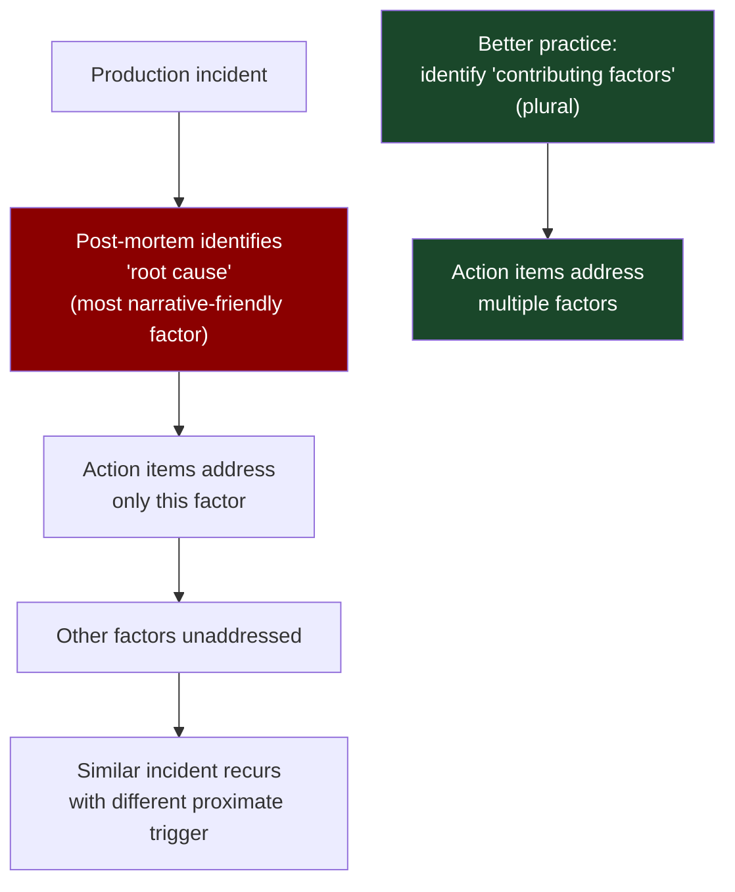
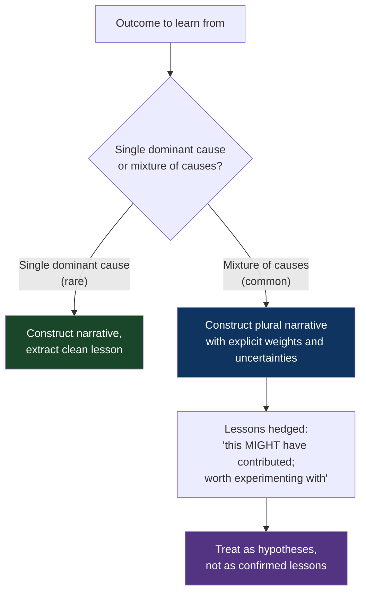

# CH-16: The Narrative Fallacy
### *Why the story you tell about why something happened is usually neat, satisfying, and wrong*

> **Part 4 of 5 · Your Brain Against You**
> **Model Type:** `perception`

---

## The Misread

A startup launches a new product. After six months, the product has become the company's main revenue stream and is growing 40% month over month. The team is energized; the company is profitable for the first time. The founders sit down to write a blog post about what they learned.

The blog post is a story. It explains: the team had been listening carefully to customers; the customer feedback had pointed to a specific pain point; the team had iterated on the design based on early prototypes; the launch was timed to a specific market moment; the marketing emphasized a particular value proposition that resonated; the pricing strategy reflected lessons learned from a previous failed product. Each element of the story is true. The story reads well. It gets shared widely. The founders are invited to speak at conferences.

What the story leaves out, mostly because the founders don't see it: a major competitor had a public security breach two weeks before the launch, and many of the customers who churned from the competitor specifically tried the startup's product because it was the obvious alternative. The market segment had an underlying tailwind from a regulatory change in March that no one on the team had even noticed. A specific journalist had written a positive review unprompted, which had driven significant initial traffic. A specific feature decision made early on (mostly because the engineer working on it had a strong preference) turned out to fit one specific customer use case very well, and that use case happened to become dominant.

The story is *coherent* — every element supports every other element, the cause-effect chain is clear, the lessons-learned are actionable. The story is also *largely wrong about the relative weights*. Most of the product's success was due to factors the founders didn't control and didn't notice. The factors they did control mattered, but less than the story suggests.

Six months later, the founders try to apply the lessons from the blog post to a new product. The new product fails. The founders are confused — they did all the things they had identified as success factors. The things they had identified weren't actually the main causes of the previous success. The lessons were *retrofitted* to the success, not *extracted* from it.

## The Blind Spot

The human brain is a story-construction machine. Given any sequence of events, it produces a narrative — *X happened, which caused Y, which led to Z*. The narrative is not optional; it is what the brain does with information by default. The narrative provides the satisfaction of *understanding*: now we know why it happened. Without the narrative, the events feel chaotic and threatening. With the narrative, the world feels orderly and predictable.

The cost is that the narrative is usually wrong about the relative weights of the causes. Most outcomes are produced by a *mixture* of skill, luck, timing, and effects you didn't notice. The narrative compresses this mixture into "and then because of X" stories that overweight the parts you can see and underweight the parts you can't. The compression is satisfying. The satisfaction is the trap.

A second part of the blind spot: narratives are *retrospective*. Once you know the outcome, you reconstruct the past so it leads cleanly to the outcome. Hindsight makes the chain of causation feel obvious. The same set of facts, without knowing the outcome, would have looked like noise. The retrospective narrative gives the illusion that the outcome was predictable in advance — when it wasn't.

This blind spot is *especially severe* for successful outcomes, because successful outcomes have an audience hungry for explanations. The story gets told, retold, and refined. By the time the story is published in a book or blog post, it has been smoothed into a clean causal chain that bears only a partial resemblance to what actually happened.

## The Model, Precisely

**The Narrative Fallacy.**

Outcomes are produced by a mixture of skill, luck, timing, and uncontrolled factors. The brain constructs narratives — *X happened because of Y* — that *compress* this mixture into clean causal chains. The compression is satisfying and often actionable, but it systematically overweights the visible causes and underweights the invisible ones. The narrative is usually most wrong about the *weights* of the causes, not their existence. Most success stories include factors that were real but not load-bearing, presented as if they were the primary explanation.

What this model makes visible: most "lessons learned" from successes (and failures) are post-hoc rationalizations that fit the outcome. The lessons may be useful, but their evidentiary basis is much weaker than they appear. Acting on these lessons in new situations often disappoints, because the new situation has a different mixture of luck/skill/timing/external factors, and the borrowed lessons addressed the wrong weights.

```mermaid
graph LR
    A["Outcome occurs"] --> B["Brain constructs narrative"]
    B --> C["Narrative weights:<br/>visible causes overweighted<br/>invisible causes underweighted"]
    C --> D["Story feels satisfying<br/>and complete"]
    D --> E["Lessons extracted<br/>from the narrative"]
    E --> F["Lessons applied<br/>to new situations"]
    F -->|"often disappoints"| G["New situation has different<br/>luck/skill/timing mixture"]

    H["Reality:<br/>outcome was mixture of<br/>skill + luck + timing +<br/>uncontrolled factors"] -.->|"actual causes"| A

    style D fill:#1a472a,color:#ffffff
    style E fill:#8b0000,color:#ffffff
    style H fill:#0f3460,color:#ffffff
```

Spatially: think of an outcome as a heavy object on a table held up by many legs. Some legs are visible (the things you did, the decisions you made). Some legs are invisible (the market conditions, the competitor's mistakes, the lucky timing, the unrelated journalist). The narrative explains the table by reference to the visible legs — *the table stands because of these legs you can see*. The invisible legs are doing much of the work. When you try to build another table in a different room, you copy the visible legs and the table collapses, because the invisible legs aren't there.

Kahneman's framing in *Thinking, Fast and Slow*: "WYSIATI — What You See Is All There Is." The mind constructs the best story it can from the available information, treats the constructed story as the complete picture, and grows confident in it. The narrative fallacy is WYSIATI applied to causation.

Nassim Taleb's framing (he popularized the term "narrative fallacy" in *The Black Swan*): humans cannot tolerate randomness; we insist on inventing causes. The narrative is *constructed* to make randomness feel non-random. The construction is automatic and invisible to the constructor.

## Three Domains, One Model

### Domain 1: Engineering — Post-Mortems

A production incident occurs. The team conducts a post-mortem. The post-mortem identifies a *root cause*: a deploy that introduced a regression in caching logic. The team writes up the incident, attributes it to the deploy, files action items to add caching tests and improve the deploy validation. The post-mortem is filed. Everyone feels better.

What the post-mortem leaves out: there had been a latent race condition in the caching system for eight months, exposed only under a specific load pattern that occurred during the incident. The deploy didn't cause the bug; it shifted the timing enough to expose it. Two days before the incident, the on-call had been a junior engineer who missed an early warning signal in monitoring; an experienced on-call would have caught it. The day of the incident, a separate team had made an unrelated change that increased load on the cache by 30%. The hardware the cache was running on was four years old and approaching its rated lifespan; a newer machine might have absorbed the load without exposing the race.

Each of these factors contributed. The post-mortem fingered only one — the deploy, because it was the most recent observable change. The other factors were *less narrative-friendly*: a latent bug nobody had detected for eight months doesn't make a satisfying story; an on-call's relative inexperience is socially awkward to name; an unrelated team's change is hard to causally connect; aging hardware is a long-running condition that's been "always there" and so doesn't feel like a cause.

The post-mortem is *not wrong* — the deploy did contribute. But it's wrong about the weights. The action items address the deploy. The other contributing factors are unaddressed. Three months later, a similar incident occurs with a different deploy as the proximate trigger. The team is surprised; they had "fixed" the deploy pipeline. They hadn't fixed the underlying conditions that made deploys dangerous.

The discipline of better post-mortems explicitly addresses this: ask "what are the contributing factors?" not "what is the root cause?" The plural is the corrective. Most incidents have many contributing factors, and the narrative impulse to identify one root cause is exactly the fallacy that produces undertreated recurrence.

### Domain 2: Organization — Founder Origin Stories

Every successful founder eventually tells the story of how they succeeded. The story is usually some variant of: I saw a problem nobody else was solving; I worked harder than everyone else; I had a clear vision; I made bold decisions; I assembled a great team; I persisted through dark times.

Each element may be true. The composite narrative is usually wrong in two ways.

First, the *survivorship bias*. For every successful founder telling this story, there are dozens of equally hardworking, equally visionary, equally bold founders who failed. The failures don't get to tell their story. The story you hear is selected for outcome, which means it's selected for the *intersection* of skill and luck and timing. The pattern that's actually visible — these traits + success — doesn't tell you about the traits' base rate among failures.

Second, the *narrative weighting*. The successful founder genuinely believes their hard work and vision were the load-bearing factors. They lived through it; they felt the work; the work was real. What they didn't see (or noticed and dismissed) were the lucky breaks: the investor who happened to know their college friend; the competitor who happened to flame out; the macro trend that happened to break in their favor; the early employee who happened to have a specific skill that became critical. These factors were less salient because they weren't *effort* — they happened *to* the founder, not *by* the founder. The narrative downweights things that happened to you, because they don't feel like your contribution.

This is why founder advice often does not transfer. The new founder reads the book, does the things, doesn't get the result. The book described the visible part of the previous success and missed the load-bearing invisible part. The next founder, with different (worse, in some dimensions; better in others) luck and timing, executes the visible part and gets a different outcome.

The corrective is humility about causation. Some successful founders practice it; they explicitly note "I got lucky here," "this would have failed if X hadn't happened." Most don't, because the audience doesn't reward the qualification — the audience wants a clean story with actionable lessons.

### Domain 3: Historical Battles

History textbooks often present battles as won by *generals*: Napoleon at Austerlitz, Lee at Chancellorsville, Patton at the Bulge. The general's tactical brilliance is the load-bearing causal element in the narrative. Students learn the battles as stories of individual genius.

The reality is messier. Battles are won by a mixture of: strategic position established before the battle, supply and logistics, weather, terrain, the *opponent's* decisions and mistakes, the morale of the troops, weapons and equipment availability, the timing of arrivals, intelligence about enemy positions, and — yes — tactical decisions made by the general during the battle. Most historians who study battles in depth conclude that the tactical decisions are usually a smaller factor than the popular narrative suggests, and the logistical and structural factors are usually larger.

Napoleon's victory at Austerlitz, by his own assessment, depended significantly on the Austrian-Russian decision to abandon a strong defensive position and attack — a decision Napoleon had baited but did not control. Lee's victory at Chancellorsville depended significantly on Hooker's loss of nerve and choice to retreat into defensive positions when continued offense might have crushed Lee's outnumbered force. Patton's Bulge campaign was made possible by Allied air superiority that the German offensive had failed to neutralize.

The popular narratives center the generals because generals make for satisfying protagonists. The structural and logistical factors don't. But policy decisions and military training built on the popular narratives — invest in tactical brilliance, study individual battle decisions — often miss the actual leverage, which is in logistics, training, intelligence, and structural advantage. Militaries that learn from the *historian's* nuanced narrative perform better than those that learn from the *popular* heroic narrative. The same lesson generalizes everywhere humans construct stories of individual genius: the genius is usually real but not the load-bearing factor, and policies built on the heroic narrative often produce disappointment.

## Where The Model Breaks

**The hidden assumption:** the situation has a *mixture* of causes with no single dominant factor, and the narrative is compressing the mixture incorrectly.

Some situations genuinely have a dominant cause. A single component failure that crashed a system. A single decision that pivoted a company. A single individual whose departure ended a project. In these cases, the simple narrative ("the system crashed because of the failed component") is approximately correct. Applying narrative-fallacy skepticism here is overcorrection — you'd be denying real causality.

The skill is distinguishing high-leverage single-cause situations from mixture-of-causes situations. High-leverage situations tend to have: a clear mechanism connecting the cause to the outcome; the absence of the cause would clearly have prevented the outcome; alternative causes can be ruled out. Mixture situations tend to have: multiple candidate causes that all contributed; the outcome would probably have happened (perhaps differently) even without any single cause; the relative weights are debatable. Pure narrative-fallacy skepticism applied to a high-leverage situation produces analysis paralysis ("we can't be sure what caused it"). Pure narrative-construction applied to a mixture situation produces over-confident wrong lessons.

A second failure: you must extract *some* narrative to act on. Pure "it was a mixture; we can't really know" is unactionable. The lesson-extraction process requires some causal attribution; you can't make every decision conditioned on full uncertainty about every past event. The right discipline is to extract *plural* causes with explicit weights ("the deploy contributed; the latent race contributed; the load increase contributed; we're going to address the deploy and the race but not the load increase because we judge the cost-benefit doesn't justify it"). Plural-with-weights is better than single-cause; it's also worse than nothing if it produces such complexity that no action is taken.

A third failure: in domains where the narrative actively shapes the next outcome (founder stories influencing investor decisions; political narratives influencing policy), the narrative may be partly self-fulfilling. The "story you tell" matters not because it's accurate but because it's *believed*, and the belief becomes input to the system. Narrative-skepticism in such domains is intellectually correct but pragmatically self-defeating.

**The signal you're in the break zone:** the situation genuinely has a dominant cause that the narrative correctly identifies; or you need *some* working narrative to make decisions and the search for full causal accuracy is just delay; or the narrative itself is a load-bearing input to the next outcome.

## The Collision

**This model says:** distrust narratives; recognize the mixture; weight causes carefully.
**Lessons Learned / Story-Driven Learning says:** humans learn through narrative; without a story you can't transmit knowledge; the story may be imperfect but it's actionable.

The collision is real. Pure narrative-skepticism produces "we don't know what happened, so we can't learn from it" — paralysis dressed as humility. Pure narrative-construction produces "we know exactly what happened and here are the five lessons" — confidence dressed as wisdom.

Scenario where they collide: a team is doing a retrospective on a successful project. Narrative-fallacy thinking says: "We don't know what made this work; many factors we don't control contributed; the lessons we're tempted to extract are probably wrong-weighted." Lessons-learned thinking says: "We have to extract *some* lessons or the project's learning value is zero; let's identify what we did that probably contributed and try to do more of it."

**The meta-skill:** the deciding signal is *how confidently you should hold the lesson*. Single-cause outcomes warrant confident lessons; mixture outcomes warrant tentative lessons treated as hypotheses to test in new situations. The mistake most teams make is treating mixture-outcome lessons as confident lessons and being surprised when they don't transfer. The discipline is the explicit hedge: "we think X contributed; we'll try X next time and see if it produces similar effect; if it doesn't, we'll know our narrative was wrong-weighted."

## The Retrofit

**Event:** Black Monday, October 19, 1987. The Dow Jones Industrial Average dropped 22.6% in a single day — the largest single-day percentage decline in its history. Stock markets around the world dropped sharply in the following days.

In the weeks and months after, dozens of explanations were proposed. Portfolio insurance (a hedging strategy that mechanically sold futures as prices dropped, amplifying the drop) was identified as a contributor. Program trading was blamed. Computer-driven trading was blamed. Iran-Iraq war tensions. Rising bond yields. Trade deficit concerns. Specific large trades by specific institutional investors. The 1986 tax act changing capital gains treatment.

Each explanation was supported by some evidence. Each was internally coherent. Each made for a satisfying narrative. The financial press settled on portfolio insurance as the leading explanation, because it had the cleanest mechanism: PI required sales when prices dropped; sales caused prices to drop further; this triggered more PI sales; this was the textbook reinforcing loop (CH-10).

Decades of subsequent analysis have largely settled on a less satisfying conclusion: the 1987 crash was a *complex confluence* of multiple factors, no single one of which was clearly dominant. Portfolio insurance contributed, but the size of the PI-driven flows didn't fully explain the magnitude. The various proposed external triggers (Iran-Iraq, trade deficit, etc.) were ambient factors that may have eroded investor confidence but didn't proximally trigger the crash. Computer trading played some role but mostly as transmission, not cause. The crash had elements of a self-fulfilling panic — the market dropped enough that participants believed the market was crashing, and they sold, which caused it to drop further.

The clean narratives were satisfying because Black Monday was *terrifying*. A trillion dollars in paper value evaporated in a day; people needed an explanation. The narratives that proliferated reflected the audience's hunger for understanding, not the actual causal structure of the event. The honest historical assessment — "we know many things contributed; we cannot weight them confidently; the event was a complex tail event in a market that's intrinsically capable of such events" — was unsatisfying and largely lost in the public memory of 1987.

Re-reading through the narrative fallacy: every clean explanation of Black Monday was probably partly right and partly wrong. The lessons extracted in the immediate aftermath (regulate portfolio insurance, slow down program trading, add circuit breakers) were not bad lessons, but they were extracted from narratives that overweighted the visible causes. Circuit breakers, in particular, were a useful intervention regardless of whether the narrative they were responding to was correct — they would help in any crash, regardless of its proximate cause. But the broader conclusion — "we now understand crashes" — was wrong. The 2010 Flash Crash and other subsequent events demonstrated that markets can produce extreme moves through mechanisms the 1987 narratives didn't anticipate.

**What was invisible:** the *base rate* of extreme market moves was poorly understood until decades later. Pre-1987, the assumption was that 20%+ single-day moves were essentially impossible; modeling assumed normal distributions in which such moves had probability zero. Post-1987, the field of "fat-tail" finance gradually emerged, recognizing that markets produce extreme moves more frequently than normal-distribution models predicted. The narrative fallacy had been operating not just on the specific event but on the entire pre-1987 framework: the framework had no place for events like Black Monday, so when it happened, the framework demanded a narrative that explained it as a unique pathology rather than as an instance of a regularly-occurring (if rare) phenomenon.

**The intervention point:** any analyst in November 1987 who had said "we don't fully understand what happened; multiple factors contributed; we should be careful about extracting strong lessons" would have been more accurate than the consensus narrative. They would also have been ignored, because the audience wanted certainty. The lesson generalizes: in any major event, the most accurate analysis is usually less satisfying than the most popular analysis, and gets less airtime. Reading dominant narratives skeptically — especially for events that are still emotionally raw — is a skill worth practicing because the popular narrative is systematically wrong-weighted.

## The Practice Rep

> **Duration:** 48 hours
> **What you're training:** the habit of identifying the narrative compression in stories of cause-and-effect, especially in your own retrospectives

**The exercise:**
Pick one retrospective or "lessons learned" document — yours or someone else's, from any domain. It could be a recent post-mortem, a blog post about a startup's success, a news article explaining a recent event, a book's analysis of a historical event. Just one document.

Read it through once normally.

Then read it again, and for each causal claim ("X happened because of Y"), write one sentence answering each of these:

1. "What's the evidence that Y caused X, beyond the fact that they co-occurred?"
2. "What other factor might also have contributed, that the narrative downweights or omits?"
3. "If we tried to apply the lesson 'do Y to get X' in a new situation, what would have to be true for it to work?"

Be honest. Most narratives will not survive this examination intact. That's the point.

**What to look for:**
You will find, in almost every document, that at least one causal claim is *load-bearing in the narrative* but *thinly evidenced in reality*. The narrative needs the claim to feel coherent, but the evidence is correlation, anecdote, or post-hoc reasoning. Once you can see this, you'll see it in your own retrospectives — the lessons you "learned" from past projects that you've been confidently transferring forward.

The unsettling pattern: many of your strongest beliefs about cause and effect in your professional life are probably retrospective narratives extracted from a small number of cases. You'll find some of them collapse on examination. This is uncomfortable. It's also liberating — you can now hold them more lightly and update them based on better evidence.

**The log:**
At the end of 48 hours, write one sentence: "I saw the Narrative Fallacy at work when [the specific causal claim — in someone else's retrospective or my own — that was load-bearing in the story but thinly evidenced when I actually checked]."
