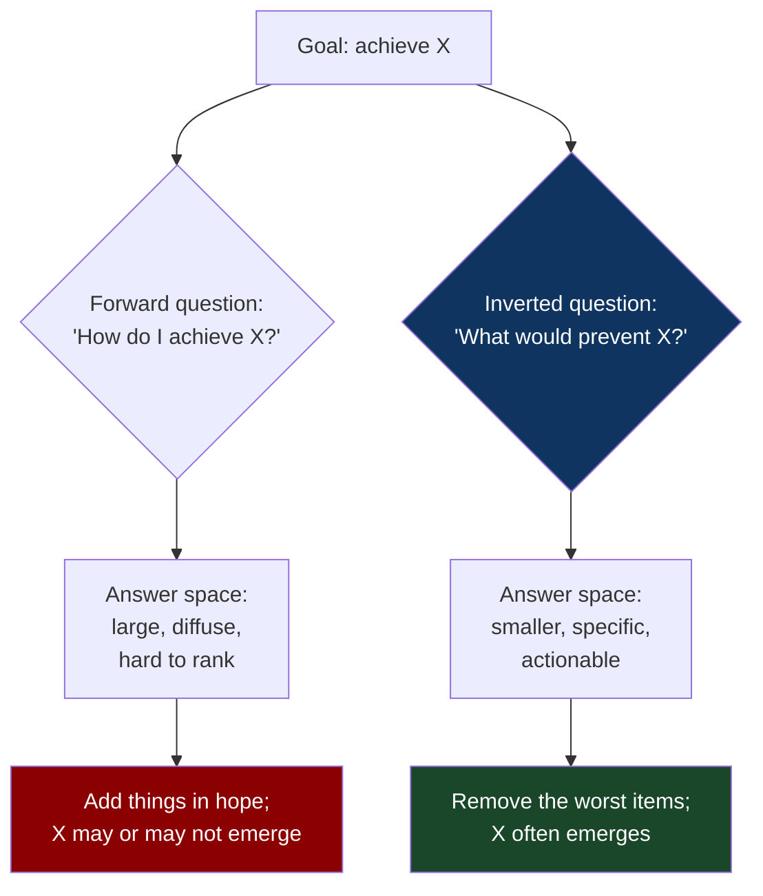
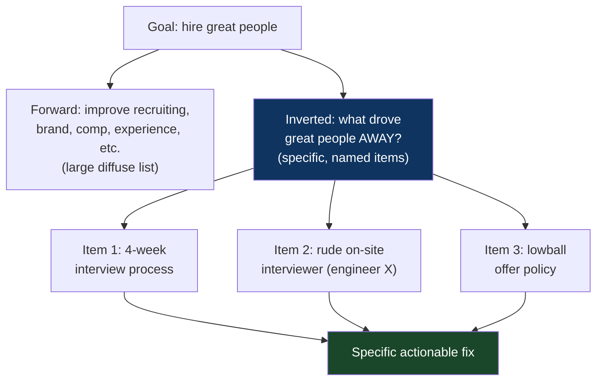
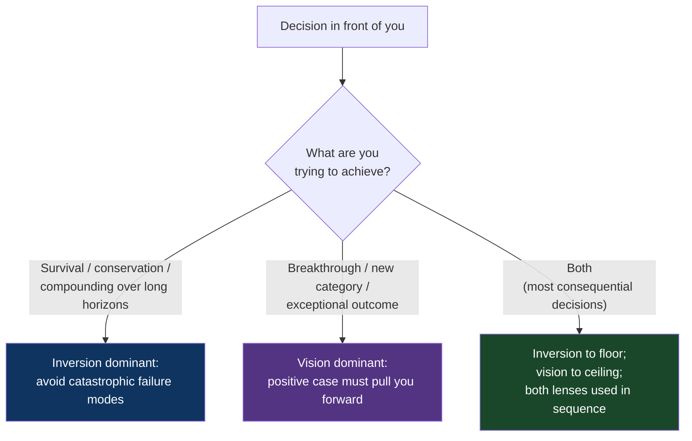

# CH-17: Inversion
### *Why "what would destroy this?" is a more useful question than "how do I make this great?"*

> **Part 5 of 5 · Lateral Moves and Meta-Solving**
> **Model Type:** `decision`

---

## The Misread

A CEO at a 300-person company is concerned about company culture. He commissions an offsite, hires a consultant, runs values workshops, redesigns the onboarding deck to emphasize culture, and adds a culture-fit interview to the hiring process. Six months later, the culture surveys are no better. Employee NPS is, if anything, slightly worse. He repeats the cycle — another offsite, a refreshed values statement, a culture committee. Six more months. No measurable change.

His CTO is irritated by the lack of progress and suggests they try a different question. Instead of asking "how do we build a great culture?", she suggests: "what would destroy our culture?"

They list. The list is uncomfortable.

- *Tolerating a senior leader who treats their reports badly while delivering results.*
- *Promotion criteria that reward visible self-promotion over substantive contribution.*
- *Compensation that's wildly inequitable in ways people will eventually find out about.*
- *A founders' clique that makes major decisions outside official channels.*
- *Public criticism of individuals in meetings, especially by senior leaders.*
- *Hiring people we don't trust because we need the headcount.*
- *Ignoring repeated feedback from a specific team without explanation.*

Reading the list, the CEO recognizes that the company is doing *most of these things, right now*. The senior leader who treats reports badly is the head of sales, whose results are excellent and who has been protected from feedback for two years. The promotion process visibly rewards charisma. There's a known compensation issue that nobody has corrected. The founders do make most consequential decisions in a private slack channel. None of these were on the culture initiative's roadmap. None of them had been mentioned at any offsite. All of them were doing actual damage to the culture every day, and the entire culture initiative had been adding good things on top of an unaddressed cesspit of bad things.

The CEO had been asking "what good things can we add?" The right question was "what bad things are we already doing?" The good things, layered onto unaddressed bad things, are theater. Removing the bad things would have done more than any number of values workshops.

He delays the next offsite. He fires the head of sales. He restructures the promotion criteria. He audits compensation and equalizes a number of clear inequities. Six months later, culture surveys improve more than they had in the previous two years combined.

## The Blind Spot

The brain is biased toward *additive* thinking. When facing a problem, we ask "what can I add?" — a new program, a new feature, a new rule, a new investment, a new initiative. Adding feels generative and visible; we can point to what we did. Subtractive thinking — "what can I remove?" — is harder to access cognitively and harder to defend politically. Recent research (Adams et al. 2021, *Nature*) showed that humans systematically under-use subtractive solutions even when they're objectively better, across a wide range of puzzle-like tasks.

This bias compounds with the structural reality that *removing bad things often has higher leverage than adding good things*, but is harder to do. Removing requires identifying a specific bad thing (politically risky), naming it (socially uncomfortable), and removing it (often involves firing, deprecation, or saying no to someone). Adding requires only proposing something new. The political and social costs are asymmetric, and they cut in the direction that biases us further away from the higher-leverage move.

Inversion is the deliberate counter-move: instead of asking the forward question, ask its inverse. *Not "how do I succeed?" but "how do I fail?" Not "how do I build a great X?" but "what would destroy X?" Not "how do I make this fast?" but "what's making this slow?"* The inverted question often produces an answer list that's *more specific, more actionable, and higher-leverage* than the forward question would have.

## The Model, Precisely

**Inversion.**

Instead of asking "how do I achieve X?", ask "what would make X impossible?" The answers — the specific failure modes, the specific anti-conditions — are often easier to identify than the success conditions, and *avoiding* them often has higher leverage than *engineering* the positive case. Inversion is most useful when the forward question is producing diffuse, low-leverage answers, or when the positive case is over-specified relative to the negative case.

What this model makes visible: many situations have a *small number of catastrophic failure modes* that account for most bad outcomes, and an *unbounded space of good outcomes* that are hard to engineer directly. Avoiding the catastrophic failures is tractable; engineering greatness is not. Inversion redirects effort from the unbounded space to the tractable one.

Spatially: think of success as a high plateau. The forward question — how do I climb the plateau? — has many possible routes, most of which are hard to evaluate in advance. The inverted question — what would push me off the plateau? — has a small list of specific things (cliffs, holes, hostile actors), most of which can be identified and avoided. Avoiding the things that push you off the plateau is often sufficient to remain on it; you don't need to engineer the plateau, you need to stay on it.

The model is associated with Charlie Munger, who attributes it (somewhat freely) to the German mathematician Carl Jacobi: "Invert, always invert." The Berkshire Hathaway investment philosophy — "we don't try to be brilliant, we try to not be stupid" — is inversion as life strategy. The claim is that *not being stupid* over a long time horizon compounds more reliably than *being brilliant*, because brilliance has many failure modes and stupidity avoidance has few.

Parrish, in *The Great Mental Models*, treats inversion as one of the most reliably useful cognitive tools, precisely because the cost of using it is low (10 minutes of inverted brainstorming) and the upside is high (catching the catastrophic failures that forward thinking would have missed).

## Three Domains, One Model

### Domain 1: Engineering — System Reliability

The forward question: "How do we make our service reliable?" Answer space: better testing, better monitoring, better architecture, better incident response, more redundancy, better deployment practices, more on-call training, better documentation. All of these are valid. The list is large. Each item could absorb a quarter of work. The priority is unclear.

The inverted question: "What would cause our service to fail catastrophically?" Answer space: total data center outage; cascading dependency failure; corrupted deploy that we can't roll back; a single point of failure (a database, a service, a person) going down; a security breach that takes the system offline; a denial-of-service attack that overwhelms capacity; a config change that propagates errors faster than we can stop. The list is *smaller*, *more specific*, and each item has a *named mitigation* that's easier to scope than "improve reliability."

The inverted approach drives different work. Instead of "make reliability better" (vague), you have "we don't have multi-region failover; that's a top catastrophic risk; fix it" or "the deploy pipeline has no automated rollback; that's a top catastrophic risk; fix it." The work is sized, prioritized, and verifiable. Once you've removed the top three or four catastrophic failure modes, your reliability has materially improved without having directly engineered "reliability" as a target.

This is the structural reason that pre-mortems work. Klein's invention — gather the team before starting a project; imagine the project has failed catastrophically; brainstorm why — is inversion applied to project planning. Pre-mortems consistently surface risks that forward planning misses, because the forward question ("how do we make this succeed?") generates aspirational lists, while the inverted question ("what would have killed this?") generates specific actionable risks.

### Domain 2: Organization — Hiring

The forward question: "How do we hire great people?" Answer space: better recruiting; better interview process; better employer brand; competitive compensation; better candidate experience; better assessment of skills. Each is a real lever; each has been the subject of books. The set is enormous; the relative priority is unclear.

The inverted question: "What mistakes have we made that drove away great people?" Answer space: slow process; lowball offers; rude interviewers; opaque progression; lack of feedback after no-hires; a public reputation issue with a former employee; specific senior hires whose presence makes other candidates wary; misalignment between the role advertised and the role offered.

The inverted list is smaller, more specific, and immediately actionable. Each item has a named target. Some of them (rude interviewers, opaque progression) are politically uncomfortable to address, which is exactly why they persist and why addressing them produces leverage. The forward "let's improve recruiting" effort might run for years without touching the rude interviewer; the inverted "what drove the last great candidate to take the other offer?" effort surfaces them in week one.

### Domain 3: Buffett, Munger, and "Don't Be Stupid" Investing

Warren Buffett and Charlie Munger have been explicit, across decades of public commentary, that their investment success is largely an inversion strategy. They are not trying to find brilliant investments; they are trying to *avoid catastrophically bad investments*. The forward question — "how do I find a great stock?" — has, in their view, no reliable answer that retail or even most institutional investors can execute. The inverted question — "what kinds of investments destroy capital?" — has a relatively short, reliable answer list: companies with unstable economics, companies in industries facing structural decline, companies with management of questionable integrity, leveraged positions, derivatives whose downside isn't fully understood, anything you don't understand well enough to value.

Their strategy is, essentially, to *never make those mistakes*, and to wait patiently for opportunities to buy good businesses at reasonable prices when those rare opportunities appear. Most of their effort is in *not doing things* — not investing in tech in the 1990s when the dot-com bubble was inflating, not using leverage during 2008, not making decisions outside their circle of competence. The "Berkshire underperformed in the 1999 bull market" critique was leveled at them yearly until 2000, when the inversion strategy was proven right by the dot-com crash. Inversion plays out across long horizons; in short horizons, it can look conservative or even cowardly.

Munger has been more explicit about the cognitive mechanism: "It is remarkable how much long-term advantage people like us have gotten by trying to be consistently not stupid, instead of trying to be very intelligent." The asymmetry he's pointing at is that intelligence is required to make outstanding decisions, but only discipline is required to avoid stupid ones, and the cumulative effect of avoiding stupidity over decades is greater than the cumulative effect of intelligence applied to seeking brilliance.

The strategy has limits — Buffett has explicitly missed entire categories of investment (tech for years; he eventually corrected on Apple) because his inversion-driven caution kept him out. The opportunity cost of the inversion strategy is real. But the *catastrophic loss avoidance* it produces compounds in a way that overcomes most of the opportunity cost over long periods.

## Where The Model Breaks

**The hidden assumption:** the absence of bad is sufficiently close to the presence of good for the strategy to produce desired outcomes.

In some domains, *not failing is not the same as winning*. A team that has no problems isn't necessarily a great team — it might just be a sleepy one that's never attempted anything ambitious. A startup that hasn't run out of money isn't necessarily on a path to success — it might be slowly dying. A career that hasn't been derailed isn't necessarily great — it might be drifting. Inversion gives you the *floor* (avoid the catastrophic); it doesn't give you the *ceiling* (achieve the exceptional).

For ceiling pursuit, you need positive-vision thinking — what would *outstanding* look like? — that the inversion lens cannot supply. Pure inversion produces survival and conservation; it doesn't produce breakthroughs. The greatest creative work, the most successful new businesses, the most consequential scientific discoveries — these often required someone holding a positive vision that no inverted question would have generated.

A second failure: inversion can become *paralysis*. If you list every way something could go wrong, you can talk yourself out of action. The number of failure modes is, in principle, large; the discipline of inversion is to identify the *catastrophic* failure modes and focus there, not the long tail of minor failure modes. A team that takes inversion too literally produces risk registers with hundreds of items, treats every item as needing mitigation, and never ships anything.

A third failure: in adversarial or competitive environments, *defending against past failure modes* doesn't help if the competitor exploits failure modes you didn't anticipate. Generals fighting the last war is the classical version. Inversion-driven thinking can produce systems robust against historical failures and fragile to novel ones, because the inversion was over the *known* failure space.

**The signal you're in the break zone:** you've inverted, identified the catastrophic risks, addressed them, and now your work is positive-vision pursuit. Or: you're inverting in pursuit of breakthrough rather than survival, and the inverted question isn't producing useful answers. Or: your inverted list is so long that it's become a justification for not acting.

## The Collision

**This model says:** invert; avoid catastrophe; conservation beats engineering greatness.
**Vision-Driven Thinking (e.g., "moonshots," "what would exceptional look like?") says:** great work requires a positive vision that pulls the team toward outcomes inversion can't articulate; without vision, you produce mere survival.

The collision is real. Inversion will tell Apple in 1996 to "not go bankrupt"; vision-driven thinking gave us the iMac and the iPhone. Inversion will tell a writer to "not write a bad book"; vision gave us *Hamlet*. The two are sometimes complementary (avoid catastrophic risk *and* pursue exceptional outcome) and sometimes in active tension (the breakthrough requires risks that inversion would have rejected).

Scenario where they collide: a startup is considering whether to enter a new market. Inversion says: "What would cause this entry to fail catastrophically? Insufficient capital; team without market expertise; competitor's pre-emptive response; regulatory risk we haven't modeled. Address these before committing." Vision says: "Imagine we're the dominant player in this market in five years. What would have to be true for that? What's the most leveraged path?"

Both lenses produce different actions. Inversion produces a careful scoped entry with clear risk mitigations. Vision produces a bold commitment that may overrun the risk-modeling. Pure inversion produces no entry (the risks are always real); pure vision produces over-committed entries that often fail.

**The meta-skill:** the deciding signal is *what kind of outcome you're pursuing*. Conservation goals (survival, compounding, reliability) are inversion-dominant. Breakthrough goals (new categories, exceptional creation, paradigm shifts) are vision-dominant. Most consequential decisions need both — inversion to set the floor, vision to pull toward the ceiling. The mistake is using only one lens, either because you find vision uncomfortable (your work becomes safe and unambitious) or because you find inversion uncomfortable (your work becomes brittle and prone to catastrophic failure).

## The Retrofit

**Event:** Pre-mortems as a project management practice, formalized by Gary Klein in his 2007 *Harvard Business Review* article "Performing a Project Premortem."

Klein's empirical research showed that conventional risk-identification techniques in project management — risk registers, brainstorming, expert review — consistently *under-identified* risks. Projects shipped with known-but-unaddressed risks, and many failed for reasons that had been listed somewhere but not taken seriously. He hypothesized that the framing was wrong: asking "what risks might this project face?" prompted a defensive, abstract response in which people listed politely-stated possibilities and moved on.

His intervention was an inversion. Before kicking off a project, gather the team. Tell them: *imagine we are one year in the future and this project has failed catastrophically. Now write the story of why.* The shift in framing produced dramatically different responses. People were more honest, more specific, more willing to name things ("the marketing team won't actually be able to deliver on time"; "the CEO will pull resources mid-project"; "the technical assumption we're making about API X is wrong") that the forward "what risks might we face?" framing had been suppressing.

The mechanism: in the forward framing, naming a risk is *socially expensive* (you sound negative; you're flagging your colleagues' work as risky; you're seen as a blocker). In the inverted framing, you're being asked to *imagine* the failure — it's hypothetical; the social cost of saying "the marketing team failed" is lower because the failure is fictional and your statement is just a creative contribution to the exercise.

Pre-mortems have been widely adopted in industry over the past decade. The evidence on their effectiveness is reasonably strong: teams that conduct pre-mortems identify more (and more accurate) risks than teams using conventional risk-identification methods. Several large organizations (Wikipedia notes Marriott, the Joint Chiefs of Staff, others) have made pre-mortems standard practice for major initiatives.

Re-reading through inversion: pre-mortems are not telling people anything they couldn't have said with conventional risk-identification. The risks identified in a pre-mortem are usually the same kinds of risks; the people who name them are usually the same people who would have known them. The *framing* — inverting "what could go wrong?" into "imagine it has gone wrong; reconstruct why" — is the entire intervention. The framing reduces the social cost of honesty and prompts more specific articulation. The structure of the inversion is doing the work; no new information is being added.

**What was invisible:** the social structure of risk identification in conventional project planning. The forward framing was a social environment in which honesty was expensive. The inverted framing was a social environment in which honesty was cheap. The shift was almost entirely in the meta-game of who-says-what-and-how, not in any analytical capability. This is a recurring theme in inversion: the inverted question often unlocks *information that was always available but socially suppressed*, by changing the social cost of articulating it.

**The intervention point:** any organization that struggles with risk identification can install pre-mortems essentially for free. The barrier to adoption is usually cultural ("we don't want to dwell on the negative; let's focus on success") rather than methodological. Organizations that overcome this cultural barrier and consistently run pre-mortems before major initiatives identify a substantial fraction of the risks that would have killed those initiatives, in time to address them. This is one of the highest-leverage process changes available, and it's almost entirely an inversion exercise.

## The Practice Rep

> **Duration:** 48 hours
> **What you're training:** the discipline of asking the inverted question instead of, or in addition to, the forward question

**The exercise:**
Pick one specific goal you have — at work or personal — that you've been working on without obvious progress. Could be a project, a relationship dynamic, a habit you're trying to build, a team outcome you're chasing. One thing.

Spend ten focused minutes asking only one question: "What would prevent this?" or "What would destroy this?"

Write down everything that comes to mind. Don't filter. Don't worry about whether the items are likely or unlikely. List as many as you can.

When you have the list, do two things:

1. Rank the items by *severity* (how bad it would be if it happened) × *likelihood*. The top 2–3 are your highest-leverage targets.
2. For each of the top 2–3, ask: *what specific action would prevent this?* Notice that the actions are usually specific, scoped, and immediately doable — much more so than "achieve the original goal" was.

**What to look for:**
The pattern that will surprise you most: the highest-leverage items on your inverted list are almost always things you *already knew about but had been not-addressing*. The thing you've been avoiding talking to your colleague about. The dependency you've been hoping won't bite you. The communication issue you've been hoping will resolve itself. The competing priority that's been silently draining attention. Inversion surfaces these because asking "what would destroy this?" makes them socially safe to name (you're brainstorming hypothetical failures, not making accusations) and structurally salient (they leap to mind faster than positive-case items do).

The unsettling pattern: many of the items will be things you could have done weeks or months ago. The reason you haven't isn't lack of skill or resources; it's that the forward question — "how do I make progress on the goal?" — had been generating diffuse aspirational answers that crowded out the specific subtractive moves the inverted question now reveals. Inversion is often less about new insight and more about re-prioritization toward subtraction.

**The log:**
At the end of 48 hours, write one sentence: "I saw Inversion at work when [the specific subtractive action — removing or avoiding something — that produced more progress on my goal than weeks of additive effort had]."
