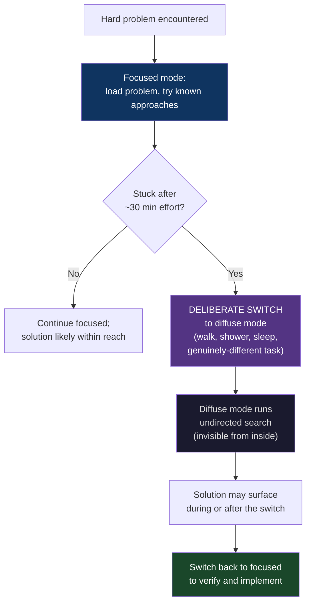
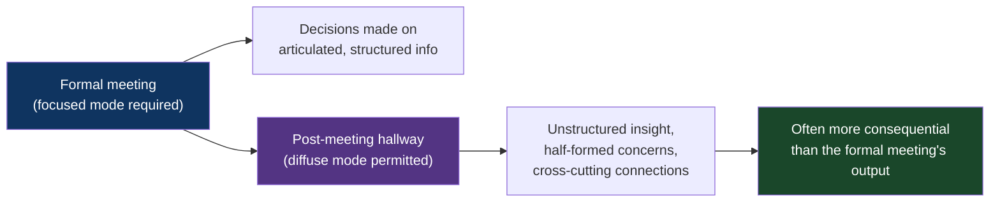
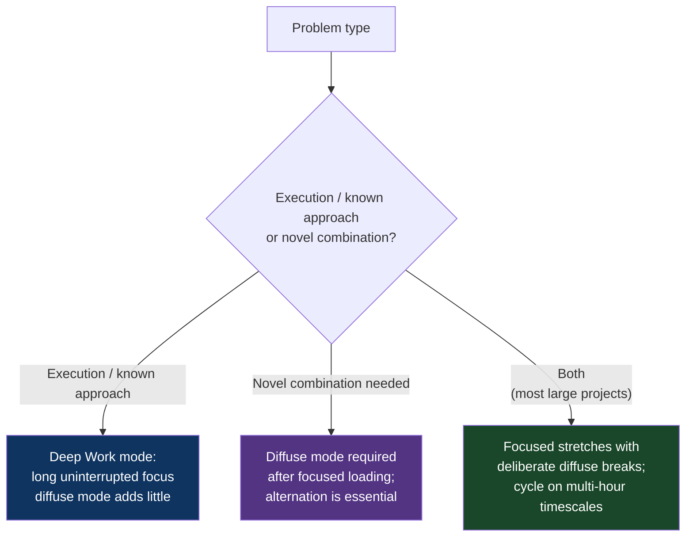

# CH-18: The Diffuse Mode
### *Why your best problem-solving happens when you aren't trying — and why this looks like laziness from the outside*

> **Part 5 of 5 · Lateral Moves and Meta-Solving**
> **Model Type:** `meta`

---

## The Misread

An engineer is stuck on a hard architecture problem. She's been working on it intensely for six hours — whiteboard sketches, code prototypes, reading related codebases, going through the requirements again. She is no closer to a clean solution than she was at hour one. Several candidate designs each have a fatal flaw. She is frustrated. She skips dinner. She works for another two hours, makes no progress, and finally goes home at 9pm, defeated.

She walks her dog the next morning. About fifteen minutes into the walk, while looking at nothing in particular, the solution arrives. Not as a flash of inspiration in a movie sense — more as a quiet recognition: "Oh. The two requirements that seemed in conflict are actually the same requirement; if I restructure the data model around the underlying invariant, both fall out for free." She stops walking. The dog stops too. She mentally walks through the consequences. The design is clean. It addresses everything. It's been there, fully formed, since at least fifteen minutes into the walk.

She gets to the office and writes it up in twenty minutes. The team reviews it. It's accepted. She ships the implementation in two days.

The temptation is to attribute the morning insight to *luck* or *the unconscious working overnight*. Both are partially right, but they miss the mechanism. What was actually happening: her morning walk had given her brain *permission to stop focusing*. The focused mode she'd been in all day had been hammering on the same set of candidate solutions, getting deeper into local optima but unable to *see across the landscape*. The diffuse mode — which can only engage when focus relaxes — runs a different kind of search, one that connects distant ideas and finds non-obvious connections. The diffuse search had been running in the background since she stopped trying. The walk was the moment her conscious mind got out of the way long enough for the diffuse search's results to surface.

If she had stayed at her desk for the extra two hours, the diffuse mode would not have run. Focused effort was actively *suppressing* the kind of thinking the problem actually needed. The "lazy" walk was the productive part of her day. The "hardworking" eight hours had been the part that wasn't producing solutions.

She suspects, but cannot prove, that her manager noticed her arriving at 10am that morning and silently filed it as a productivity concern. The manager has no idea that the late arrival is when the work got done.

## The Blind Spot

We have a strong cultural model that *thinking* equals *focused effort*. Sitting at a desk with eyes on a problem is thinking. Walking, showering, staring out a window, taking a nap — these are not thinking; they are breaks from thinking. This model is wrong in a specific way that costs us most of our hardest problem-solving.

The brain has two distinct modes of operation. Focused mode is what we recognize as "thinking" — tight, narrow, deliberate, exploiting known patterns and pathways. Diffuse mode is broader, looser, less deliberate, more associative, capable of connecting ideas that focused mode can't bridge because they live in different parts of the brain's network. Diffuse mode does not feel like work; it feels like resting, or daydreaming, or zoning out. But for problems that require *combining* concepts that don't naturally combine, diffuse mode is essential, and focused mode is actively counterproductive.

The blind spot is that *we cannot observe diffuse mode running*. From the inside, it feels like nothing is happening. From the outside, the person looks like they're not working. The cultural reward signal goes entirely to focused mode because focused mode is the visible kind. People who reliably solve hard problems by alternating modes look, to observers, like they're working less than people who stay focused all day — even when the alternating mode produces more output.

The structural cost: many of the people doing the hardest knowledge work have managers, peers, or themselves judging them by the focused-mode signal. They feel guilty about walking away from a hard problem. They sit at the desk for the extra hours. The extra hours don't produce anything because the problem needed diffuse mode, and diffuse mode can't engage while you're sitting at the desk forcing focus. The eight hours that produce nothing are the *socially expected* eight hours; the morning walk that produces the answer is the *socially suspect* walk.

## The Model, Precisely

**The Diffuse Mode.**

The brain has two complementary thinking modes. **Focused mode** is tight, deliberate, narrow; it exploits known pathways and works well for problems where the solution lies inside a well-known solution space. **Diffuse mode** is broad, associative, undirected; it connects distant ideas across the brain's network and works well for problems that require novel combinations or perspective shifts. Diffuse mode can only engage when focused mode relaxes. Many hard problems require *both modes in alternation* — focused mode loads the problem and exhausts known approaches; diffuse mode runs an undirected search; focused mode is then needed to verify and implement what diffuse mode produced.

What this model makes visible: a substantial fraction of "stuckness" on hard problems is the result of refusing to leave focused mode. The solution isn't more focused effort; it's a *deliberate switch* to diffuse mode, which from the inside looks like stopping work. The discipline of switching is the meta-skill. Most knowledge workers do not have it, because culture and self-image conspire against it.

Spatially: focused mode is a flashlight beam — it illuminates a small area with high intensity. Diffuse mode is moonlight — it illuminates a wide area with low intensity. Most problems require both at different stages. Trying to use a flashlight to map a forest is futile; trying to read a book by moonlight is impossible. The skill is knowing which kind of light the current task needs and being willing to put down the wrong one.

Barbara Oakley's framing in *A Mind for Numbers* draws on the neuroscience: focused mode engages a specific set of brain networks (default mode networks are *suppressed*), while diffuse mode engages broader, more distributed networks (default mode networks are *active*). The two are physically distinct neural states; you cannot be in both at once. Switching takes time and requires *actually disengaging*, not just shifting attention slightly.

## Three Domains, One Model

### Domain 1: Engineering — The Architecture Insight

Almost every senior software architect can tell a version of the opening misread. The pattern is reliable: the hardest design problems get solved during showers, walks, drives, runs, or sleep, not at the desk. The architects know this empirically but often don't have the conceptual framework for *why*.

The mechanism: architecture problems usually require *combining* concepts that don't naturally combine. The right data model is a non-obvious blending of constraints from multiple subsystems; the right module boundary is found by considering how the system will evolve in directions not yet specified; the right abstraction is the one that fits *both* the use cases you've enumerated and the use cases you can't articulate yet. These are exactly the kind of problems where focused-mode pattern-matching against known solutions runs out of candidates, but diffuse-mode association across unfamiliar territory can find non-obvious connections.

Senior architects often build personal *rituals* around the diffuse mode without naming it as such. They walk to coffee instead of using the office kitchen. They block "thinking time" in their calendar with no agenda. They take long lunches. They tell their teams "I need to step away from this." From the outside, these look like preferences or eccentricities. They are usually deliberate deployment of diffuse mode.

The pedagogical implication for teaching this to juniors: it's not enough to say "take a walk when stuck." The junior also needs *permission* — explicit cultural sanction — to step away from a hard problem without feeling like they're failing to work. The most effective version is when a senior explicitly says "I'm walking away from this for two hours; I'll let you know what I come up with." The modeling does more than the instruction. Teams whose seniors model diffuse-mode use produce engineers who can solve harder problems than teams whose seniors performatively grind.

### Domain 2: Organization — The Meeting After the Meeting

Many of the most useful conversations in any organization happen *after* the formal meeting, in the hallway, the walk back to the desk, the lunch afterwards. People who have observed this often say "the real meeting was after the meeting" without understanding why.

The mechanism is diffuse mode applied to social and strategic problems. The formal meeting forces focused-mode engagement — agenda items, structured discussion, deliberate stances. The post-meeting moments allow *both* parties to operate in a more diffuse mode. The conversational tone relaxes; people make associations they wouldn't have made in the formal setting; the *insight* about what's actually going on or what should actually be done often arrives in this looser space.

This is part of why "managing by walking around" works for some managers. The structured 1:1 is focused-mode. The chance encounter at the coffee machine is diffuse-mode. Information that wouldn't surface in the 1:1 — half-formed concerns, vague intuitions, "I'm not sure but" — comes out in the chance encounter because the diffuse setting permits less-finished thoughts.

The same mechanism explains why fully-remote work environments often struggle with serendipity. The "watercooler conversation" is a diffuse-mode setting where unplanned cross-pollination happens. Remote-only environments tend to compress all communication into scheduled, agenda-driven formats — all focused-mode. The cross-pollination that diffuse-mode social interaction would have produced doesn't happen, and the organization's collective problem-solving capability degrades in subtle ways that don't show up in any metric.

This is not an argument against remote work — there are many factors. But the *diffuse-mode social cost* of pure remote is real, and organizations that try to compensate for it (with deliberate unstructured time, off-sites, virtual coffee chats with no agenda) are sometimes engineering around the missing diffuse mode. Not always successfully.

### Domain 3: Poincaré's Mathematical Insight

Henri Poincaré, the great French mathematician (1854–1912), wrote one of the most-cited accounts of how a mathematical breakthrough actually feels. He had been working for two weeks on a problem involving Fuchsian functions, making no progress. He drank black coffee one night and could not sleep; ideas combined and recombined unbidden. By morning, he had what would become a foundational result, but the actual *moment of insight* — the instant when the structure became visible — came later, while he was boarding a bus on an unrelated trip:

"At the moment when I put my foot on the step the idea came to me, without anything in my former thoughts seeming to have paved the way for it... I felt a complete certainty. On my return to Caen, for conscience's sake I verified the result at my leisure."

Poincaré's account is striking because it describes the *bus-step moment* in detail — and notes that he made no further mental effort on the problem at that moment. The insight arrived complete, unforced, in a setting maximally disconnected from his work. He took the insight, verified it later (in focused mode), and the result was correct.

He went on to articulate, in *Science and Method* (1908), what is essentially an early model of the focused/diffuse mode distinction, though he didn't use those terms. He observed that unconscious work seemed to *combine* ideas in ways the conscious mind couldn't, and that the unconscious work seemed to require *prior conscious effort to load the problem*, followed by *deliberate stepping-away* to allow the unconscious combination to happen. His prescription: work hard on the problem, then leave it alone, then return to verify what the unconscious has produced.

A century later, neuroscience has confirmed much of Poincaré's introspective model. The default mode network — active during rest, mind-wandering, and undirected thought — does perform genuine cognitive work, including problem-solving and creative combination. The "doing nothing" of diffuse mode is doing something real, and the *cycling* between focused and diffuse modes is the mechanism by which the hardest creative work gets done.

Poincaré's account is also striking because it implicitly admits something most working mathematicians would never admit publicly: a substantial fraction of his major results came during walks, baths, and bus rides, not at his desk. He was honest enough about his process to record it. Most modern knowledge workers are not.

## Where The Model Breaks

**The hidden assumption:** the problem at hand actually requires the kind of broad associative search that diffuse mode performs.

Many problems don't. Executing on a known plan, debugging by elimination, writing well-specified code, doing deliberate practice on a skill — these are *focused-mode* problems. Walking away from them doesn't help; you'll just have to come back to the same situation and execute. Treating focused-mode problems as diffuse-mode problems produces avoidance — you go for a walk hoping for inspiration on a problem that doesn't need inspiration, it needs grinding.

A second failure: diffuse mode requires the focused mode to have *loaded the problem* first. You can't just decide to engage diffuse mode on a fresh topic; the diffuse search needs prior loaded context to associate against. Newcomers to a domain often try to skip the loading phase and "let their unconscious solve it," with predictable nonresults. The shower insights of senior engineers are built on years of loaded focused work; the same shower would produce nothing for someone who hadn't done the loading.

A third failure: diffuse mode is *unreliable in timing*. You cannot summon it on demand. The insight may come during the walk, or the next day, or two weeks later, or never. For time-sensitive problems with hard deadlines, you may not have the luxury of waiting for the diffuse search to complete. Focused-mode grinding may produce a worse-quality solution but produce it on time, which is better than waiting indefinitely for the perfect one.

A fourth failure: some forms of distraction *look like* diffuse mode but aren't. Mindless scrolling, anxious replaying, low-grade entertainment that demands attention without intellectual engagement — these don't engage diffuse mode; they just suppress focused mode without enabling the alternative. True diffuse mode requires *low-cognitive-demand engagement* that lets the mind wander (walking, showering, doing dishes, sleeping). Scrolling Instagram is not diffuse mode; it's focused mode on something trivial.

**The signal you're in the break zone:** the problem you're stuck on is actually an execution problem and you're avoiding the grind by calling it a need for diffuse mode. Or you haven't loaded the problem enough for diffuse mode to have anything to work with. Or the timeline is too tight to wait for diffuse mode's unpredictable timing.

## The Collision

**This model says:** alternate focused and diffuse modes; step away when stuck; the apparent break is the productive work.
**Deep Work (Newport) says:** the productive work happens during long uninterrupted focused stretches; interruption is the enemy; the world has been training us to context-switch in ways that destroy our capacity for deep focus.

Both are correct in their respective domains. The collision is in the framing.

Deep Work emphasizes the *defensive* aspect of focused effort: in a world of constant interruption, the discipline of long focused stretches is what allows substantial work to happen at all. This is true and important. Diffuse Mode emphasizes the *generative* aspect of stepping away: focused effort alone, without diffuse interludes, cannot produce certain kinds of insight. This is also true and important.

Newport himself acknowledges this — his model of deep work includes "deliberate rest" as a complement to deep focus. The popular reception of Deep Work has often missed this nuance and treated focus as the entire prescription. The result is people who can do many hours of focused execution but who do not produce the *novel insights* that diffuse mode generates. They are reliable executors who don't have breakthroughs.

**The meta-skill:** the deciding signal is *whether the problem at hand requires novel combination or just disciplined execution*. Execution problems are deep-work problems; diffuse mode is overhead. Insight problems are alternation problems; pure focus blocks the insight. Most consequential work involves both kinds of problems in sequence — there's a creative phase that needs alternation, then an execution phase that needs deep focus. The mistake is using one mode for the wrong phase.

## The Retrofit

**Event:** James Watson and Francis Crick's discovery of the double-helix structure of DNA, 1953.

The conventional story of the discovery emphasizes Watson and Crick's intellectual brilliance, their use of Rosalind Franklin's X-ray crystallography data, and the speed of their breakthrough. Less commonly noted is the *texture* of how they actually worked, which is recorded in Watson's memoir *The Double Helix* and in later historical accounts.

Watson and Crick spent most of their working hours *talking*. Not at a board doing calculations; not at a microscope examining data; just talking. They walked. They went to pubs. They argued. They considered models, rejected them, considered new ones. Their conscious effort was distributed across long stretches of mostly-unfocused, conversation-based exploration — a sustained form of social diffuse mode. They did focused work too, building physical models with metal plates and wire, doing the geometric calculations to verify proposed structures. But the *generative* part — the proposing of new structural ideas — happened in conversation, often during walks, often at the pub.

Crick later described their work pattern with some self-awareness: they were paid (modestly) to be unproductive in the conventional sense, free to spend their days exploring. The actual breakthrough — the recognition that the helix had to be a *double* helix with complementary base-pairing — emerged from this sustained low-pressure exploration over months. The specific *moment* of insight, the moment Watson saw the AT-GC pairing pattern, came at his desk while playing with cardboard cutouts of the bases. But the *months of preparation* that made that moment possible were sustained diffuse-mode exploration.

The contrast is Linus Pauling, the other major contender for the DNA structure. Pauling, working in California, used a much more focused-mode approach: rigorous computation, systematic enumeration of structural possibilities, isolation from distraction. He produced a structure (the triple helix, in early 1953) that turned out to be wrong in important ways. Pauling's focused-mode rigor was brilliant but constrained; he wasn't doing the broader exploration that might have surfaced the double-helix structure.

Re-reading through the diffuse mode: Watson and Crick's success was partly luck and timing (they had access to Franklin's data; they were younger and less encumbered than Pauling), but it was also genuinely a function of *how they worked*. The diffuse-mode pattern they sustained for months — talking, walking, exploring without immediate pressure to produce — was the kind of cognitive environment that could surface non-obvious combinations. Pauling, working in a more conventional focused-mode environment, missed the combination that was right there in the data.

**What was invisible:** the cultural assumption that "serious scientific work" looks like focused mode. Watson and Crick's work, judged by conventional standards of "are you producing visible output?" would have looked like loafing for most of the period leading up to the discovery. Their institutional environment (Cambridge's Cavendish Lab) was, fortunately, tolerant of this. In many environments — corporate R&D, modern academia with publication-rate pressures, startups with weekly reporting — the same work pattern would have been pressured into more visible focused-mode output and the breakthrough might never have occurred.

**The intervention point:** organizational environments that *protect* diffuse-mode time from focused-mode performance metrics are the ones that produce the highest rates of genuine breakthrough. Bell Labs at its peak, Xerox PARC at its peak, certain academic departments, certain startup founding teams — all shared this property. As the focused-mode metrics tightened (publication counts, quarterly OKRs, weekly status reports), the rate of breakthrough work tended to decline. The lesson is hard to operationalize at scale because diffuse-mode work cannot be defended by its visible output (it has none, by definition), but it's worth knowing that the protection is what enables the work.

## The Practice Rep

> **Duration:** 48 hours
> **What you're training:** the discipline of deliberately leaving a hard problem at a specific stuck point, instead of grinding past the productive limit of focused mode

**The exercise:**
For the next 48 hours, when you're working on a hard problem (technical, design, strategic — anything non-routine) and you find yourself stuck for more than 30 minutes without progress, *physically leave*. Don't switch tabs. Don't switch to email. Don't look at your phone.

Go somewhere different: walk outside, take a shower, do dishes, lie on the couch with eyes closed, take a nap. Do something that requires low cognitive demand and does not provide focused-mode entertainment. The activity should let your mind wander without demanding it.

After 20–60 minutes (varies by problem and by person), return to the problem and try again.

Track each instance in a notes file: (a) what the problem was, (b) how long you'd been stuck before leaving, (c) what you did during the break, (d) what happened when you returned — did you have new ideas? Did the problem look different? Did you spot something you'd missed?

**What to look for:**
The first surprise is how *uncomfortable* it feels to leave. Your trained intuition will say "I should keep working" — even though you've already established that the working isn't producing results. Notice this discomfort. The discomfort is the cultural training fighting the better strategy. Push through it.

The second surprise: at least once in the 48 hours, the solution will arrive during or right after the break. Not because of magic — because the diffuse mode was running and your conscious mind got out of the way. The moment when you realize "oh, I already know what to do; I just needed to stop trying" is the model running.

The third surprise: not every break will produce a solution. Sometimes the diffuse mode doesn't find anything. That's normal. The diffuse mode is unreliable in timing, and a single 30-minute walk is not guaranteed to surface anything. The discipline is doing it anyway, knowing that the *cumulative* practice of alternating modes produces more insight than the alternative pattern of pure grinding does.

You may also notice the social texture. Colleagues will see you leave your desk for a walk; some will respect it, some will judge it. If you can articulate what you're doing ("I've been stuck on this for two hours; I need to step away so my brain can work differently"), most reasonable colleagues respond well. The articulation also reinforces the discipline for yourself.

**The log:**
At the end of 48 hours, write one sentence: "I saw the Diffuse Mode at work when [the specific moment a solution arrived during or after a deliberate break that focused-mode grinding had not produced]."
