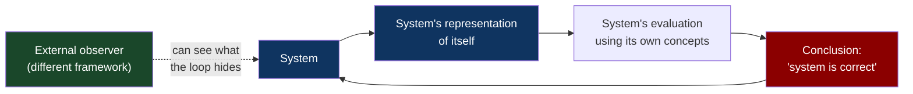
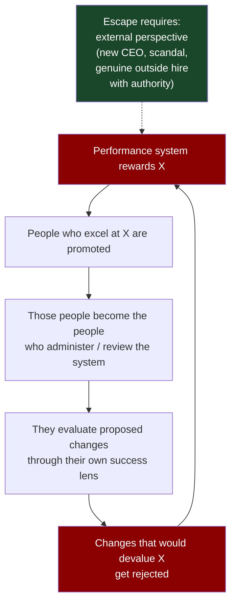
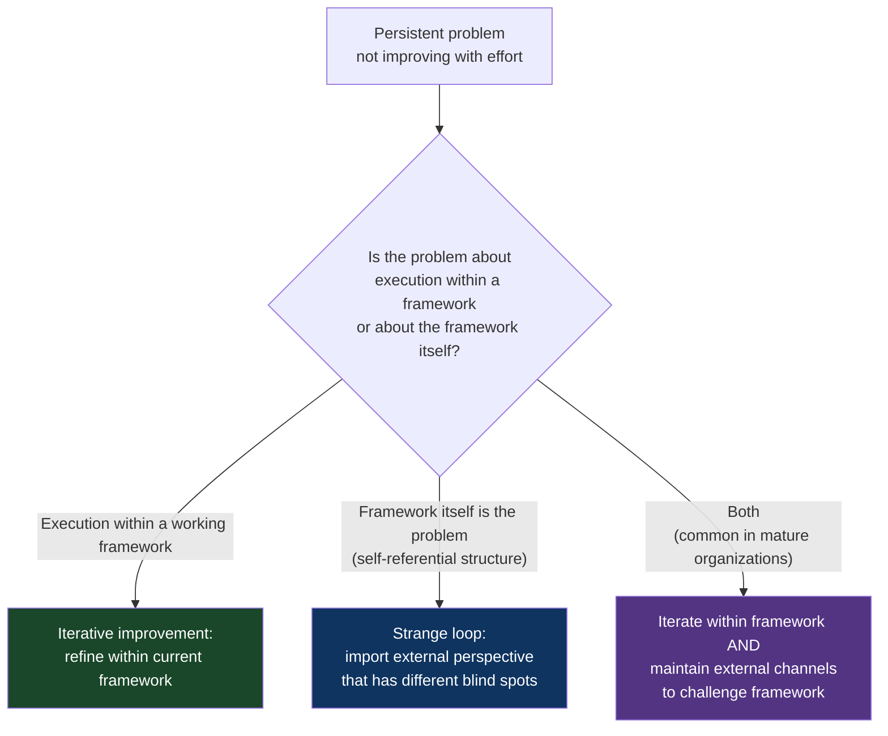

# CH-19: Strange Loops
### *Why systems that contain themselves are blind from the inside — and why escape requires standing outside the loop*

> **Part 5 of 5 · Lateral Moves and Meta-Solving**
> **Model Type:** `system`

---

## The Misread

A 400-person engineering organization has a diversity problem. The org is roughly 90% male, 95% from a narrow set of universities, and 80% under 35. The leadership has been concerned for years. They have run diversity initiatives, partnered with diversity-focused recruiting firms, sponsored conferences, mentored underrepresented candidates, and held quarterly all-hands on the topic. The numbers have barely moved.

The hiring process has, throughout this period, been gradually refined. Each refinement was prompted by some specific issue. A bad hire prompted a stricter coding bar. A complaint about an interviewer prompted a structured rubric. A discussion about technical depth prompted a system-design round. Each refinement made the process "more rigorous," and each refinement was made by the current team — the team that itself is 90% male, 95% from a narrow set of universities, 80% under 35.

The hiring rubric explicitly values: "clean code with idiomatic patterns" (where "idiomatic" is defined by the current team's habits), "ability to design at scale" (where "at scale" is defined by problems the current team has experienced), "cultural fit" (where "culture" is the current team's culture), "strong fundamentals in algorithms" (where "strong" is calibrated against the current team's interview performances), and "communication style" (where "style" is the implicit norm of the current team).

Every clause in the rubric encodes the current team's preferences. The encoding is invisible to the team because the team has no contrast — these are just what "good engineer" looks like, from their position. The rubric is then used to evaluate candidates. Candidates who match the current team's profile score higher. They are hired. They join the team. They participate in subsequent rubric refinements. The loop closes.

The diversity initiatives — the recruiting partnerships, the conference sponsorships, the mentorship programs — operate at the *top* of the funnel. They get diverse candidates into the pipeline. The pipeline then runs them through the rubric, which systematically filters in favor of the existing team's profile. The diversity initiatives are real and well-intentioned. They are also operating *outside* the loop that's producing the homogeneity. The loop continues, undisturbed.

In leadership meetings, the consistent confusion is: "We're investing in diversity at the top of the funnel; why isn't it working?" The answer is structural and uncomfortable: the team has built a system whose output (new hires) re-enters as input (the team that designs the next rubric), and the loop is so tight that any input to the top is normalized to the existing pattern by the time it reaches the offer stage. The system cannot fix itself from inside. The team that designed the rubric cannot, by itself, design a rubric that would deliver people unlike themselves; their conception of "good engineer" is the loop's output.

## The Blind Spot

The deepest cognitive blind spot is *being inside the system you're trying to evaluate*. We can see other systems clearly because we observe them from outside; we can see their assumptions, their loops, their hidden constraints. We cannot see our own system the same way, because we are operating *from* it. Our "objective" observations of ourselves are made through the very faculties the system has shaped. The shaping is invisible because there is no contrast to make it visible.

This is the structural feature Hofstadter called a *strange loop*. A system that *contains a representation of itself* and then *uses that representation to determine its own behavior* creates a self-referential closure that is invisible from inside. The system can talk about itself, but only through concepts the system itself supplies; it cannot reach the concepts outside itself that would describe its own constraints.

Gödel's incompleteness theorems are the formal version: any sufficiently powerful formal system can talk about itself, and the moment it can, there are true statements about the system that the system cannot prove. The system's expressive power is also its blind spot. The same structural feature appears in organizations, in cultures, in cognitive systems. A team that judges its own processes by criteria the processes themselves produced cannot find the flaws in the criteria. A culture that defines "good behavior" by its own norms cannot see the harms that its norms produce in cases the culture wasn't designed for. An ideology that supplies the framework for evaluating ideologies has, by construction, marked itself as correct within its own framework.

The blind spot is not that people inside the loop are stupid or dishonest. It is that the loop has structurally removed the perspective that would be needed to see the loop. *Self-awareness is harder than awareness*, and there are categorical kinds of self-awareness that require external perspective to achieve at all.

## The Model, Precisely

**Strange Loops.**

A strange loop occurs when a system contains a representation of itself and uses that representation to determine its own behavior. The self-reference creates a closure that is invisible from inside the system — the system can only evaluate itself using concepts the system supplies, and those concepts are themselves products of the system. Escape from a strange loop requires *viewing the system from outside* — through an external observer, a different framework, a deliberate disruption of the self-referential closure.

What this model makes visible: many persistent organizational, cultural, and cognitive problems are not problems that can be solved from inside the system that produces them. The system's self-evaluation will keep returning "the system is fine" because the evaluation uses the system's own concepts. Real change requires external perspective: an outside hire, a peer organization with different assumptions, a deliberate stepping-outside of the framework, a recognition that the "common sense" of the system is the system's own production, not a universal truth.

Spatially: think of a fish trying to study water. The fish can move through water, react to water, depend on water — but cannot easily *see* water as a distinct medium because the fish has never not been in it. Everything the fish has ever experienced has been through water. To recognize water as a thing, the fish needs either to leave water briefly (an external perspective) or to encounter another medium (a contrast). Without those, water is just *the background of all experience*, invisible because ubiquitous.

Hofstadter's framing in *Gödel, Escher, Bach* — the foundational source for this concept — uses musical canons, Escher's drawings (the hands drawing themselves, the staircase that loops back to itself), and Gödel's formal proofs to triangulate on the same underlying pattern. Each instance is a system that successfully refers to itself in a way that produces something genuinely new — and also something fundamentally limited. The strange loop is creative and trapping at the same time.

Senge, in *The Fifth Discipline*, captures one organizational expression of this with the concept of *mental models*. He notes that the mental models held by the senior leadership of an organization are usually the limiting factor on the organization's behavior, because the leadership cannot easily see those mental models as choices — the models present themselves as *reality*. Senge's prescription (surface the mental models, treat them as testable hypotheses) is an attempt to break the strange loop from within, with limited success unless external perspective is also imported.

## Three Domains, One Model

### Domain 1: Engineering — Cache Coherence in Self-Modifying Systems

A subtle technical strange loop: a service maintains a cache of its own configuration. The cache improves performance because configuration lookups are frequent and the config rarely changes. The cache invalidates entries when it detects config changes by watching for a specific event.

The bug: the *configuration of how the cache detects changes* is itself stored in the cache. When the configuration of the change-detection mechanism is updated, the cache cannot detect the update — because the change-detection mechanism is reading its own (stale) configuration from the cache. The cache continues to use the old change-detection configuration indefinitely. The system has a strange loop: its self-monitoring uses its own (potentially stale) state to monitor itself.

The bug only surfaces in specific situations — when the change-detection config is updated, which is rare — and is essentially un-debuggable from inside the running system, because every diagnostic the cache provides is itself filtered through the same stale cache. Engineers who don't recognize the strange-loop structure spend days chasing what looks like a "cache invalidation bug" without recognizing that the cache cannot, by construction, invalidate the configuration that controls its invalidation. The fix requires *external* intervention: a hard restart, an out-of-band config push that bypasses the cache, or an architectural change that places the change-detection config outside the cache's purview.

This is one of the cleanest engineering examples of a strange loop because the structure is *named*: cache, monitoring config, cache containing the monitoring config. The pattern recurs widely in self-monitoring systems. Any system that uses its own state to monitor its own state can produce strange loops; the fix is to ensure that monitoring has *some* component that is structurally outside the system being monitored. The principle is so common that experienced infrastructure engineers have a rule of thumb: monitoring should never depend on the thing being monitored, recursively, all the way down.

### Domain 2: Organization — Incentive Systems That Reward Defending the Incentive System

A company introduces a new performance review system. The system measures employees against specific criteria — say, OKR achievement, peer-review scores, manager assessment, and visible contributions. The system is designed by senior leadership and HR. It is meant to be objective and fair.

After a few cycles, certain patterns emerge. People who are good at *making their OKRs look achieved* (whether or not they're substantive) score higher. People who are good at *managing their peer-review network* (by being helpful to the people who'll review them) score higher. People who are good at *visible contributions* (presentations, demos, named projects) score higher than people doing important-but-invisible work. The system is, in this sense, working as designed: it measures the things it measures.

The strange loop: the people who score highest get promoted. They become the people who *administer* the next iteration of the system. They are now the seniors who design OKRs for others, review peers, and evaluate manager candidates. They are also the people who, by their experience, *know* that the system works — they're its outputs. When asked to evaluate whether the system should change, they evaluate it through the lens of their own success, which the system produced. The system's outputs are now the system's evaluators. Any proposed change to the system has to pass review by people whose careers were built by mastering the current system.

The system is, in effect, self-reinforcing in a way that makes it nearly impossible to reform from inside. Reform proposals get watered down or rejected in committees of people whose worldview the current system created. External pressure — a new CEO, a major scandal, a competitor's pressure — is often required to break the loop. Even then, the new system is usually designed by the people inside, and the new system tends to encode the existing leadership's preferences in different language, perpetuating the loop with a new vocabulary.

The diversity example in the opening Misread is one specific instance. So is the broader pattern of "promotion to senior leadership requires the candidate to have already demonstrated senior-leadership behaviors as defined by the current senior leadership." So is the pattern of "the experts who decide what counts as expertise."

### Domain 3: Gödel's Incompleteness Theorems

Kurt Gödel's 1931 paper proved that *any consistent formal system powerful enough to express elementary arithmetic* contains true statements about itself that the system cannot prove. The proof is technical and beautiful; the structural insight is what matters here.

Gödel constructed, within a formal system, a statement that *says of itself* "I am not provable in this system." If the statement is true, then it is not provable, and the system is incomplete (there's a true statement it can't prove). If the statement is false, then it *is* provable, but it says it isn't provable — so the system is inconsistent. The system either fails completeness or fails consistency; both are damning.

The construction worked because Gödel found a way for the system to *represent itself* through coding — every formula in the system could be encoded as a number, and statements about formulas could be expressed as statements about numbers. The system, in expressing arithmetic, gained the ability to express statements about itself. The strange loop was the door through which incompleteness entered.

The deeper lesson, beyond formal mathematics: *any system that can describe itself has a structural limit*. The limit is not a flaw of any particular system; it is a structural property of self-reference. Systems that can talk about themselves cannot, by construction, prove everything true about themselves. The blind spot is built into the structure.

This generalizes. An organization that develops vocabulary to describe its own functioning gains powerful tools for self-improvement — but also gains the ability to wrap itself in self-justifying narratives that cannot be defeated within the organization's own framework. A cognitive system (a person) that develops the ability to reflect on its own thinking gains the meta-skill that distinguishes human reasoning from animal reasoning — but also gains the ability to construct elaborate self-deceptions that are internally consistent and externally absurd. A society that develops a self-description (an ideology, a narrative about itself) gains coordination power — but also gains the property that the self-description can become self-fulfilling and self-defending in ways that resist external critique.

The escape from strange loops, in every case, requires *importing perspective from outside the system*. Gödel's proof itself works only because Gödel was external to the formal system he was analyzing. An organization breaks its strange loop only when it brings in genuine outside perspective. A person breaks their cognitive strange loops only through encounter with people, ideas, or experiences that are not products of their existing framework. The general principle: *the loop cannot be broken from inside the loop.*

## Where The Model Breaks

**The hidden assumption:** the system has a meaningful strange-loop structure that is producing the persistent problem you're trying to solve.

Many problems are not strange loops; they're just hard problems. Treating every persistent issue as a strange loop will produce excessive "we need outside perspective" responses where simple competent execution would suffice. Some teams genuinely just need to do the work; the issue is not that they can't see themselves clearly, it's that the work is hard and they haven't done it yet. Forcing a strange-loop frame on a hard-execution problem produces avoidance dressed as wisdom.

A second failure: external perspective is *itself* a system, with its own loops. The outside consultant has their own blind spots. The new hire from a competitor brings the competitor's strange loops with them. The peer organization you're benchmarking against has its own self-reinforcing patterns. Importing perspective helps when the imported perspective has *different* blind spots than yours, not when it has the same ones. Two organizations with identical strange loops cannot help each other escape.

A third failure: the recognition that you are inside a strange loop can produce *paralysis*. If your entire framework is suspect because it's the loop's product, how do you decide anything? At some point you must act on the framework you have, even knowing it is partial. The discipline is to *act on it while also maintaining channels for outside perspective to challenge it*, not to refuse to act until you've escaped the loop (which you can't, fully).

A fourth failure: outside perspective is often *rejected* by the system precisely because it threatens the strange loop. The outside hire who challenges the team's assumptions is labeled "not a culture fit" and leaves. The external consultant whose recommendations would require structural change has the recommendations diluted into ones that preserve the loop. The strange loop's defense mechanisms are real and powerful; merely *having* external perspective available doesn't guarantee it'll be heard.

**The signal you're in the break zone:** the problem is just-hard, not structurally self-referential; or you've imported "outside" perspective that turns out to share your blind spots; or you've correctly identified a strange loop but the system is actively suppressing the outside perspective that would help.

## The Collision

**This model says:** the system can't see itself; import outside perspective.
**Single-Loop Learning / Iterative Improvement says:** most systems improve through ongoing internal iteration; constantly questioning the framework is overkill; just keep refining within the framework.

The collision is real. Strange-loop awareness pushes toward radical re-examination; iterative improvement pushes toward steady refinement. Both are right for different kinds of problems.

Scenario where they collide: a team's hiring outcomes are mediocre. Iterative improvement says: refine the interview rubric, train interviewers better, improve calibration sessions, source from more places. These are real improvements that compound. Strange-loop awareness says: the rubric was designed by the current team and encodes their preferences; refinement within this framework will produce more of the same outcomes; you need to import outside perspective on what "good engineer" even means in your context.

Both might be correct simultaneously. The right move is often to do the iterative improvements *and* simultaneously create a channel for external perspective (a hiring consultant with different assumptions; a peer review of the rubric by someone from a different industry; a structured outreach to candidates who don't fit your current profile, with explicit attention to what their experience reveals about the rubric).

**The meta-skill:** the deciding signal is *whether the problem persists despite competent execution within the current framework*. If you've executed well and the problem persists, the framework is suspect — look for the strange loop. If you haven't executed well, execute first; calling the framework into question may be a sophisticated form of avoidance. Mature problem-solvers often hold both possibilities simultaneously: maybe we're not executing well *and* maybe the framework is wrong; investigate both.

## The Retrofit

**Event:** The replication crisis in psychology and biomedical research, ~2010–present. Around 2010, large-scale replication efforts began revealing that a substantial fraction of published findings in psychology (and later, other fields) could not be reproduced. Estimates varied but were sobering — in some replications, fewer than 40% of major published results replicated. The crisis affected high-profile work, including some of the most-cited studies in the field.

The replication crisis was a strange loop made visible. The mechanism: academic psychology rewarded *novel positive findings*. Researchers were promoted, funded, and published for producing surprising statistically-significant results. The system's incentives — *the rules and goals* — selected for behaviors that maximized surprising-and-positive output: p-hacking (running many statistical tests until something is significant), HARKing (hypothesizing after results are known), selective reporting (publishing only the studies that worked), small-sample studies (more likely to produce extreme results by chance).

These behaviors were not, mostly, deliberate fraud. They were what the system *trained* people to do. Researchers who didn't do them — who reported null results, who pre-registered their analyses, who ran replications instead of novel studies — were disadvantaged in the academic market. They didn't get tenure. They left the field. The system, like all strange-loop systems, was *selecting for behaviors that reproduced the system*.

The diagnosis was structurally invisible from inside. Senior psychologists, themselves products of the incentive system, evaluated journal submissions through criteria the system had taught them: was the result novel? Was it surprising? Was it statistically significant? These criteria were *correct* within the system's framework and *exactly the criteria that produced the unreliability*. Internal critics existed (Paul Meehl had written about these problems in the 1960s) but were largely ignored — within the framework, their critiques sounded like methodological pedantry rather than fundamental challenges.

The crisis became visible only when *external* methods were applied. Brian Nosek's Reproducibility Project — a coordinated effort to replicate 100 studies published in major psychology journals — was structured to operate *outside* the publish-novel-findings incentive system. The replications were pre-registered, transparently reported, and conducted by researchers with no professional stake in the original findings. When the replication rates came back at ~36–47%, the field could no longer ignore the problem. The strange loop had been opened from outside.

Re-reading through strange loops: the replication crisis was not caused by stupid or fraudulent researchers. It was caused by a system whose self-reinforcing incentive structure had selected for behaviors that produced unreliable knowledge, while the system's self-evaluation mechanisms (journal review, citation count, tenure decisions) were *themselves products of the same system* and could not see the problem. The system was fully internally coherent. Every component was working as the system specified. The system was producing inaccurate knowledge as a byproduct of optimizing what it was optimizing.

**What was invisible:** the assumption, baked deep into academic culture, that "what gets published is approximately true." This assumption was load-bearing for the entire knowledge-production enterprise. Once challenged externally, it could not be defended; but it was nearly impossible to challenge from inside because the system's self-evaluation criteria (citations, journal rankings, etc.) all assumed it was true.

**The intervention point:** the post-crisis reforms have been structural — pre-registration of studies, registered reports (where journals commit to publishing based on methods, not results), open data and code, replication incentives, statistics reform. Each of these moves a piece of the system *outside* the strange loop — pre-registration moves the analysis decisions outside the post-results selection bias; registered reports move publication decisions outside the novel-positive-result selection; open data moves analysis outside the original lab's framework. The reforms have not fully solved the crisis (the underlying incentive structure is hard to reform), but they have meaningfully reduced the loop's strength. The general principle: structural reforms that physically *locate decisions outside the loop* are more durable than reforms that ask people inside the loop to behave differently while inside it.

## The Practice Rep

> **Duration:** 48 hours
> **What you're training:** noticing when you are inside the system you're trying to evaluate, and seeking external perspective when the self-evaluation is suspect

**The exercise:**
For the next 48 hours, pick one assumption your team or organization makes about itself — something said often, treated as obvious, never seriously questioned. "We're a culture of high standards." "We're a flat organization." "We're customer-obsessed." "Our hiring bar is the bar." "We don't tolerate bullshit." Just one.

Write the assumption down.

Then ask, in writing, three questions:

1. "Who decides whether this assumption is true?" (Identify the evaluator.)
2. "Is the evaluator inside or outside the system the assumption describes?" (Almost always inside.)
3. "What would an external observer who didn't share our framework see when they looked at this?"

For question 3, try to imagine a specific external observer — a competitor, a peer at another company, an employee from a different culture, a former employee who left, someone who interviewed and didn't join. What would they say about the assumption?

**What to look for:**
The first time you do this exercise honestly, you will probably find that the assumption is *partly false* — there is a gap between the self-description and the external view. The gap is usually invisible from inside because the self-description was constructed using the system's own concepts. The external view uses different concepts and sees what the internal concepts hid.

The harder discovery: most of the "obvious truths" your organization holds about itself are *partly* strange-loop products. The organization didn't lie; it just selected for self-descriptions that fit its internal logic. The descriptions are useful for coordination but inaccurate as descriptions. Recognizing this is uncomfortable because it suggests that everything you "know" about your organization is partly the organization's own production.

The actionable response is not to disbelieve everything. It is to *maintain channels for external perspective* — interview candidates who chose not to join (and listen genuinely to what they say); track exit interview themes across years (not just individual ones); cultivate relationships with peers at other companies; bring in genuine outside hires and give them authority before they've assimilated. These are structural moves that keep some external perspective alive within the organization's decision-making. Without them, the strange loop will close completely over time, and the organization will become opaque to itself.

**The log:**
At the end of 48 hours, write one sentence: "I saw a Strange Loop at work when [the specific moment I noticed my organization's self-description was load-bearing inside its own framework but contradicted by an external view I had been ignoring]."
