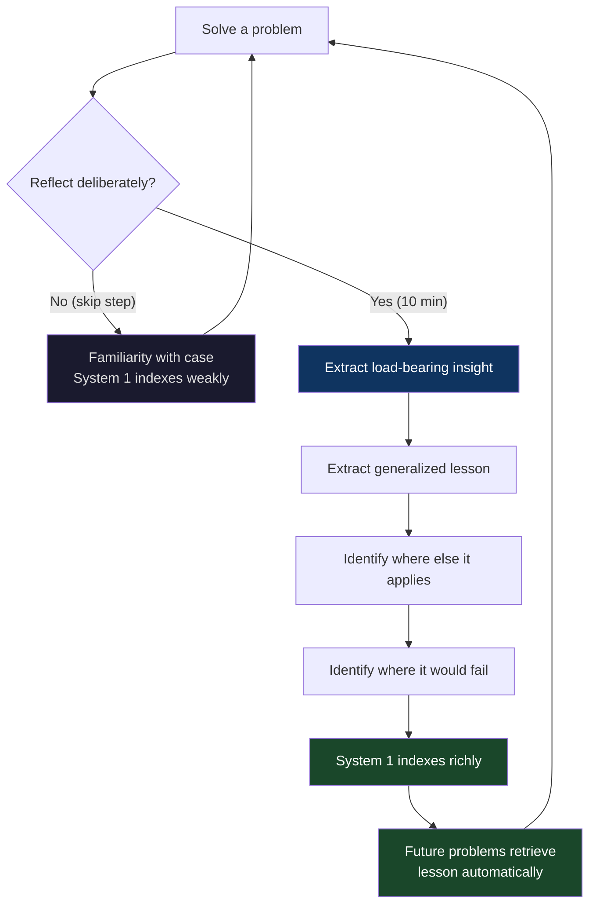
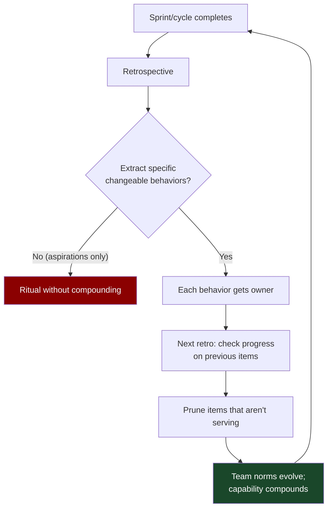
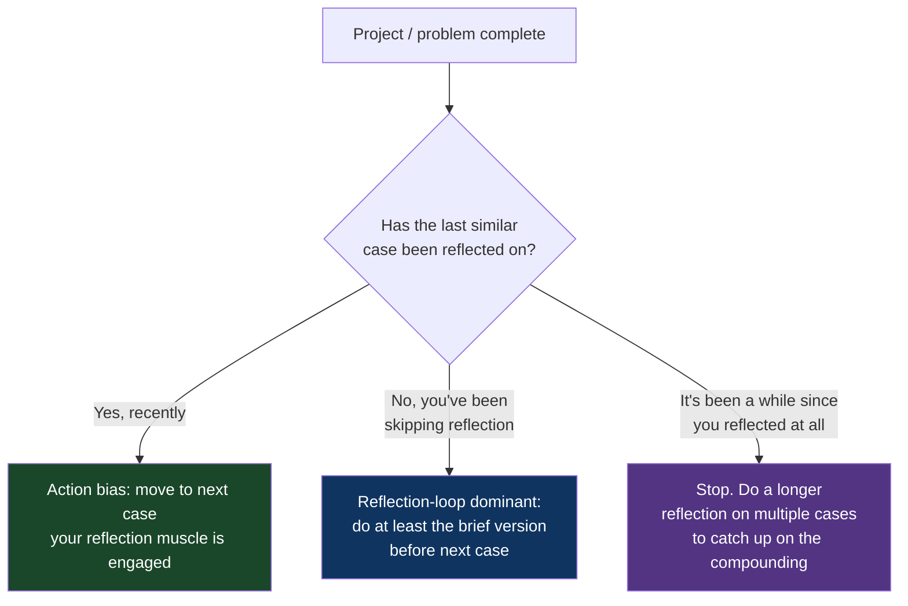

# CH-20: The Reflection Loop
### *Why the skill of compounding lives in the step everyone skips — Pólya's fourth move, and the close of this book*

> **Part 5 of 5 · Lateral Moves and Meta-Solving**
> **Model Type:** `meta`

---

## The Misread

An engineer at a 200-person company has been at her job for four years. She is competent. She ships consistently. Her code review is thoughtful. Her managers have given her good performance reviews every cycle. By any conventional measure, she is doing well.

She is also approximately the same engineer she was three years ago.

Specifically: the kinds of problems she finds hard now are the same kinds of problems she found hard three years ago. The kinds of mistakes she makes are the same kinds of mistakes she made three years ago. The way she debugs, the way she designs, the way she handles ambiguity — all of these have improved slightly through accumulated familiarity with the codebase, but the underlying *skill stock* has barely moved. Each new problem she encounters is solved fresh; the lessons from previous problems are not consciously extracted, not indexed, not deliberately deployed against new cases.

A new hire joins her team. He's been an engineer for two years. He is, in raw skill, behind her. He is also obviously growing fast. By the end of his first year on the team, he's catching up. By the end of his second year, he's ahead. Her manager promotes him to senior engineer; she is passed over for the same promotion she'd been hoping for. She is hurt and confused. She has more years of experience. She has shipped more code. She has been at the company longer.

What she doesn't see: he does something at the end of every meaningful piece of work that she doesn't do. After a hard debug, he writes a note: "this bug was caused by [mechanism]; I would have caught it faster if I'd checked [signal]." After a design that took two weeks, he writes: "the load-bearing insight was [insight]; I almost went with [worse alternative] because [reason]." After a stakeholder conversation that went well, he writes: "the move that turned it around was [move]; I'll try it again the next time someone is anxious about scope." After mistakes, he writes: "next time I'm in this situation, the question to ask is [question]."

The notes are short. They take 10 minutes per case. Over two years, they have accumulated into a personal knowledge base that he consults — and, more importantly, into a *retrained System 1* (CH-13) that retrieves the patterns automatically when similar situations arise. His skill is compounding because he is explicitly extracting it from each experience. Hers is not, because she is not.

She has *four years of experience*. He has *two years of experience reflected on twelve times each*. The reflection multiplier is the entire gap.

## The Blind Spot

We treat solutions as *terminal*. Once it works, we move on. The next problem demands attention; the previous one is finished. The cultural model is *throughput* — the more cases you process, the more productive you are. There is no reward signal for the moment *after* a solution that doesn't produce visible output. Reflection is the step that consumes time and produces nothing concrete; under throughput pressure, it's always the first thing cut.

The blind spot is that *learning does not happen automatically from experience*. Experience that you don't reflect on produces familiarity, not skill. You get faster at the specific patterns you encounter, but you do not get *better in general*. The general improvement requires extracting the lesson from the specific case — naming what was load-bearing, naming what would generalize, naming what would have made you solve it faster. The extraction must be deliberate. The pattern-matching machinery of System 1 will accumulate some indexing automatically from sheer volume, but the indexing is much sparser and lower-quality than what deliberate reflection produces.

This is why Pólya's fourth step — *looking back* — is the most consistently skipped of the four. The first three (Understand, Plan, Carry out) feel like work; the fourth feels like leisure. The first three produce visible output; the fourth produces a private note. The first three are recognized as part of "doing the work"; the fourth is treated as optional cleanup. And so most people skip it, most of the time, and their skill compounds at the rate that pure volume can produce — which is much slower than the rate volume-plus-reflection produces.

## The Model, Precisely

**The Reflection Loop.**

Pólya's fourth step. After solving a problem, deliberately extract: *what was the load-bearing insight? What generalized lesson can I pull from this? Where else might this method apply? Where would this method fail?* Without the extraction, experience produces familiarity but not skill. With the extraction, each problem deposits a lesson into System 1's index that compounds with the lessons from previous problems. The compounding is the entire mechanism by which skill grows faster than experience accumulates.

What this model makes visible: most "experience" is wasted because it isn't reflected on. The compound-skill engineers, managers, founders, and thinkers in any domain are usually the ones with a deliberate reflection practice — even a small one, sustained over years. The skill gap between equally-experienced people is usually a reflection gap. The intervention is structurally simple (10 minutes after each meaningful case) and culturally hard (no immediate reward; feels like overhead).

Spatially: think of skill as a stock (CH-09) that you're trying to build. Each problem you solve is an inflow opportunity. The inflow is small and shallow if you just solve and move on. The inflow is much larger and deeper if you reflect — because reflection takes a single experience and *replays* it through multiple frames (what was load-bearing, what generalizes, where else applies, where fails). The replay is what builds the rich indexing that future System 1 retrieval depends on. Without the replay, the experience deposits a thin layer; with it, the experience deposits a structured layer. Decades of thin layers vs. decades of structured layers produce dramatically different total stocks.

Pólya's original phrasing of the fourth step ("Looking Back"): "Can you check the result? Can you check the argument? Can you derive the result differently? Can you see it at a glance? Can you use the result, or the method, for some other problem?" These four questions are the operationalization. Each takes minutes. Each produces an indexed insight. Each is regularly skipped.

The same idea recurs across traditions. The After-Action Review (US Army). The Retrospective (agile teams). The Postmortem (engineering). The Personal Journal (executives). Each is a culturally-specific implementation of the same underlying meta-skill: *deliberate extraction of lesson from experience*. The implementations vary; the mechanism is the same.

## Three Domains, One Model

### Domain 1: Engineering — The Senior's Notebook

Many of the most skilled senior engineers maintain some form of personal notebook — sometimes literal, sometimes a directory of markdown files, sometimes a small wiki. The notebook is not project documentation. It's not personal journaling. It's a *lessons-learned archive* that the engineer consults when starting work that pattern-matches to past entries.

The entries are usually short. A few sentences each. Examples (synthesized from interviews with engineers who maintain such notebooks):

- "Whenever I see X-shaped error in the logs, the cause is almost always [specific subsystem]. Check there first."
- "The pattern of starting with abstraction Y looks elegant but creates problem Z in 6 months. Don't do it again unless I have at least three lived use cases."
- "Code reviews go better when I lead with the question rather than the suggestion. People defend less."
- "Designs that depend on stakeholder A keeping a promise fail. Designs that work even if A forgets succeed. Plan for A to forget."
- "When debugging is taking more than 4 hours, the bug is almost always not where I'm looking. Stop and re-examine assumptions."

Each entry is the *output* of a reflection step on a past problem. The collection becomes the engineer's externalized System 1. They can be querying their own past lessons in seconds because they're stored, and they can update them over time as new cases refine the patterns.

The engineer who maintains the notebook *appears* to have unusual intuition. They make calls others miss. They warn about failure modes others didn't see coming. The mechanism is mostly the notebook. The notebook works because each entry was made through deliberate reflection — a 10-minute investment per past case. The compound effect over a career is enormous.

Engineers who don't maintain such a practice often look at the notebook-keepers and conclude they're smarter. They aren't. They've made a structural choice to reflect that the non-keepers haven't. The reflection is available to anyone; the practice is what makes the difference.

### Domain 2: Organization — The Retrospective That Actually Changes Behavior

Most teams that practice agile development run retrospectives. Most retrospectives produce action items that don't get done. The retrospective becomes a ritual that everyone tolerates and nobody benefits from — a clean example of the reflection step happening in form but not in substance.

The retrospectives that work share a structural property: they extract *specific changeable behaviors* from the cycle's experience, not just venting and aspirational lessons. "We should communicate better" is not a retrospective output; it's a wish. "When the deployment slot is double-booked, the person who claimed it second will check in with the first claimant in Slack before bumping" is a retrospective output — it's a specific behavior, with a specific trigger, that someone can do. The first produces no compounding; the second deposits a small but durable change into the team's working norms.

The teams that compound through retrospectives are usually the teams that:
1. Extract specific behaviors, not aspirations.
2. Assign owners for each change.
3. Check in on previous retrospective items at the start of the next retrospective.
4. Are willing to discard process items that aren't working.

The fourth element is critical and often missing. A team that just adds new items at every retrospective accumulates process debt: rituals from old retrospectives that nobody remembers the reason for, that everyone is half-doing because they're "what we do here." The retrospective process itself becomes vestigial. The teams that compound are willing to *prune* their accumulated norms as well as add to them. Reflection includes evaluating whether the past extracted lessons are still serving the team.

This is the organizational version of the same individual practice: deliberate, structured extraction of specific lessons from cycles of experience, with mechanisms to update the lessons as the situation evolves. Teams that do this well compound their effectiveness over years. Teams that don't will be approximately the same team in five years that they are today, possibly slightly worse from accumulated process debt.

### Domain 3: After-Action Reviews in the US Army

The After-Action Review (AAR) is one of the most institutionally-developed reflection practices in any large organization. Developed by the US Army in the 1970s under the leadership of General William DePuy and the National Training Center, the AAR became standard practice across the Army by the 1980s and has spread to other militaries, fire services, hospitals, and an increasing number of civilian organizations.

The AAR structure is deliberately simple: after any significant event (a training exercise, a mission, a major decision), participants gather and address four questions:

1. What was supposed to happen?
2. What actually happened?
3. Why was there a difference?
4. What should we do differently next time?

The simplicity is deliberate. The Army discovered, after years of more elaborate review processes, that the structural minimum produced most of the benefit. The questions force *comparison between intent and outcome*, identification of *causal differences*, and extraction of *specific changes*. The questions are asked of every participant; rank does not affect who speaks first. The AAR is meant to be *blameless* — its purpose is learning, not punishment — and units that successfully establish the blameless norm get dramatically better at honest extraction.

The AAR's effectiveness has been measured. Units that conduct rigorous AARs demonstrably improve at their tasks faster than units that don't. The improvement compounds across many cycles of training. By the time a unit deploys, the difference between AAR-disciplined and non-AAR units is large enough to be tactically significant.

The civilian adoption has been slower, partly because the blameless norm is harder to establish in organizations where retrospective findings can be used against individuals in performance reviews. But where the norm has been established, the same compounding effect appears. Several major medical centers credit AAR adoption with substantial reductions in surgical error rates over multi-year periods.

Re-reading through the reflection loop: the AAR is exactly Pólya's fourth step institutionalized. The structure forces the extraction that individuals routinely skip. The institutionalization makes the practice *unskippable* — you don't get to decide whether to reflect; the next cycle of operations begins with the AAR of the previous one. The compounding is the result of structurally preventing the skip.

The lesson generalizes beyond the military: *the reflection step is most reliable when it is institutionalized rather than left to individual discipline*. Individuals who maintain personal reflection practices are rare and high-performing. Organizations that build reflection into the cycle by structure compound the practice across many people without requiring each of them to develop the individual discipline. The structural approach is more scalable than the individual one, though it requires institutional commitment that's often hard to sustain.

## Where The Model Breaks

**The hidden assumption:** the problem is recurring or analogous to future problems — the extracted lesson will have application.

If you're solving genuinely one-off problems whose lessons won't apply to anything future, reflection is overhead. Some problems are like this: a specific historical bug in a system that's being deprecated next month; a one-time negotiation with a counterparty you'll never deal with again; a unique crisis whose specific shape won't recur. Forcing reflection on these is real waste. The leverage of reflection scales with *problem recurrence* — if the kind of case will appear again, reflection compounds; if not, it doesn't.

A second failure: reflection without subsequent retrieval is just journaling. If you write down the lesson but don't consult it when the next case appears, you've gotten the cost of reflection without the benefit. The full loop requires both extraction *and* retrieval. The retrieval can be automatic (the indexed System 1 retrieves it) or manual (you actively consult your notes when starting a similar case), but if neither happens, the reflection was wasted. Many people start a journal/notebook and discover that they never look at it; this is reflection without the loop closing.

A third failure: over-reflection becomes navel-gazing. If every cycle spawns a multi-page retrospective with elaborate analysis, the cost of reflection exceeds its benefit. The discipline of the AAR — short, structured, time-boxed — protects against this. The teams and individuals who compound effectively reflect *briefly and frequently*, not lengthily and rarely.

A fourth failure: the extracted lesson may be wrong. You can deeply reflect on a case and extract the wrong lesson — one that fit this specific case but won't generalize, or that addresses the wrong factor. Reflection doesn't guarantee right lessons; it just produces lessons. The lessons themselves are hypotheses that get tested against future cases. The discipline of *updating* lessons when later cases contradict them is part of the practice.

**The signal you're in the break zone:** the problem is genuinely one-off; or you're reflecting but never retrieving; or your reflection is consuming more time than the next case is saving; or your reflections are accumulating wrong lessons because you're not updating them against new cases.

## The Collision

**This model says:** reflect after every meaningful problem; the compounding is the source of skill growth.
**Action Bias / Ship and Iterate says:** the next problem is in front of you; reflect by acting on the next case; over-reflection is procrastination dressed as wisdom; the rep is the reflection.

The collision is sharper than it first appears. Action-bias proponents are not wrong that *thinking about previous work* can become a way to avoid *doing the next work*. Reflection-loop proponents are not wrong that *doing without reflection* produces familiarity without skill. Both failure modes are real; they look like opposites but they appear in different people.

The action-bias person needs to slow down enough to extract lessons; otherwise they accumulate volume without compounding. The reflection-heavy person needs to ship more; otherwise they over-analyze each case and slow down their feedback cycle. The two failure modes are real, common, and require different correctives.

Scenario where they collide: you've just finished a hard project. The next project is starting; the stakeholders want you to dive in. Action bias says: *go; the next project is the priority; you'll learn by doing the next one.* Reflection-loop says: *take 30 minutes; extract what you learned from the project that just ended; without the extraction, the lessons are lost.*

**The meta-skill:** the deciding signal is *whether your reflection muscle has been getting reps lately*. If you've been reflecting regularly, action-bias on the next case is fine — your habits have absorbed the discipline. If you've been skipping reflection for a while, you owe yourself the catch-up before more cases pile on top. The skill is recognizing which mode you're in. Both pure modes — pure action-bias and pure reflection — fail in different ways; the alternation is the practice.

## The Retrofit

**Event:** Polya's *How to Solve It* itself, 1945, and its sustained influence on mathematics education over the subsequent 80 years.

George Polya, a Hungarian mathematician at Stanford, wrote *How to Solve It* as a small book attempting to articulate the heuristics that mathematicians actually use when solving novel problems. The book's central contribution was the four-step framework: Understand the problem, Devise a plan, Carry out the plan, *Look back*.

The four steps are simple. Polya emphasized repeatedly that the fourth step — looking back — was the one his students and colleagues most reliably skipped. Once a problem was solved, the impulse was to move to the next problem; the time spent reviewing the solution felt like leisure that the urgency of new problems didn't permit. Polya argued, with examples and arguments throughout the book, that the fourth step was where the *general* mathematical skill grew, while the first three only produced the specific solution to the specific problem.

The book has remained in print for nearly 80 years. It is one of the most-cited works in mathematics education. It is also one of the most consistently incompletely-implemented: textbooks describe the four steps, students learn to recite them, and the fourth step is still the one that's skipped in actual practice. Even the textbooks that present Polya's framework often allocate disproportionate space to the first three steps, mirroring the bias they were warning against.

The deeper retrospective: every generation of mathematics education has rediscovered Polya's fourth step as a "new" pedagogical insight. Math educators in the 1960s emphasized "metacognition." Educators in the 1980s emphasized "reflective practice." Educators in the 2010s emphasize "growth mindset" and "deliberate practice" (which depend implicitly on reflection-driven learning). Each is approximately a re-framing of Polya's fourth step. Each generation rediscovers the importance because each generation's students keep skipping the step.

The pattern is structural. The fourth step has no immediate visible reward. The first three produce solved problems; the fourth produces a meta-insight that pays off only on *future* problems. Under any reward system that emphasizes current output, the fourth step gets squeezed. The institutional moves required to make the fourth step actually happen — explicit time for reflection, graded reflection exercises, retrospective-style structures in classrooms — require sustained pedagogical commitment that has been hard to maintain.

Re-reading through the reflection loop: Polya's contribution was not to invent something new. The fourth step was already part of how skilled mathematicians worked. His contribution was to *name it* and to *insist on it* in pedagogical contexts where it had been invisible. The naming gave the practice institutional purchase; the insistence (across many editions, many translations, many derivative works) kept it in conversation. The fact that 80 years of insistence has only modestly changed actual student behavior is testament to how strongly the structural reward systems push against reflection.

**What was invisible:** the assumption, deep in education, that *learning happens automatically from solving problems*. This assumption is false at the level Polya was identifying. Solving produces familiarity with the specific problem; learning produces transferable skill that applies to future problems. The assumption persists because it's *almost* true — some learning does happen automatically. The 80-year gap between Polya's insight and any sustained pedagogical change reflects how hard it is to update an assumption that's *almost true* with a more accurate version that's *less convenient*.

**The intervention point:** any individual who adopts the fourth step as personal practice — without waiting for institutional support — gets the benefit. The same is true at the organizational level. A team that institutes AARs gets the benefit, regardless of whether the broader organization values reflection. The intervention is available; the cost is low; the compounding is huge. The reason it isn't universal is the structural reward pressure against reflection, not the lack of evidence that it works. Polya's 80 years of evidence demonstrates the practice's value; the slowness of adoption demonstrates the strength of the structural pressure against it.

## The Practice Rep

> **Duration:** 48 hours (and forever after, if you can sustain it)
> **What you're training:** the discipline of extracting the load-bearing insight from every meaningful piece of work, indexing it for future retrieval, and treating reflection as part of the work, not as overhead added to it

**The exercise:**
For the next 48 hours, after every meaningful piece of work — a bug fixed, a design completed, a meeting that mattered, a conversation that shifted something, a problem solved — pause for five minutes and write three lines:

1. *The key insight was: ____.* (What was the thing that, once seen, made the rest easy? What was load-bearing?)
2. *Where else might this apply: ____.* (What other situations have the same structure? What would I look for to recognize them?)
3. *The assumption that would invalidate this approach: ____.* (Under what conditions would this method fail? What would the signal be that I'm in the failure zone?)

Three lines. Five minutes. After each meaningful case.

Keep the lines in a single file or notebook — somewhere you can find them later, somewhere you can consult them when starting work that pattern-matches to past entries.

After 48 hours, you will have between five and twenty entries. Read them all in sequence. Notice the pattern: each one is a structured deposit into your external System 1. Each one would have been lost without the deposit. Each one is now retrievable.

**What to look for:**
The pattern that will surprise you most: the act of writing the entry will *itself* change what you noticed about the case. The act of articulating "the key insight was X" forces you to identify X explicitly, where without the writing the insight would have remained vague. The reflection isn't passive recording; it's active construction. The case's lesson exists in articulable form only because you articulated it.

The second pattern: within the 48 hours, at least one entry will retrieve. You'll be in the middle of a new case and recall a previous entry. The retrieval will produce a shortcut — a candidate solution, a warning, a question to ask — that would not have surfaced without the previous entry being deposited. That moment is the loop closing for the first time. The cost saved in that moment is small. Multiplied over years, the compounding is what produces the skill gap between people with similar experience.

The third pattern: most of the entries will feel obvious as you write them. "The insight was: I should have checked the network first." "The assumption that would have invalidated this approach: if the user volume had been higher." The obviousness is misleading. The entries are obvious *after* the case. Before the case, they were not obvious to past-you. Future-you will not have the same access to them unless they're written down. The obvious-in-retrospect quality is exactly why they need to be externalized.

After the 48 hours: try to sustain the practice. Five minutes per case. Most people fail at sustaining personal disciplines like this; you might too. If you can sustain it even partially — even if you only do it for half of cases — the compounding will still produce outsized returns over years. The full discipline is the ideal; partial discipline is still much better than none.

**The log:**
At the end of 48 hours, write one sentence: "I saw the Reflection Loop at work when [the specific moment a previously-deposited insight retrieved during a new case and shortened the work, OR the moment I noticed how thinly my past 'experience' had compounded because I'd never been doing this practice]."

---

## Closing

The Reflection Loop closes back to the Map ≠ Territory in CH-01.

Every lens in this book — every model you have now installed — is *itself a map*. Maps have lossy compressions. The lossiness is where reality will eventually bite. The discipline of the reflection loop is what allows you to *update the maps over time* as the territory teaches you where they are wrong.

You are about to put down this book. The lenses will start to fade unless you exercise them. The practice reps are the difference between a book you read and a book that changed how you think. Each rep is small. The compounding is enormous. The skill you build by running these reps over years is real, and it is yours, and no one can take it from you.

Go.
