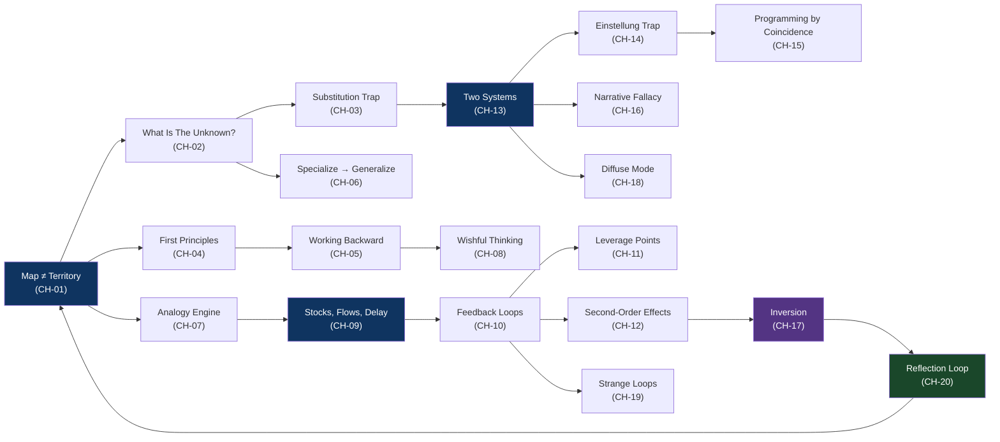

# The Solver's Mind
### *A Field Manual for Rewiring Problem-Solving from the Ground Up*

> "If I had an hour to solve a problem I'd spend 55 minutes thinking about the problem and 5 minutes thinking about solutions."
> — *attributed to Albert Einstein*

> "The formulation of a problem is often more essential than its solution."
> — *Albert Einstein, actually, this time*

---

## What This Book Does

This book doesn't add things to know. It changes the *resolution* at which you see problems — so you stop solving the wrong problem fluently and start seeing the actual problem clearly. After reading it, the moment before you reach for a solution will feel different. The pause will grow teeth. You'll start noticing problems that hid in plain sight inside the problems you were already working on.

It is a synthesis. The models inside are extracted from Pólya, Kahneman, Meadows, Munger (via Parrish), Hofstadter, de Bono, Oakley, Senge, Hunt & Thomas, and Rusczyk — but they have been re-tooled and re-sequenced into a single working lattice. Each chapter installs one lens, breaks it against a real edge case, collides it with a competing lens, and gives you a 48-hour drill to wire it into perception. Read in order if you can; the dependencies are real.

You won't get a 95% lift in problem-solving from reading. You'll get it from running the practice reps. Reading installs the lens; the rep installs the muscle. Treat each chapter as a 48-hour deployment, not a chapter.

## What It Deliberately Doesn't Do

- It does not promise that better thinking produces better outcomes in every situation. Some problems are dominated by luck, capital, politics, or timing — thinking better only changes what you can see, not always what you can move.
- It does not treat any model as universally correct. Every chapter ends by showing where the model breaks. Models that don't break aren't models — they are religions.
- It does not substitute for domain knowledge. A great general-purpose solver who knows nothing about databases will still produce nonsense about databases. These models *amplify* what you already know; they don't replace it.
- It does not flatter the reader. Several chapters will hit you. That's the price of admission.

## How The Models Relate

The graph is not just decorative. CH-01, CH-09, CH-13, and CH-17 are *load-bearing* — later chapters reference them as primitives. Read those carefully. The Reflection Loop (CH-20) closes back to CH-01 because the loop is the book's deepest claim: that all the lenses are themselves maps, and you must occasionally check the territory.

## The Full Model Index

| # | Model | Chapter | Type | One-Line Definition |
|---|---|---|---|---|
| 01 | **Map ≠ Territory** | CH-01 | perception | Every model you trust is a lossy compression of reality; the loss is where reality bites you. |
| 02 | **Pólya's Diagnostic** | CH-02 | meta | Before solving, name the unknown, the given, and the condition that ties them — most "bad solutions" are answers to undiagnosed problems. |
| 03 | **Substitution Trap** | CH-03 | perception | When asked a hard question, the brain quietly answers an easier one and reports back as if it answered the original. |
| 04 | **First Principles** | CH-04 | meta | Decompose a claim to its irreducible facts and rebuild; the cost is time, the payoff is finding the non-obvious move. |
| 05 | **Working Backward** | CH-05 | decision | Start at the desired end state and ask what must be true the step before; forward search explodes, backward search prunes. |
| 06 | **Specialize → Generalize** | CH-06 | decision | Solve N=1 fully before designing for N. The abstraction emerges from the diff between cases, not from imagination. |
| 07 | **Analogy Engine** | CH-07 | meta | Expertise is mostly retrieval of structurally similar problems you've already solved — the skill is indexing by structure, not surface. |
| 08 | **Wishful Thinking** | CH-08 | decision | Assume the hard subproblem is solved and build the rest; often the rest *is* the actual problem and the hard part was a phantom. |
| 09 | **Stocks, Flows, Delay** | CH-09 | system | The current value of any system is the integral of all past flows minus drains, lagged — present causes do not explain present states. |
| 10 | **Feedback Loops** | CH-10 | system | Any output that re-enters as an input creates either resistance (balancing) or amplification (reinforcing); most systems are made of these. |
| 11 | **Leverage Points** | CH-11 | system | Parameters move things weakly, rules move them more, goals more still, paradigms most — and resistance scales with leverage. |
| 12 | **Second-Order Effects** | CH-12 | system | The interesting consequences of any action live two layers deep, inside the system's adaptation to your first-order intervention. |
| 13 | **Two Systems** | CH-13 | perception | Fast trained intuition and slow deliberate reasoning are both tools; expertise is *trained System 1 built from past System 2 work*. |
| 14 | **Einstellung Trap** | CH-14 | perception | A known good solution actively blocks perception of better solutions to new-shaped problems wearing old clothes. |
| 15 | **Programming by Coincidence** | CH-15 | decision | A fix that makes the symptom go away without an articulable mechanism isn't a fix — it's a bet on the same context repeating. |
| 16 | **Narrative Fallacy** | CH-16 | perception | Outcomes are skill+luck+timing, but the brain compresses them into "because X" stories that are satisfying and load-bearingly wrong. |
| 17 | **Inversion** | CH-17 | decision | Instead of asking "how do I achieve X?", ask "what would make X impossible?" — avoiding catastrophe usually beats engineering greatness. |
| 18 | **Diffuse Mode** | CH-18 | meta | The brain solves hard problems in two modes; you must stop focusing to let the diffuse search run, and most people interpret this as laziness. |
| 19 | **Strange Loops** | CH-19 | system | Systems that contain themselves create self-referential traps invisible from inside; escape requires viewing the loop from outside. |
| 20 | **Reflection Loop** | CH-20 | meta | The skill of compounding is in deliberately extracting the load-bearing insight from each solution — Pólya's fourth step, the one everyone skips. |

## Reading Path

**Linear path (recommended on first read):** CH-01 → CH-20 in order. The dependencies are real and chapters routinely build on prior models.

**By Part (estimated active reading time, with practice reps NOT included):**

| Part | Theme | Chapters | Time |
|---|---|---|---|
| 1 | Seeing the Problem Before You Solve It | CH-01 → CH-04 | ~3 hrs |
| 2 | The Solver's Toolkit | CH-05 → CH-08 | ~3 hrs |
| 3 | Systems Are Where Problems Live | CH-09 → CH-12 | ~3.5 hrs |
| 4 | Your Brain Against You | CH-13 → CH-16 | ~3 hrs |
| 5 | Lateral Moves and Meta-Solving | CH-17 → CH-20 | ~3 hrs |

**Practice rep schedule:** Each chapter ships with a 48-hour drill. Doing all 20 sequentially is 40 days. Doing them in pairs (two simultaneous lenses) is 20 days. *Doing none of them is reading a book.*

**Non-linear paths for specific problems:**
- *You're debugging the same bug repeatedly:* CH-15 → CH-09 → CH-20
- *You're stuck on a hard problem:* CH-02 → CH-08 → CH-18 → CH-05
- *Your team is dysfunctional:* CH-11 → CH-19 → CH-17
- *You're making a big decision:* CH-04 → CH-12 → CH-17
- *Your past success is becoming a liability:* CH-14 → CH-19 → CH-04

## Prerequisite Lenses

To get full value from this book, you should already have:
- **Basic causality intuition** — the difference between correlation and causation as a working concept, not just a phrase
- **Familiarity with feedback as a mechanism** — at minimum, knowing what a thermostat does and why
- **Some experience solving problems you didn't have a recipe for** — the kind of friction this book describes is invisible to people who've only executed known procedures
- **A working tolerance for being wrong** — several chapters will tell you that something you currently do is broken. If that is intolerable, you will defend yourself against the book instead of using it

If any of these are missing, you can still read it, but expect the practice reps to do more of the work than the chapters.

## Source Texts

This book is a synthesis of:

- **Pólya, George** — *How to Solve It* (Princeton, 1945)
- **Rusczyk, Richard et al.** — *The Art of Problem Solving, Vols I & II*
- **Kahneman, Daniel** — *Thinking, Fast and Slow* (FSG, 2011)
- **Parrish, Shane et al.** — *The Great Mental Models, Vols I–IV*
- **Meadows, Donella** — *Thinking in Systems* (Chelsea Green, 2008)
- **Senge, Peter** — *The Fifth Discipline* (Doubleday, 1990)
- **Hofstadter, Douglas** — *Gödel, Escher, Bach* (Basic Books, 1979)
- **Hunt, Andrew & Thomas, David** — *The Pragmatic Programmer* (Addison-Wesley, 1999; 20th anniv. ed. 2019)
- **de Bono, Edward** — *Lateral Thinking* (Harper & Row, 1970)
- **Oakley, Barbara** — *A Mind for Numbers* (TarcherPerigee, 2014)

Where the sources contradict each other, the contradictions are surfaced (see Collision sections). Where they reinforce each other, the synthesis is explicit. Where I have added something that is not in any source, I have flagged it.

---

*Built for Jenish. Read it like you're learning to see in the dark — slowly, with both eyes.*
